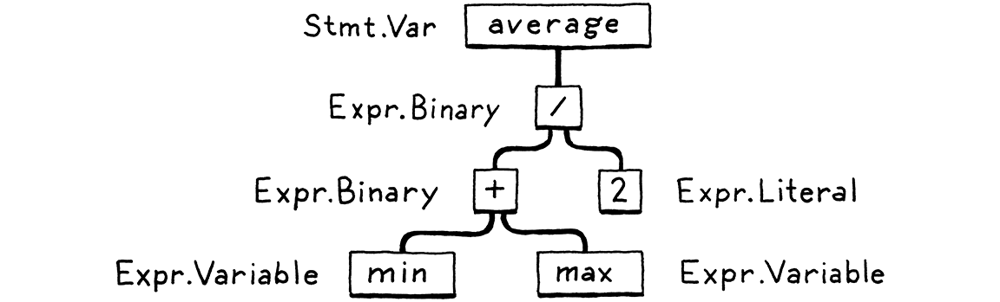

> 你必须要有一张地图，无论它是多么粗糙。否则你就会到处乱逛。在《指环王》中，我从未让任何人在某一天走得超出他力所能及的范围。
>
> ​ ——J.R.R. Tolkien

我们不想到处乱逛，所以在我们开始之前，让我们先浏览一下以前的语言实现者所绘制的领土。它能帮助我们了解我们的目的地和其他人采用的备选路线。

首先，我先做个简单说明。本书的大部分内容都是关于语言的*实现*，它与*语言本身*这种柏拉图式的理想形式有所不同。诸如“堆栈”，“字节码”和“递归下降”之类的东西是某个特定实现中可能使用的基本要素。从用户的角度来说，只要最终产生的装置能够忠实地遵循语言规范，这些都是东西不过是他们不关心的实现细节罢了。

我们将会花很多时间在这些细节上，所以如果我每次提及的时候都写“语言实现”，我的手指都会被磨掉。相反，除非有重要的区别，否则我将使用“语言”来指代一种语言或该语言的一种实现，或两者皆有。

## 2.1 语言的各部分

自计算机的黑暗时代以来，工程师们就一直在构建编程语言。当我们可以和计算机对话的时候，我们发现这样做太难了，于是我们寻求电脑的帮助。我觉得很有趣的是，即使今天的机器确实快了一百万倍，存储空间也大了几个数量级，但我们构建编程语言的方式几乎没有改变。

尽管语言设计师所探索的领域辽阔，但他们往往都走到相似的几条路上。 并非每种语言都采用完全相同的路径（有些会采用一种或两种捷径），但除此之外，从海军少将 Grace Hopper 的第一个 COBOL 编译器，一直到一些热门的可以转译到 JavaScript 的语言（JS 的 "文档 "甚至完全是由 Git 仓库中一个编辑得很差的 README 组成的[^1]），都呈现出相似的特征，这令人十分欣慰。

我把一个语言实现可能选择的路径网络类比为爬山。你从最底层开始，程序是原始的源文本，实际上只是一串字符。每个阶段都会对程序进行分析，并将其转换为更高层次的表现形式，从而使语义（作者希望计算机做什么）变得更加明显。

最终我们达到了峰顶。我们可以鸟瞰用户的程序，可以看到他们的代码含义是什么。我们开始从山的另一边下山。我们将这个最高级的表示形式转化为连续的较低级别的形式，从而越来越接近我们所知道的如何让 CPU 真正执行的形式。


让我们追随着这一条条路径和点前进吧。我们的旅程从左边的用户源代码的纯文本开始：


### 2.1.1 扫描

第一步是**扫描**，也就是所谓的**词法分析** ( lexing 或者强调写法 lexical analysis )。扫描和词法分析的意思相近。我喜欢词法分析这个描述，因为这听起来像是一个邪恶的超级大坏蛋会做的事情，但我还是用扫描，因为它似乎更常见一些。

扫描器(或词法解析器)接收线性字符流，并将它们切分成一系列更类似于“单词”的东西。在编程语言中，这些词的每一个都被称为**词法单元**。有些词法单元是单个字符，比如`(`和 `,`。其他的可能是几个字符长的，比如数字（`123`）、字符串字元（`"hi!"`）和标识符（`min`）。

源文件中的一些字符实际上没有任何意义。空格通常是无关紧要的，而注释，从定义就能看出来，会被变成语言忽略。扫描器通常会丢弃这些字符，留下一个干净的有意义的词法单元序列。

![[var] [average] [=] [(] [min] [+] [max] [)] [/] [2] [;]](./tokens.png)

### 2.1.2 语法分析

下一步是**解析**。 这就是我们从句法中得到**语法**的地方——语法能够将较小的部分组成较大的表达式和语句。你在英语课上做过语法图解吗？如果有，你就做了解析器所做的事情，区别在于，英语中有成千上万的“关键字”和大量的歧义，而编程语言要简单得多。

**解析器**将扁平的词法单元序列转化为树形结构，树形结构能更好地反映语法的嵌套本质。这些树有两个不同的名称:**解析树**或**抽象语法树**，这取决于它们与源语言的语法结构有多接近。在实践中，语言黑客通常称它们为“**语法树**”、“**AST**”，或者干脆直接说“**树**”。



解析在计算机科学中有着悠久而丰富的历史，它与人工智能界有着密切的联系。今天用于解析编程语言的许多技术最初被人工智能研究人员用于解析人类语言，人工智能研究人员试图通过这些技术让计算机能与我们对话。

事实证明，人类语言对于只能处理僵化语法的解析器来说太混乱了，但面对编程语言这种简单的人造语法时，解析器表现得十分合适。唉，可惜我们这些有缺陷的人类在使用这些简单的语法时，仍然会不停地出错，因此解析器的工作还包括通过报告**语法错误**让我们知道出错了。

### 2.1.3 静态分析

在所有实现中，前两个阶段都非常相似。 现在，每种语言的个性化特征开始发挥作用。 至此，我们知道了代码的语法结构（诸如哪些表达式嵌套在其他表达式中）之类的东西，但是我们知道的也就仅限于此了。

在`a + b`这样的表达式中，我们知道我们要把`a`和`b`相加，但我们不知道这些名字指的是什么。它们是局部变量吗？全局变量？它们在哪里被定义？

大多数语言所做的第一点分析叫做**绑定**或**决议**。对于每一个**标识符**，我们都要找出定义该名称的地方，并将两者连接起来。这就是**作用域**的作用——在这个源代码区域中，某个名字可以用来引用某个声明。

如果语言是静态类型的，这就是我们进行类型检查的时机。一旦我们知道了`a`和`b`的声明位置，我们也可以弄清楚它们的类型。然后如果这些类型不支持相加，我们就会报告一个**类型错误**[^2]。

深吸一口气。 我们已经到达了山顶，并对用户的程序有了全面的了解。从分析中可见的所有语义信息都需要存储在某个地方。我们可以把它存储在几个地方：

- 通常，它会被直接存储在语法树本身的**属性**中——属性是节点中的额外字段，这些字段在解析时不会初始化，但在稍后会进行填充。
- 有时，我们可能会将数据存储在外部的查找表中。 通常，该表的关键字是标识符，即变量和声明的名称。 在这种情况下，我们称其为**符号表**，并且其中与每个键关联的值告诉我们该标识符所指的是什么。
- 最强大的记录工具是将树转化为一个全新的数据结构，更直接地表达代码的语义。这是下一节的内容。

到目前为止，所有内容都被视为实现的**前端**。 你可能会猜至此以后是**后端**，其实并不是。 在过去的年代，当“前端”和“后端”被创造出来时，编译器要简单得多。 后来，研究人员在两个半部之间引入了新阶段。 威廉·沃尔夫（William Wulf）和他的同伴没有放弃旧术语，而是新添加了一个迷人但有点自相矛盾的名称“**中端**”。

### 2.1.4 中间码

你可以把编译器看成是一条流水线，每个阶段的工作是把代表用户代码的数据组织起来，使下一阶段的实现更加简单。管道的前端是针对程序所使用的源语言编写的。后端关注的是程序运行的最终架构。

在中间阶段，代码可能被存储在一些**中间代码**（**intermediate representation**， 也叫**IR**）中，这些中间代码与源文件或目的文件形式都没有紧密的联系（因此叫作 "中间"）。相反，IR 充当了这两种语言之间的接口[^3]。

这可以让你更轻松地支持多种源语言和目标平台。假设你想在 x86、ARM、SPARC 平台上实现 Pascal、C 和 Fortran 编译器。通常情况下，这意味着你需要写九个完整的编译器：Pascal→x86，C→ARM，以及其他各种组合[^4]。

一个共享的中间代码可以大大减少这种情况。你为每个产生 IR 的源语言写*一个*前端。然后为每个目标平台写*一个*后端。现在，你可以将这些混搭起来，得到每一种组合。

我们希望将代码转化为某种语义更加明确的形式，还有一个重要的原因是。。。

### 2.1.5 优化

一旦我们理解了用户程序的含义，我们就可以自由地用另一个具有相同语义但实现效率更高的程序来交换它——我们可以对它进行**优化**。

一个简单的例子是**常量折叠**：如果某个表达式求值得到的始终是完全相同的值，我们可以在编译时进行求值，并用其结果替换该表达式的代码。 如果用户输入：

```java
pennyArea = 3.14159 * (0.75 / 2) * (0.75 / 2);
```

我们可以在编译器中完成所有的算术运算，并将代码更改为：

```java
pennyArea = 0.4417860938;
```

优化是编程语言业务的重要组成部分。许多语言黑客把他们的整个职业生涯都花在了这里，竭尽所能地从他们的编译器中挤出每一点性能，以使他们的基准测试速度提高百分之几。有的时候这也会变成一种痴迷, 无法自拔。

我们在本书中通常会跳过这些棘手问题。令人惊讶的是许多成功的语言只有很少的编译期优化。 例如，Lua 和 CPython 生成没怎么优化过的代码，并将其大部分性能工作集中在运行时上[^5]。

### 2.1.6 代码生成

我们已经将所有可以想到的优化应用到了用户程序中。 最后一步是将其转换为机器可以实际运行的形式。 换句话说，**生成代码**（或**代码生成**），这里的“代码”通常是指 CPU 运行的类似于汇编的原始指令，而不是人类可能想要阅读的“源代码”。

最后，我们到了**后端**，从山的另一侧开始向下。 从现在开始，随着我们越来越接近于思维简单的机器可以理解的东西，我们对代码的表示变得越来越原始，就像逆向进化。

我们需要做一个决定。 我们是为真实 CPU 还是虚拟 CPU 生成指令？ 如果我们生成真实的机器代码，则会得到一个可执行文件，操作系统可以将其直接加载到芯片上。 原生代码快如闪电，但生成它需要大量工作。 当今的体系结构包含大量指令，复杂的管线和足够塞满一架 747 行李舱的历史包袱。

使用芯片的语言也意味着你的编译器是与特定的架构相绑定的。如果你的编译器以 x86 机器代码为目标，那么它就无法在[ARM](https://en.wikipedia.org/wiki/ARM_architecture)设备上运行。追朔到上世纪 60 年代计算机体系结构 “寒武纪大爆发” 期间，这种缺乏可移植性的情况是一个真正的障碍[^6]。

为了解决这个问题，专家开始让他们的编译器生成虚拟机代码，包括 BCPL 的设计者 Martin Richards 以及 Pascal 设计者 Niklaus Wirth。他们不是为真正的芯片编写指令，而是为一个假设的、理想化的机器编写代码。Wirth 称这种**p-code**为“可移植代码”，但今天，我们通常称它为**字节码**，因为每条指令通常都是一个字节长。

这些合成指令的设计是为了更紧密地映射到语言的语义上，而不必与任何一个计算机体系结构的特性和它积累的历史错误绑定在一起。你可以把它想象成语言底层操作的密集二进制编码。

### 2.1.7 虚拟机

如果你的编译器产生了字节码，你的工作还没有结束。因为没有芯片可以解析这些字节码，因此你还需要进行翻译。同样，你有两个选择。你可以为每个目标体系结构编写一个小型编译器，将字节码转换为该机器的本机代码[^7]。你仍然需要针对你支持的每个芯片做一些工作，但最后这个阶段非常简单，你可以在你支持的所有机器上重复使用编译器流水线的其余部分。你基本上是把你的字节码作为一种中间代码。

或者，你可以编写**虚拟机（VM）**[^8]，该程序可在运行时模拟支持虚拟架构的虚拟芯片。在虚拟机中运行字节码比提前将其翻译成本地代码要慢，因为每条指令每次执行时都必须在运行时模拟。作为回报，你得到的是简单性和可移植性。用比如说 C 语言实现你的虚拟机，你就可以在任何有 C 编译器的平台上运行你的语言。这就是我们在本书中构建的第二个解释器的工作原理。

### 2.1.8 运行时

我们终于将用户程序锤炼成可以执行的形式。最后一步是运行它。如果我们将其编译为机器码，我们只需告诉操作系统加载可执行文件，然后就可以运行了。如果我们将它编译成字节码，我们需要启动 VM 并将程序加载到其中。

在这两种情况下，除了最基本的底层语言外，我们通常需要我们的语言在程序运行时提供一些服务。例如，如果语言自动管理内存，我们需要一个垃圾收集器去回收未使用的比特位。如果我们的语言支持用 "instance of "测试我们拥有什么类型的对象，那么我们就需要一些表示方法来跟踪执行过程中每个对象的类型。

所有这些东西都是在运行时进行的，所以它被恰当地称为，**运行时**。在一个完全编译的语言中，实现运行时的代码会直接插入到生成的可执行文件中。比如说，在[Go](https://golang.org/)中，每个编译后的应用程序都有自己的一份 Go 的运行时副本直接嵌入其中。如果语言是在解释器或虚拟机内运行，那么运行时将驻留于虚拟机中。这也就是 Java、Python 和 JavaScript 等大多数语言实现的工作方式。

## 2.2 捷径和备选路线

这是一条漫长的道路，涵盖了你要实现的每个可能的阶段。许多语言的确走完了整条路线，但也有一些捷径和备选路径。

### 2.2.1 单遍编译器

一些简单的编译器将解析、分析和代码生成交织在一起，这样它们就可以直接在解析器中生成输出代码，而无需分配任何语法树或其他 IR。这些**单遍编译器**限制了语言的设计。你没有中间数据结构来存储程序的全局信息，也不会重新访问任何之前解析过的代码部分。 这意味着，一旦你看到某个表达式，就需要足够的知识来正确地对其进行编译[^9]。

Pascal 和 C 语言就是围绕这个限制而设计的。在当时，内存非常珍贵，一个编译器可能连整个源文件都无法存放在内存中，更不用说整个程序了。这也是为什么 Pascal 的语法要求类型声明要先出现在一个块中。这也是为什么在 C 语言中，你不能在定义函数的代码上面调用函数，除非你有一个明确的前向声明，告诉编译器它需要知道什么，以便生成调用后面函数的代码。

### 2.2.2 树遍历解释器

有些编程语言在将代码解析为 AST 后就开始执行代码（可能应用了一点静态分析）。为了运行程序，解释器每次都会遍历语法树的一个分支和叶子，并在运行过程中计算每个节点。

这种实现风格在学生项目和小型语言中很常见，但在通用语言中并不广泛使用，因为它往往很慢。有些人使用“解释器”仅指这类实现，但其他人对“解释器”一词的定义更宽泛，因此我将使用没有歧义的“**树遍历解释器**”来指代这些实现。我们的第一个解释器就是这样工作的[^10]。

### 2.2.3 转译器

为一种语言编写一个完整的后端可能需要大量的工作。 如果你有一些现有的通用 IR 作为目标，则可以将前端转换到该 IR 上。 否则，你可能会陷入困境。 但是，如果你将某些其他*源语言*视为中间代码，该怎么办？

你需要为你的语言编写一个前端。然后，在后端，你可以生成一份与你的语言级别差不多的其他语言的有效源代码字符串，而不是将所有代码*降低*到某个原始目标语言的语义。然后，你可以使用该语言现有的编译工具作为逃离大山的路径，得到某些可执行的内容。

人们过去称之为**源到源编译器**或**转换编译器**[^11]。随着那些为了在浏览器中运行而编译成 JavaScript 的各类语言的兴起，它们有了一个时髦的名字——**转译器**。

虽然第一个编译器是将一种汇编语言翻译成另一种汇编语言，但现今，大多数编译器都适用于高级语言。在 UNIX 广泛运行在各种各样的机器上之后，编译器开始长期以 C 作为输出语言。C 编译器在 UNIX 存在的地方都可以使用，并能生成有效的代码，因此，以 C 为目标是让语言在许多体系结构上运行的好方法。

Web 浏览器是今天的 "机器"，它们的 "机器代码 "是 JavaScript，所以现在似乎[几乎所有的语言都有一个以 JS 为目标的编译器](https://github.com/jashkenas/coffeescript/wiki/list-of-languages-that-compile-to-js)，因为这是让你的代码在浏览器中运行的主要方式[^12]。

转译器的前端（扫描器和解析器）看起来跟其他编译器相似。 然后，如果源语言只是在目标语言在语法方面的换皮版本，则它可能会完全跳过分析，并直接输出目标语言中的类似语法。

如果两种语言的语义差异较大，那么你就会看到完整编译器的更多典型阶段，包括分析甚至优化。然后，在代码生成阶段，无需输出一些像机器代码一样的二进制语言，而是生成一串语法正确的目标语言的源码（好吧，目标代码）。

不管是哪种方式，你再通过目标语言已有的编译流水线运行生成的代码就可以了。

### 2.2.4 即时编译

最后一个与其说是捷径，不如说是危险的高山争霸赛，最好留给专家。执行代码最快的方法是将代码编译成机器代码，但你可能不知道你的最终用户的机器支持什么架构。该怎么做呢？

你可以做和 HotSpot JVM、Microsoft 的 CLR 和大多数 JavaScript 解释器相同的事情。 在终端用户的机器上，当程序加载时（无论是 JS 源代码还者是平台无关的 JVM 和 CLR 字节码），都可以将其编译为对应的本地代码，以适应本机支持的体系结构。 自然地，这被称为**即时编译**。 大多数黑客只是说“ JIT”，其发音与“ fit”押韵。

最复杂的 JIT 将性能分析钩子插入到生成的代码中，以查看哪些区域对性能最为关键，以及哪些类型的数据正在流经其中。 然后，随着时间的推移，它们将通过更高级的优化功能自动重新编译那些热点部分[^13]。

## 2.3 编译器和解释器

现在我已经向你的脑袋里塞满了一大堆编程语言术语，我们终于可以解决一个自远古以来一直困扰着程序员的问题:编译器和解释器之间有什么区别?

事实证明，这就像问水果和蔬菜的区别一样。这看上去似乎是一个非此即彼的选择，但实际上 "水果 "是一个植物学术语，"蔬菜 "是烹饪学术语。严格来说，一个并不意味着对另一个的否定。有不是蔬菜的水果（苹果），也有不是水果的蔬菜（胡萝卜），也有既是水果又是蔬菜的可食用植物，比如西红柿[^14]。


好，回到语言上：

- **编译**是一种实现技术，其中涉及到将源语言翻译成其他语言——通常是较低级的形式。当你生成字节码或机器代码时，你就是在编译。当你移植到另一种高级语言时，你也在编译。
- 当我们说语言实现“是**编译器**”时，是指它会将源代码转换为其他形式，但不会执行。 用户必须获取结果输出并自己运行。
- 相反，当我们说一个实现“是一个**解释器**”时，是指它接受源代码并立即执行它。 它“从源代码”运行程序。

像苹果和橘子一样，某些实现显然是编译器，而不是解释器。 GCC 和 Clang 接受你的 C 代码并将其编译为机器代码。 最终用户直接运行该可执行文件，甚至可能永远都不知道使用了哪个工具来编译它。 所以这些是 C 的*编译器*。

由 Matz 实现的老版本 Ruby 中，用户从源代码中运行 Ruby。该实现通过遍历语法树对其进行解析并直接执行。期间都没有发生其他的转换，无论是在实现内部还是以任何用户可见的形式。所以这绝对是一个 Ruby 的*解释器*。

但是 CPython 呢？当你使用它运行你的 Python 程序时，代码会被解析并转换为内部字节码格式，然后在虚拟机内部执行。从用户的角度来看，这显然是一个解释器——他们是从源代码开始运行自己的程序。但如果你看一下 CPython 的内部，你会发现肯定有一些编译工作在进行。

答案是两者兼而有之。 CPython 是一个解释器，但他也*有*一个编译器。 实际上，大多数脚本语言都以这种方式工作[^15]，如你所见：


.

中间那个重叠的区域也是我们第二个解释器所在的位置，因为它会在内部编译成字节码。所以，虽然本书名义上是关于解释器的，但我们也会涉及一些编译的内容。

## 2.4 我们的旅程

一下子有太多东西要消化掉。别担心。这一章并不是要求你理解所有这些零碎的内容。我只是想让你们知道它们是存在的，以及大致了解它们是如何组合在一起的。

当你探索本书本书所指导的路径之外的领域时，这张地图应该对你很有用。我希望你自己出击，在那座山里到处游走。

但是，现在，是我们自己的旅程开始的时候了。系好你的鞋带，背好你的包，走吧。从这里开始，你需要关注的是你面前的路。

[^1]: 毫无疑问，CS 论文也有死胡同，被引为零的悲惨小众论文以及如今被遗忘的优化方法，这些优化方法只有在以单个字节为单位来衡量内存时才有意义。
[^2]: 我们在本书中构建的语言是动态类型的，因此将在稍后的运行时中进行类型检查。
[^3]: 有几种成熟的 IR 风格。点击你熟悉的搜索引擎，搜索 "控制流图"、"静态单赋值形式"、"延续传递形式 "和 "三位址码"。
[^4]: 如果你曾经好奇[GCC](https://en.wikipedia.org/wiki/GNU_Compiler_Collection)如何支持这么多疯狂的语言和体系结构，例如 Motorola 68k 上的 Modula-3，现在你就明白了。 语言前端针对的是少数 IR，主要是[GIMPLE](https://gcc.gnu.org/onlinedocs/gccint/GIMPLE.html)和[RTL](https://gcc.gnu.org/onlinedocs/gccint/RTL.html)。 目标后端如 68k，会接受这些 IR 并生成本机代码。
[^5]: 如果你无法抗拒要进入这个领域，可以从以下关键字开始，例如“常量折叠”，“公共表达式消除”，“循环不变代码外提”，“全局值编号”，“强度降低”，“ 聚合量标量替换”，“死码删除”和“循环展开”。
[^6]: 例如，[AAD](http://www.felixcloutier.com/x86/AAD.html)（"ASCII Adjust AX Before Division",除法前 ASCII 调整 AX）指令可以让你执行除法，这听起来很有用。除了该指令将两个二进制编码的十进制数字作为操作数打包到一个 16 位寄存器中。你最后一次在 16 位机器上使用 BCD 是什么时候？
[^7]: 这里的基本原则是，你把特定于体系架构的工作推得越靠后，你就可以在不同架构之间共享更多的早期阶段。不过，这里存在一些矛盾。 许多优化（例如寄存器分配和指令选择）在了解特定芯片的优势和功能时才能发挥最佳效果。 弄清楚编译器的哪些部分可以共享，哪些应该针对特定目标是一门艺术。
[^8]: 术语“虚拟机”也指另一种抽象。 “系统虚拟机”在软件中模拟整个硬件平台和操作系统。 这就是你可以在 Linux 机器上玩 Windows 游戏的原因，也是云提供商为什么可以给客户提供控制自己的“服务器”的用户体验，而无需为每个用户实际分配单独的计算机。在本书中，我们将要讨论的虚拟机类型是“语言虚拟机”或“进程虚拟机”（如果你需要明确的话）。
[^9]: [语法导向翻译](https://en.wikipedia.org/wiki/Syntax-directed_translation)是一种结构化的技术，用于构建这些一次性编译器。你可以将一个操作与语法的每个片段(通常是生成输出代码的语法片段)相关联。然后，每当解析器匹配该语法块时，它就执行操作，一次构建一个规则的目标代码。
[^10]: 一个明显的例外是早期版本的 Ruby，它们是树遍历型解释器。在 1.9 时，Ruby 的规范实现从最初的 MRI（"Matz' Ruby Interpreter"）切换到了 Koichi Sasada 的 YARV（"Yet Another Ruby VM"）。YARV 是一个字节码虚拟机。
[^11]: 第一个转编译器 XLT86 将 8080 程序集转换为 8086 程序集。 这看似简单，但请记住 8080 是 8 位芯片，而 8086 是 16 位芯片，可以将每个寄存器用作一对 8 位寄存器。 XLT86 进行了数据流分析，以跟踪源程序中的寄存器使用情况，然后将其有效地映射到 8086 的寄存器集。它是由悲惨的计算机科学英雄加里·基尔达尔（Gary Kildall）撰写的。 他是最早认识到微型计算机前景的人之一，他创建了 PL / M 和 CP / M，这是它们的第一种高级语言和操作系统。
[^12]: JS 曾经是在浏览器中执行代码的唯一方式。多亏了[Web Assembly](https://github.com/webassembly/)，编译器现在有了第二种可以在 Web 上运行的低级语言。
[^13]: 当然，这正是 HotSpot JVM 名称的来源。
[^14]: 花生（连真正的坚果都算不上）和小麦等谷类其实都是水果，但我把这个图画错了。我能说什么呢，我是个软件工程师，不是植物学家。我也许应该抹掉这个花生小家伙，但他太可爱了，我不忍心。
[^15]: [Go 工具](https://golang.org/)更是一个奇葩。如果你运行`go build`，它就会把你的 go 源代码编译成机器代码然后停止。如果你输入`go run`，它也会这样做，然后立即执行生成的可执行文件。所以，可以说 go 是一个编译器（你可以把它当做一个工具来编译代码而不运行）；也可以说是一个解释器（你可以调用它立即从源码中运行一个程序），并且有一个编译器（当你把它当做解释器使用时，它仍然在内部编译）。

---

## 习题

1、选择一个你喜欢的语言的开源实现。下载源代码，并在其中探索。试着找到实现扫描器和解析器的代码，它们是手写的，还是用 Lex 和 Yacc 等工具生成的？（存在`.l`或`.y`文件通常意味着后者）

2、实时编译往往是实现动态类型语言最快的方法，但并不是所有的语言都使用它。有什么理由不采用 JIT 呢？

3、大多数可编译为 C 的 Lisp 实现也包含一个解释器，该解释器还使它们能够即时执行 Lisp 代码。 为什么？
