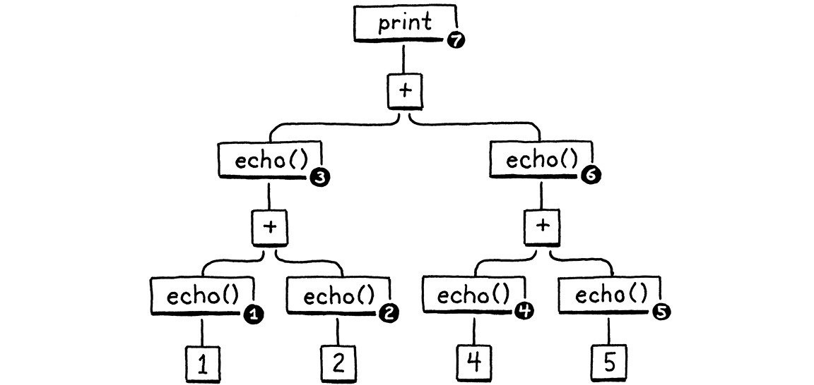

> 魔术师们之所以保护他们的秘密，并不是因为秘密很大、很重要，而是它们是如此小而微不足道。在舞台上创造出的奇妙效果往往源自于一个荒谬的小秘密，以至于魔术师都不好意思承认这是如何完成的。
>
> ​ ——Christopher Priest, _The Prestige_


我们已经花了很多时间讨论如何将程序表示为字节码指令序列，但是这感觉像是只用填充的死动物来学习生物学。我们知道理论上的指令是什么，但我们在实际操作中从未见过，因此很难真正理解指令的*作用*。如果我们不能很好地理解字节码的行为方式，就很难编写输出字节码的编译器。

因此，在构建新解释器的前端之前，我们先从后端开始——执行指令的虚拟机。它为字节码注入了生命。通过观察这些指令的运行，我们可以更清楚地了解编译器如何将用户的源代码转换成一系列的指令。

## 15.1 指令执行机器

虚拟机是我们解释器内部结构的一部分。你把一个代码块交给它，它就会运行这块代码。VM 的代码和数据结构放在一个新的模块中。

_<u>vm.h，创建新文件：</u>_

```c
#ifndef clox_vm_h
#define clox_vm_h

#include "chunk.h"

typedef struct {
  Chunk* chunk;
} VM;

void initVM();
void freeVM();

#endif
```

跟之前一样，我们从简单的部分开始。VM 会逐步获取到一大堆它需要跟踪的状态，所以我们现在定义一个结构，把这些状态都塞进去。目前，我们只存储它执行的代码块。

与我们创建的大多数数据结构类似，我们也会定义用来创建和释放虚拟机的函数。下面是其对应实现：

_<u>vm.c，创建新文件：</u>_

```c
#include "common.h"
#include "vm.h"

VM vm;

void initVM() {
}

void freeVM() {
}
```


好吧，把这些函数称为“实现”有点牵强了。我们目前还没有任何感兴趣的状态需要初始化或释放，所以这些函数是空的。相信我，我们终会实现它的。

这里稍微有趣的一行是`vm`的声明。这个模块最终会有一系列的函数，如果要将一个指向 VM 的指针传递给所有的函数，那就太麻烦了。相反，我们声明了一个全局 VM 对象。反正我们只需要一个虚拟机对象，这样可以让本书中的代码在页面上更轻便[^1]。


在我们开始向虚拟机中添加有效代码之前，我们先将其连接到解释器的主入口点。

_<u>main.c，在 main()方法中新增代码：</u>_

```c
int main(int argc, const char* argv[]) {
  // 新增部分开始
  initVM();
  // 新增部分结束
  Chunk chunk;
```

当解释器第一次启动时，我们也启动虚拟机。然后当我们要退出时，我们将其关闭。

_<u>main.c，在 main()方法中添加代码：</u>_

```c
  disassembleChunk(&chunk, "test chunk");
  // 新增部分开始
  freeVM();
  // 新增部分结束
  freeChunk(&chunk);
```

最后一项仪式性任务：

_<u>main.c，添加代码：</u>_

```c
#include "debug.h"
// 新增部分开始
#include "vm.h"
// 新增部分结束
int main(int argc, const char* argv[]) {
```

现在如果你运行 clox，它会先启动虚拟机，再创建上一章中的手写代码块。虚拟机已经就绪了，我们来教它一些事情吧。


### 15.1.1 执行指令


当我们命令 VM 解释一个字节码块时，它就会开始启动了。

_<u>main.c，在 main()方法中添加代码：</u>_

```c
  disassembleChunk(&chunk, "test chunk");
  // 新增部分开始
  interpret(&chunk);
  // 新增部分结束
  freeVM();
```


这个函数是进入 VM 的主要入口。它的声明如下：

_<u>vm.h，在 freeVM()方法后添加：</u>_

```c
void freeVM();
// 新增部分开始
InterpretResult interpret(Chunk* chunk);
// 新增部分结束
#endif
```


VM 会运行字节码块，然后返回下面枚举中的一个值作为响应：

_<u>vm.h，在结构体 VM 后添加：</u>_

```c
} VM;
// 新增部分开始
typedef enum {
  INTERPRET_OK,
  INTERPRET_COMPILE_ERROR,
  INTERPRET_RUNTIME_ERROR
} InterpretResult;
// 新增部分结束
void initVM();
void freeVM();
```


我们现在还不会使用这个结果，但是当我们有一个报告静态错误的编译器和检测运行时错误的 VM 时，解释器会通过它来知道如何设置进程的退出代码。


我们正逐步走向一些真正的实现。

_<u>vm.c，在 freeVM()方法后添加：</u>_

```c
InterpretResult interpret(Chunk* chunk) {
  vm.chunk = chunk;
  vm.ip = vm.chunk->code;
  return run();
}
```


首先，我们在虚拟机中存储正在执行的块。然后我们调用`run()`，这是一个内部辅助函数，实际运行字节码指令。在这两部分之间，有一条耐人寻味的线。这个`ip`作用是什么？


当虚拟机运行字节码时，它会记录它在哪里——即当前执行的指令所在的位置。我们没有在`run()`方法中使用局部变量来进行记录，因为最终其它函数也会访问该值。相对地，我们将其作为一个字段存储在 VM 中[^2]。

_<u>vm.h，在结构体 VM 中添加代码：</u>_

```c
typedef struct {
  Chunk* chunk;
  // 新增部分开始
  uint8_t* ip;
  // 新增部分结束
} VM;
```


它的类型是一个字节指针。我们使用一个真正的 C 指针指向字节码数组的中间，而不是使用类似整数索引这种方式，这是因为对指针的引用比通过索引查找数组中的一个元素要更快。


“IP”这个名字很传统，而且与 CS 中的很多传统名称不同的是，它是有实际意义的：它是一个[指令指针](https://en.wikipedia.org/wiki/Program_counter)。几乎世界上所有的指令集，不管是真实的还是虚拟的，都有一个类似的寄存器或变量[^3]。


我们通过将`ip`指向块中的第一个字节码来对其初始化。我们还没有执行该指令，所以`ip`指向*即将执行*的指令。在虚拟机执行的整个过程中都是如此：IP 总是指向下一条指令，而不是当前正在处理的指令。


真正有趣的部分在`run()`中。

_<u>vm.c，在 freeVM()方法后添加：</u>_

```c
static InterpretResult run() {
#define READ_BYTE() (*vm.ip++)

  for (;;) {
    uint8_t instruction;
    switch (instruction = READ_BYTE()) {
      case OP_RETURN: {
        return INTERPRET_OK;
      }
    }
  }

#undef READ_BYTE
}
```


到目前为止，这是 clox 中最重要的一个函数。当解释器执行用户的程序时，它有大约 90%的时间是在`run()`中。它是虚拟机跳动的心脏。


尽管这个介绍很戏剧性，但从概念上来说很简单。我们有一个不断进行的外层循环。每次循环中，我们会读取并执行一条字节码指令。


为了处理一条指令，我们首先需要弄清楚要处理的是哪种指令。`READ_BYTE`这个宏会读取`ip`当前指向字节，然后推进指令指针[^4]。任何指令的第一个字节都是操作码。给定一个操作码，我们需要找到实现该指令语义的正确的 C 代码。这个过程被称为**解码**或指令**分派**。


每一条指令，每一次执行时，我们都会进行这个过程，所以这是整个虚拟机性能最关键的部分。编程语言的传说中充满了高效进行字节码分派的各种奇技淫巧[^5]，一直可以追溯到计算机的早期。


可惜的是，最快的解决方案要么需要对 C 进行非标准的扩展，要么需要手写汇编代码。对于 clox，我们要保持简单。就像我们的反汇编程序一样，我们写一个巨大的`switch`语句，其中每个 case 对应一个操作码。每个 case 代码体实现了操作码的行为。


到目前为止，我们只处理了一条指令，`OP_RETURN`，而它做的唯一的事情就是完全退出循环。最终，该指令将被用于从当前的 Lox 函数返回，但是我们目前还没有函数，所以我们暂时用它来结束代码执行。


让我们继续支持另一个指令。

_<u>vm.c，在 run()方法中增加代码：</u>_

```c
    switch (instruction = READ_BYTE()) {
      // 新增部分开始
      case OP_CONSTANT: {
        Value constant = READ_CONSTANT();
        printValue(constant);
        printf("\n");
        break;
      }
      // 新增部分结束
      case OP_RETURN: {
```


我们还没有足够的机制来使用常量做任何有用的事。现在，我们只是把它打印出来，这样我们这些解释器黑客就可以看到我们的 VM 内部发生了什么。调用`printf()`方法需要进行 include。

_<u>vm.c，在文件顶部添加：</u>_

```c
// 新增部分开始
#include <stdio.h>
// 新增部分结束
#include "common.h"
```


我们还需要定义一个新的宏。

<u>_vm.c，在 run()方法中添加代码：_</u>

```c
#define READ_BYTE() (*vm.ip++)
// 新增部分开始
#define READ_CONSTANT() (vm.chunk->constants.values[READ_BYTE()])
// 新增部分结束
  for (;;) {
```


`READ_CONTANT()`从字节码中读取下一个字节，将得到的数字作为索引，并在代码块的常量表中查找相应的 Value。在后面的章节中，我们将添加一些操作数指向常量的指令，所以我们现在要设置这个辅助宏。

Like the previous `READ_BYTE` macro, `READ_CONSTANT` is only used inside `run()`. To make that scoping more explicit, the macro definitions themselves are confined to that function. We define them at the beginning and—because we care—undefine them at the end.

与之前的`READ_BYTE`宏类似，`READ_CONSTANT`只会在`run()`方法中使用。为了使作用域更明确，宏定义本身要被限制在该函数中。我们在开始时定义了它们，然后因为我们比较关心，在结束时取消它们的定义[^6]。

_<u>vm.c，在 run()方法中添加：</u>_

```c
#undef READ_BYTE
// 新增部分开始
#undef READ_CONSTANT
// 新增部分结束
}
```


### 15.1.2 执行跟踪


如果现在运行 clox，它会执行我们在上一章中手工编写的字节码块，并向终端输出 1.2。我们可以看到它在工作，但这是因为我们在`OP_CONSTANT`的实现中，使用临时代码记录了这个值。一旦该指令执行了它应做的操作，并将取得的常量传递给其它想要使用该常量的操作，虚拟机就会变成一个黑盒子。这使得我们作为虚拟机实现者的工作更加艰难。


为了帮助我们自己解脱这种困境，现在是给虚拟机添加一些诊断性日志的好时机，就像我们对代码块本身所做的那样。事实上，我们甚至会重用相同的代码。我们不希望一直启用这个日志——它只针对我们这些虚拟机开发者，而不是 Lox 用户——所以我们首先创建一个标志来隐藏它。

_<u>common.h，新增代码：</u>_

```c
#include <stdint.h>
// 新增部分开始
#define DEBUG_TRACE_EXECUTION
// 新增部分结束
#endif
```


定义了这个标志之后，虚拟机在执行每条指令之前都会反汇编并将其打印出来。我们之前的反汇编程序只是静态地遍历一次整个字节码块，而这个反编译程序则是动态地、即时地对指令进行反汇编。

_<u>vm.c，在 run()方法中新增代码：</u>_

```c
  for (;;) {
// 新增部分开始
#ifdef DEBUG_TRACE_EXECUTION
    disassembleInstruction(vm.chunk,
                           (int)(vm.ip - vm.chunk->code));
#endif
// 新增部分结束
    uint8_t instruction;
```


由于 `disassembleInstruction()` 方法接收一个整数`offset`作为字节偏移量，而我们将当前指令引用存储为一个直接指针，所以我们首先要做一个小小的指针运算，将`ip`转换成从字节码开始的相对偏移量。然后，我们对从该字节开始的指令进行反汇编。


跟之前一样，我们需要在调用函数之前先引入函数的声明。

_<u>vm.c，新增代码：</u>_

```c
#include "common.h"
// 新增部分开始
#include "debug.h"
// 新增部分结束
#include "vm.h"
```


我知道这段代码到目前为止还不是很令人印象深刻——它实际上只是一个封装在`for`循环中的 switch 语句，但信不信由你，这就是我们虚拟机的两个主要组成部分之一。有了它，我们就可以命令式地执行指令。它的简单是一种优点——它做的工作越少，就能做得越快。作为对照，可以回想一下我们在 jlox 中使用 Visitor 模式遍历 AST 的复杂度和开销。


## 15.2 一个值栈操作器


除了命令式的副作用外，Lox 还有产生、修改和使用值的表达式。因此，我们编译的字节码还需要一种方法在需要值的不同指令之间传递它们。例如：

```
print 3 - 2;
```


显然我们需要常数 3 和 2、`print`语句和减法对应的指令。但是减法指令如何知道 3 是被减数而 2 是减数呢？打印指令怎么知道要打印计算结果的呢？


为了说得更清楚一点，看看下面的代码：

```c
fun echo(n) {
  print n;
  return n;
}

print echo(echo(1) + echo(2)) + echo(echo(4) + echo(5));
```


我将每个子表达都包装在对`echo()`的调用中，这个调用会打印并返回其参数。这个副作用意味着我们可以看到操作的确切顺序。


暂时不要担心虚拟机的问题。只考虑 Lox 本身的语义。算术运算符的操作数显然需要在执行运算操作之前求值（如果你不知道`a`和`b`是什么，就很难计算`a+b`）。另外，当我们在 jlox 中实现表达式时，我们决定了左操作数必须在右操作数之前进行求值[^7]。


下面是`print`语句的语法树：




确定了从左到右的求值顺序，以及表达式嵌套方式，任何一个正确的 Lox 实现都*必须*按照下面的顺序打印这些数字：

```c
1  // from echo(1)
2  // from echo(2)
3  // from echo(1 + 2)
4  // from echo(4)
5  // from echo(5)
9  // from echo(4 + 5)
12 // from print 3 + 9
```


我们的老式 jlox 解释器通过递归遍历 AST 来实现这一点。其中使用的是后序遍历。首先，它向下递归左操作数分支，然后是右操作数分支，最后计算节点本身。


在对左操作数求值之后，jlox 需要将结果临时保存在某个地方，然后再向下遍历右操作数。我们使用 Java 中的一个局部变量来实现。我们的递归树遍历解释器会为每个正在求值的节点创建一个单独的 Java 调用帧，所以我们可以根据需要维护很多这样的局部变量。


在 clox 中，我们的`run()`函数不是递归的——嵌套的表达式被展开成一系列线性指令。我们没有办法使用 C 语言的局部变量，那我们应该如何存储这些临时值呢？你可能已经猜到了，但我想真正深入研究这个问题，因为这是编程中我们习以为常的一个方面，但我们很少了解为什么计算机是这样架构的。


让我们做一个奇怪的练习。我们来一步一步地遍历上述程序的执行过程：


左边是代码的执行步骤。右边是我们要追踪的值。每条杠代表一个数字。起点是数值产生时——要么是一个常数，要么是一个加法计算结果；杠的长度表示之前产生的值需要保留的时间；当该值最终被某个操作消费后，杠就到终点了。


随着你不断执行，你会看到一些数值出现，然后被消费掉。寿命最长的是加法左侧产生的值。当我们在处理右边的操作数表达式时，这些值会一直存在。


在上图中，我为每个数字提供了单独的可视化列。让我们更简洁一些。一旦一个数字被消费了，我们就允许它的列被其它值重用。换句话说，我们将数字从右向左推入，把上面的空隙都填上：


这里有一些有趣的事情发生了。当我们把所有数字都移动以后，每个数字在整个生命周期中仍然能保持在一列。此外，也没有留下任何空隙。换句话说，只要一个数字比另一个数字出现得早，那么它的寿命至少和第二个数字一样长。第一个出现的数字是最后一个消费掉的，嗯……后进先出……哎呀，这是一个栈！


在第二张图中，每次我们生成一个数字时，都会从右边将它压入栈。当数字被消费时，它们也是从右向左进行弹出。


由于我们需要跟踪的临时值天然具有类似栈的行为，我们的虚拟机将使用栈来管理它们。当一条指令“生成”一个值时，它会把这个值压入栈中。当它需要消费一个或多个值时，通过从栈中弹出数据来获得这些值。


### 15.2.1 虚拟机的栈


也许这看起来不像是什么新发现，但我喜欢基于栈的虚拟机。当你第一次看到一个魔术时，你会觉得它真的很神奇。但是当你了解到它是如何工作的——通常是一些机械式花招或误导——惊奇的感觉就消失了。在计算机科学中，有一些理念，即使我把它们拆开并了解了所有的来龙去脉之后，最初的闪光点仍然存在。基于堆栈的虚拟机就是其中之一[^8]。


你在本章中将会看到，在基于堆栈的虚拟机中执行指令是非常简单的。在后面的章节中，你还会发现，将源语言编译成基于栈的指令集是小菜一碟。但是，这种架构的速度快到足以在产生式语言的实现中使用。这感觉就像是在编程语言游戏中作弊[^9]。


好了，编码时间到！下面是栈：

_<u>vm.h，在结构体 VM 中添加代码：</u>_

```c
typedef struct {
  Chunk* chunk;
  uint8_t* ip;
  // 新增部分开始
  Value stack[STACK_MAX];
  Value* stackTop;
  // 新增部分结束
} VM;
```


我们在一个原生的 C 数组上自己实现了栈语义。栈的底部——第一个推入的值和最后一个被弹出的值——位于数组中的零号位置，后面推入的值跟在它后面。如果我们把“crepe”几个字母按顺序推入栈中，得到的 C 数组看起来像这样：


由于栈会随着值的压入和弹出而伸缩，我们需要跟踪栈的顶部在数组中的位置。和`ip`一样，我们使用一个直接指针而不是整数索引，因为每次我们需要使用它时，解引用比计算索引的偏移量更快。


指针指向数组中栈顶元素的下一个元素位置，这看起来有点奇怪，但几乎每个实现都会这样做。这意味着我们可以通过指向数组中的零号元素来表示栈是空的。


如果我们指向栈顶元素，那么对于空栈，我们就需要指向-1 位置的元素[^10]。这在 C 语言中是没有定义的。当我们把值压入栈时：


`stackTop`一直会超过栈中的最后一个元素。


我是这样记的：`stackTop`指向下一个值要被压入的位置。我们在栈中可以存储的值的最大数量（至少目前是这样）为：

_<u>vm.h，添加代码：</u>_

```c
#include "chunk.h"
// 新增部分开始
#define STACK_MAX 256
// 新增部分结束
typedef struct {
```


给我们的虚拟机一个固定的栈大小，意味着某些指令系列可能会压入太多的值并耗尽栈空间——典型的“堆栈溢出”。我们可以根据需要动态地增加栈，但是现在我们还是保持简单。因为 VM 中会使用 Value，我们需要包含它的声明。

_<u>vm.h，添加代码：</u>_

```c
#include "chunk.h"
// 新增部分开始
#include "value.h"
// 新增部分结束
#define STACK_MAX 256
```


现在，虚拟机中有了一些有趣的状态，我们要对它进行初始化。

_<u>vm.c，在 initVM()中添加代码：</u>_

```c
void initVM() {
  // 新增部分开始
  resetStack();
  // 新增部分结束
}
```


其中使用了这个辅助函数：

_<u>vm.c，在变量 vm 后添加：</u>_

```c
static void resetStack() {
  vm.stackTop = vm.stack;
}
```


因为栈数组是直接在 VM 结构体中内联声明的，所以我们不需要为其分配空间。我们甚至不需要清除数组中不使用的单元——我们只有在值存入之后才会访问它们。我们需要的唯一的初始化操作就是将`stackTop`指向数组的起始位置，以表明栈是空的。


栈协议支持两种操作：

_<u>vm.h，在 interpret()方法后添加：</u>_

```c
InterpretResult interpret(Chunk* chunk);
// 新增部分开始
void push(Value value);
Value pop();
// 新增部分结束
#endif
```


你可以把一个新值压入栈顶，你也可以把最近压入的值弹出。下面是第一个函数：

_<u>vm.c，在 freeVM()方法后添加：</u>_

```c
void push(Value value) {
  *vm.stackTop = value;
  vm.stackTop++;
}
```


如果你对 C 指针的语法和操作感到生疏，这是一个很好的熟悉的机会。第一行在栈顶的数组元素中存储`value`。记住，`stackTop`刚刚跳过上次使用的元素，即下一个可用的元素。这里把值存储在该元素槽中。接着，因为上一个槽被占用了，我们增加指针本身，指向数组中下一个未使用的槽。


弹出正好是压入的镜像操作。

_<u>vm.c，在 push()方法后添加代码：</u>_

```c
Value pop() {
  vm.stackTop--;
  return *vm.stackTop;
}
```


首先，我们将栈指针回退到数组中最近使用的槽。然后，我们查找该索引处的值并将其返回。我们不需要显式地将其从数组中“移除”——将`stackTop`下移就足以将该槽标记为不再使用了。


### 15.2.2 栈跟踪


我们有了一个工作的栈，但是很难看出它在工作。当我们开始实现更复杂的指令，编译和运行更大的代码片段时，最终会在这个数组中塞入很多值。如果我们对栈有一定的可见性，那么作为虚拟机开发者，我们就会更轻松。


为此，每当我们追踪执行情况时，我们也会在解释每条指令之前展示栈中的当前内容。

_<u>vm.c，在 run()方法中添加代码：</u>_

```c
#ifdef DEBUG_TRACE_EXECUTION
// 新增部分开始
    printf("          ");
    for (Value* slot = vm.stack; slot < vm.stackTop; slot++) {
      printf("[ ");
      printValue(*slot);
      printf(" ]");
    }
    printf("\n");
// 新增部分结束
    disassembleInstruction(vm.chunk,
```


我们循环打印数组中的每个值，从第一个值开始（栈底），到栈顶结束。这样我们可以观察到每条指令对栈的影响。这个输出会相当冗长，但是从我们在解释器中遇到令人讨厌的错误时，这就会很有用了。


堆栈在手，让我们重新审视一下目前的两条指令。首先是：

_<u>vm.c，在 run()方法中替换两行：</u>_

```c
      case OP_CONSTANT: {
        Value constant = READ_CONSTANT();
        // 新增部分开始
        push(constant);
        // 新增部分结束
        break;
```


在上一节中，我粗略介绍了`OP_CONSTANT`指令是如何“加载”一个常量的。现在我们有了一个堆栈，你就知道产生一个值实际上意味着什么：将它压入栈。

_<u>vm.c，在 run()方法中添加代码：</u>_

```c
      case OP_RETURN: {
        // 新增部分开始
        printValue(pop());
        printf("\n");
        // 新增部分结束
        return INTERPRET_OK;
```


接下来，我们让`OP_RETURN`在退出之前弹出栈顶值并打印。等到我们在 clox 中添加对真正的函数的支持时，我们将会修改这段代码。但是，目前来看，我们可以使用这种方法让 VM 执行简单的指令序列并显示结果。


## 15.3 数学计算器


我们的虚拟机的核心和灵魂现在都已经就位了。字节码循环分派和执行指令。栈堆随着数值的流动而增长和收缩。这两部分都在工作，但仅凭我们目前的两条基本指令，很难感受到它们如何巧妙地互动。所以让我们教解释器如何做算术。

We’ll start with the simplest arithmetic operation, unary negation.

我们从最简单的算术运算开始，即一元取负。

```c
var a = 1.2;
print -a; // -1.2.
```


前缀的`-`运算符接受一个操作数，也就是要取负的值。它只产生一个结果。我们还没有对解析器进行处理，但可以添加上述语法编译后对应的字节码指令。

_<u>chunk.h，在枚举 OpCode 中添加代码：</u>_

```c
  OP_CONSTANT,
  // 新增部分开始
  OP_NEGATE,
  // 新增部分结束
  OP_RETURN,
```


我们这样执行它：

_<u>vm.c，在 run()方法中添加代码：</u>_

```c
      }
      // 新增部分开始
      case OP_NEGATE:   push(-pop()); break;
      // 新增部分结束
      case OP_RETURN: {
```


该指令需要操作一个值，该值通过弹出栈获得。它对该值取负，然后把结果重新压入栈，以便后面的指令使用。没有什么比这更简单的了。我们也可以对其反汇编：

_<u>debug.c，在 disassembleInstruction()方法中添加代码：</u>_

```c
    case OP_CONSTANT:
      return constantInstruction("OP_CONSTANT", chunk, offset);
    // 新增部分开始
    case OP_NEGATE:
      return simpleInstruction("OP_NEGATE", offset);
    // 新增部分结束
    case OP_RETURN:
```


我们可以在测试代码中试一试。

_<u>main.c，在 main()方法中添加代码：</u>_

```c
  writeChunk(&chunk, constant, 123);
  // 新增部分开始
  writeChunk(&chunk, OP_NEGATE, 123);
  // 新增部分结束
  writeChunk(&chunk, OP_RETURN, 123);
```


在加载常量之后，返回之前，我们会执行取负指令。这条指令会将栈中的常量替换为其对应的负值。然后返回指令会打印出：

```c
-1.2
```


神奇！


### 15.3.1 二元操作符


好吧，一元运算符并没有那么令人印象深刻。我们的栈中仍然只有一个值。要真正看到一些深度，我们需要二元运算符。Lox 中有四个二进制算术运算符：加、减、乘、除。我们接下来会同时实现它们。

_<u>chunk.h，在枚举 OpCode 中添加代码：</u>_

```c
  OP_CONSTANT,
  // 新增部分开始
  OP_ADD,
  OP_SUBTRACT,
  OP_MULTIPLY,
  OP_DIVIDE,
  // 新增部分结束
  OP_NEGATE,
```


回到字节码循环中，它们是这样执行的：

_<u>vm.c，在 run()方法中添加代码：</u>_

```c
      }
      // 新增部分开始
      case OP_ADD:      BINARY_OP(+); break;
      case OP_SUBTRACT: BINARY_OP(-); break;
      case OP_MULTIPLY: BINARY_OP(*); break;
      case OP_DIVIDE:   BINARY_OP(/); break;
      // 新增部分结束
      case OP_NEGATE:   push(-pop()); break;
```


这四条指令之间唯一的区别是，它们最终使用哪一个底层 C 运算符来组合两个操作数。围绕这个核心算术表达式的是一些模板代码，用于从栈中获取数值，并将结果结果压入栈中。等我们后面添加动态类型时，这些模板代码会增加。为了避免这些代码重复出现四次，我将它包装在一个宏中。

_<u>vm.c，在 run()方法中添加代码：</u>_

```c
#define READ_CONSTANT() (vm.chunk->constants.values[READ_BYTE()])
// 新增部分开始
#define BINARY_OP(op) \
    do { \
      double b = pop(); \
      double a = pop(); \
      push(a op b); \
    } while (false)
// 新增部分结束
  for (;;) {
```


我承认这是对 C 预处理器的一次相当大胆的使用[^11]。我曾犹豫过要不要这么做，但在后面的章节中，等到我们需要为每个操作数和其它内容添加类型检查时，你就会高兴的。如果把相同的代码遍历四遍就太麻烦了。


如果你对这个技巧还不熟悉，那么外层的`do while`循环可能看起来非常奇怪。这个宏需要扩展为一系列语句。作为一个谨慎的宏作者，我们要确保当宏展开时，这些语句都在同一个作用域内。想象一下，如果你定义了：

```c
#define WAKE_UP() makeCoffee(); drinkCoffee();
```


然后这样使用它：

```c
if (morning) WAKE_UP();
```


其本意是在`morning`为 true 时执行这两个语句。但是宏展开结果为：

```c
if (morning) makeCoffee(); drinkCoffee();;
```


哎呀。`if`只关联了第一条语句。您可能认为可以用代码块解决这个问题。

```c
#define WAKE_UP() { makeCoffee(); drinkCoffee(); }
```


这样好一点，但还是有风险：

```c
if (morning)
  WAKE_UP();
else
  sleepIn();
```


现在你会在`else`子句遇到编译错误，因为在宏代码块后面有个`;`。在宏中使用`do while`循环看起来很滑稽，但它提供了一种方法，可以在一个代码块中包含多个语句，并且允许在末尾使用分号。


我们说到哪里了？对了，这个宏的主体所做的事情很直接。一个二元运算符接受两个操作数，因此会弹出栈两次，对这两个值执行操作，然后将结果压入栈。


请密切注意这两次弹出栈的顺序。注意，我们将第一个弹出的操作数赋值给`b`，而不是`a`。在对操作数求值时，先计算左操作数，再计算右操作数。这意味着左操作数会在右操作数之前被压入栈，所以右侧的操作数在栈顶。因此，我们弹出的第一个值属于`b`。


举例来说，如果我们编译`3-1`，指令之间的数据流看起来是这样的：


正如我们在`run()`内的其它宏中做的那样，我们在函数结束时自行清理。

_<u>vm.c，在 run()方法中添加代码：</u>_

```c
#undef READ_CONSTANT
// 新增部分开始
#undef BINARY_OP
// 新增部分结束
}
```


最后是反汇编器的支持。

_<u>debug.c，在 disassembleInstruction()方法中添加代码：</u>_

```c
    case OP_CONSTANT:
      return constantInstruction("OP_CONSTANT", chunk, offset);
    // 新增部分开始
    case OP_ADD:
      return simpleInstruction("OP_ADD", offset);
    case OP_SUBTRACT:
      return simpleInstruction("OP_SUBTRACT", offset);
    case OP_MULTIPLY:
      return simpleInstruction("OP_MULTIPLY", offset);
    case OP_DIVIDE:
      return simpleInstruction("OP_DIVIDE", offset);
    // 新增部分结束
    case OP_NEGATE:
```


算术指令的格式很简单，类似于`OP_RETURN`。即使算术运算符需要操作数（从堆栈中获取），算术的*字节码指令*也不需要。


我们通过计算一个更大的表达式来检验一些新指令。


在我们现有的示例代码块基础上，下面是我们将 AST 手动编译为字节码后需要添加的指令。

_<u>main.c，在 main()方法中添加代码：</u>_

```c
  int constant = addConstant(&chunk, 1.2);
  writeChunk(&chunk, OP_CONSTANT, 123);
  writeChunk(&chunk, constant, 123);
  // 新增部分开始
  constant = addConstant(&chunk, 3.4);
  writeChunk(&chunk, OP_CONSTANT, 123);
  writeChunk(&chunk, constant, 123);

  writeChunk(&chunk, OP_ADD, 123);

  constant = addConstant(&chunk, 5.6);
  writeChunk(&chunk, OP_CONSTANT, 123);
  writeChunk(&chunk, constant, 123);

  writeChunk(&chunk, OP_DIVIDE, 123);
  // 新增部分结束
  writeChunk(&chunk, OP_NEGATE, 123);

  writeChunk(&chunk, OP_RETURN, 123);
```


首先进行加法运算。左边的常数 1.2 的指令已经存在了，所以我们再加一条 3.4 的指令。然后我们用`OP_ADD`把这两个值加起来，将结果压入堆栈中。这样就完成了除法的左操作数。接下来，我们压入 5.6，并用加法的结果除以它。最后，我们对结果取负。


注意，`OP_ADD`的输出如何隐式地变成了`OP_DIVIDE`的一个操作数，而这两条指令都没有直接耦合在一起。这就是堆栈的魔力。他让我们可以自由地编写指令，而无需任何复杂性或对于数据流的感知。堆栈就像一个共享工作区，它们都可以从中读取和写入。


在这个小示例中，堆栈仍然只有两个值，但当我们开始将 Lox 源代码编译为字节码时，我们的代码块将使用更多的堆栈。同时，你可以试着用这个手工编写的字节码块来计算不同的嵌套算术表达式，看看数值是如何在指令和栈中流动的。


你不妨现在就把这块代码从系统中拿出来。这是我们手工构建的最后一个字节码块。当我们下次使用字节码时，我们将编写一个编译器来生成。

[^1]: 选择使用静态的 VM 实例是本书的一个让步，但对于真正的语言实现来说，不一定是合理的工程选择。如果你正在构建一个旨在嵌入其它主机应用程序中的虚拟机，那么如果你显式地获取一个 VM 指针并传递该指针，则会为主机提供更大的灵活性。这样，主机应用程序就可以控制何时何地为虚拟机分配内存，并行地运行多个虚拟机，等等。我在这里使用的是一个全局变量，你所听说过的关于全局变量的一切坏消息在大型编程中仍然是正确的。但是，当你想在一本书中保持代码简洁时，就另当别论了。
[^2]: 如果我们想要在字节码解释器中再压榨出一点性能，我们可以将`ip`保存到一个局部变量中。该值在运行过程中会被频繁修改，所以我们希望 C 编译器将其放在寄存器中。
[^3]: x86、x64 和 CLR 称其为 "IP"。68k、PowerPC、ARM、p-code 和 JVM 称它为 "PC"，意为程序计数器。
[^4]: 请注意，一旦我们读取了操作码，`ip`就会推进了。所以，再次说一下，`ip`指向的是将要使用的操作码的下一个字节。
[^5]: 如果你想了解其中一些技术，可以搜索“direct threaded code”、“jump table” 和 “computed goto”。
[^6]: 显示地取消这些宏定义，可能会显得毫无必要，但 C 语言往往会惩罚粗心的用户，而 C 语言的预处理器更是如此。
[^7]: 我们可以不指定计算顺序，让每个语言实现自行决定。这就为优化编译器重新排列算术表达式以提高效率留下了余地，即使是在操作数有明显副作用的情况下也是如此。C 和 Scheme 没有指定求值顺序。Java 规定了从左到右进行求值，就跟我们在 Lox 中所做的一样。</br>我认为指定这样的内容通常对用户更好。当表达式没有按照用户的直觉顺序进行求值时——可能在不同的实现中会有不同的顺序——要想弄清楚发生了什么，可能是非常痛苦的。
[^8]: 堆——[数据结构](<https://en.wikipedia.org/wiki/Heap_(data_structure)>)，不是[内存管理](https://en.wikipedia.org/wiki/Memory_management#HEAP)——是另一个。还有 Vaughan Pratt 自顶向下的运算符优先级解析方案，我们会在适当的时候学习。
[^9]: 稍微说明一下：基于堆栈的解释器并不是银弹。它们通常是够用的，但是 JVM、CLR 和 JavaScript 的现代化实现中都使用了复杂的[即时编译](https://en.wikipedia.org/wiki/Just-in-time_compilation)管道，在动态中生成*更快的*本地代码。
[^10]: 聪明的读者，你可能会问，那如果栈满了怎么办？C 标准比您领先一步。C 语言中允许数组指针正好指向数组末尾的下一个位置。
[^11]: 你之前知道可以把操作符作为参数传递给宏吗？现在你知道了。预处理器并不关心操作符是不是 C 语言中的类，在它看来，这一切都只是文本符号。我知道，你已经感受到滥用预处理器的诱惑了，不是吗？

---


## 习题

1. 你会为以下表达式生成什么样的*字节码*指令序列：

   ```c
   1 * 2 + 3
   1 + 2 * 3
   3 - 2 - 1
   1 + 2 * 3 - 4 / -5
   ```

   （请记得，Lox 语法中没有负数字面量，所以`-5`是对数字 5 取负）

2. 如果我们真的想要一个最小指令集，我们可以取消`OP_NEGATE`或`OP_SUBTRACT`。请写出你为下面的表达式生成的字节码指令序列：

   ```c
   4 - 3 * -2
   ```

   首先是不能使用 `OP_NEGATE`。然后，试一下不使用`OP_SUBTRACT`。

   综上所述，你认为同时拥有这两条指令有意义吗？为什么呢？还有没有其它指令可以考虑加入？

3. 我们虚拟机的堆栈有一个固定大小，而且我们不会检查压入一个值是否会溢出。这意味着错误的指令序列可能会导致我们的解释器崩溃或进入未定义的行为。通过根据需求动态增长堆栈来避免这种情况。

   这样做的代价和好处是什么？

4. 为了解释`OP_NEGATE`，我们弹出操作数，对值取负，然后将结果压入栈。这是一个简单的实现，但它对`stackTop`进行了不必要的增减操作，因为栈最终的高度是相同的。简单地对栈中的值取负而不处理`stackTop`可能会更快。试一下，看看你是否能测出性能差异。

   是否有其它指令可以做类似的优化？

---

## 设计笔记：基于寄存器的字节码

在本书的其余部分，我们将围绕基于堆栈的字节码指令集精心实现一个解释器。此外还有另一种字节码架构——基于寄存器。尽管名称如此，但这些字节码指令并不像 x64 这样的真实芯片中的寄存器那样难以操作。对于真正的硬件寄存器，整个程序通常只用少数几个，所以你[要花很多精力来有效地使用它们，并把数据存入或取出](https://en.wikipedia.org/wiki/Register_allocation)。（基于寄存器的字节码更接近于 SPARC 芯片支持的寄存器窗口）

在一个基于寄存器的虚拟机中，仍然有一个栈。临时值还是被压入栈中，当不再需要时再被弹出。主要的区别是，指令可以从栈的任意位置读取它们的输入值，并可以将它们的输出值存储到任一指定的槽中。

以 Lox 脚本为例：

```c
var a = 1;
var b = 2;
var c = a + b;
```

在我们基于堆栈的虚拟机中，最后一条指令的编译结果类似于：

```c
load <a>  // 读取局部变量a，并将其压入栈
load <b>  // 读取局部变量b，并将其压入栈
add       // 弹出两个值，相加，将结果压入栈
store <c> // 弹出值，并存入局部变量c
```

（如果你还没有完全理解加载 load 和存储 store 指令，也不用担心。我们会在实现变量时详细地讨论它们）我们有四条独立的指令，这意味着会有四次字节码解释循环，四条指令需要解码和调度。这至少包含 7 个字节的代码——四个字节是操作码，另外三个是操作数，用于标识要加载和存储哪些局部变量。三次入栈，三次出栈，工作量很大！

在基于寄存器的指令集中，指令可以直接对局部变量进行读取和存储。上面最后一条语句的字节码如下所示：

```c
add <a> <b> <c> // 从a和b中读取值，相加，并存储到c中
```

add 指令比之前更大——有三个指令操作数，定义了从堆栈的哪个位置读取输入，并将结果写入哪个位置。但由于局部变量在堆栈中，它可以直接从`a`和`b`中读取数据，如何将结果存入`c`中。

只有一条指令需要解码和调度，整个程序只需要四个字节。由于有了额外的操作数，解码变得更加复杂，但相比之下它仍然是更优秀的。没有压入和弹出或其它堆栈操作。

Lua 的实现曾经是基于堆栈的。到了 Lua 5.0，实现切换到了寄存器指令集，并注意到速度有所提高。当然，提高的幅度很大程度上取决于语言语义的细节、特定指令集和编译器复杂性，但这应该引起你的注意。

这就引出了一个显而易见的问题：我为什么要在本书的剩余部分做一个基于堆栈的字节码。寄存器虚拟机是很好的，但要为它们编写编译器却相当困难。考虑到这可能是你写的第一个编译器，我想坚持使用一个易于生成和易于执行的指令集。基于堆栈的字节码是非常简单的。

它的文献和社区中也更广为人知。即使你最终可能会转向更高级的东西，这也是一个你可以与其他语言开发者分享的很好的共同点。
