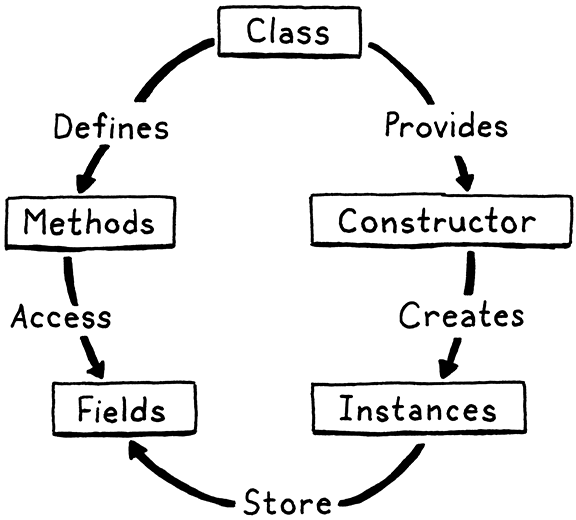
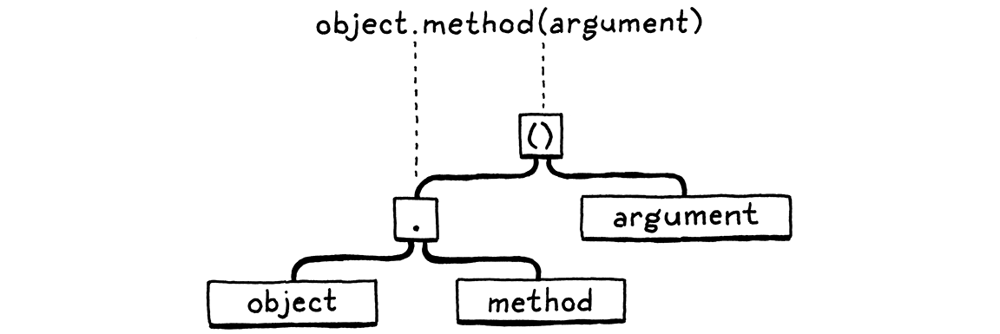
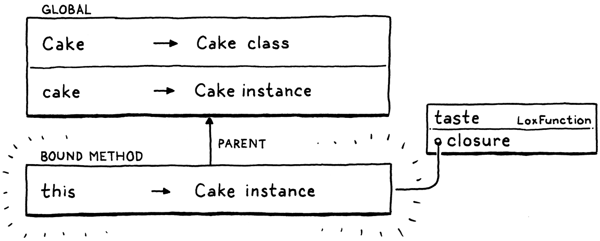

> 如果一个人没有完全了解任何事物的本质，他就没有权利去爱或恨它。伟大的爱来自于对所爱之物的深刻了解，如果你对它知之甚少，你就只能爱一点点，或者根本不爱它。（列奥纳多·达·芬奇）
>
> —— Leonardo da Vinci

我们已经完成了 11 章，你机器上的解释器几乎是一个完整的脚本语言实现了。它可以使用一些内置的数据结构，如列表和 map，当然还需要一个用于文件 IO、用户输入等的核心库。但作为语言本身已经足够了。我们有一个与 BASIC、Tcl、Scheme（不包括宏）以及早期版本的 Python 和 Lua 相同的小程序语言。

如果现在是 80 年代，我们就可以到此为止。但是现在，很多流行的语言都支持“面向对象编程”。在 Lox 中添加该功能，可以为用户提供一套熟悉的工具来编写大型程序。即使你个人不喜欢 OOP，这一章和下一章将帮助你理解别人是如何设计和构建对象系统的[^1]。

## 12.1 面向对象和类

面向对象编程有三大途径：类、[原型](http://gameprogrammingpatterns.com/prototype.html)和[多方法](https://en.wikipedia.org/wiki/Multiple_dispatch)[^2]。类排在第一位，是最流行的风格。随着 JavaScript（其次是[Lua](https://www.lua.org/pil/13.4.1.html)）的兴起，原型也比以前更加广为人知。稍后我们会更多地讨论这些问题。对于 Lox，我们采取的是经典的方法。

既然你已经跟我一起编写了大约 1000 行 Java 代码，我假设你不需要对面向对象进行详细介绍。OOP 的主要目标就是将数据与作用于数据的代码捆绑在一起。用户通过声明一个类来实现这一点：

1. 暴露*构造函数*以创建和初始化该类的新实例

2. 提供在实例上存储和访问*字段*的方法。

3. 定义一组由类的所有实例共享的*方法*，这些方法对各个实例的状态进行操作。



这大概是最低要求。大多数面向对象的语言（一直追溯到 Simula），也都是通过继承来跨类重用行为。我们会在下一章中添加该功能。即使剔除了这些，我们仍然有很多东西需要完成。这是一个很大的章节，直到我们完成上述所有内容之后，才能把所有东西整合到一起。所以请集中精力。

## 12.2 类定义

跟之前一样，我们从语法开始。`class`语句引入了一个新名称，所以它应该在`declaration` 语法规则中。

```
declaration    → classDecl
               | funDecl
               | varDecl
               | statement ;

classDecl      → "class" IDENTIFIER "{" function* "}" ;
```

新的`classDecl`规则依赖于前面定义的`function`规则。复习一下：

```
function       → IDENTIFIER "(" parameters? ")" block ;
parameters     → IDENTIFIER ( "," IDENTIFIER )* ;
```

用简单的英语来说，类声明就是`class`关键字，后跟类的名称，然后是一对花括号包含的主体。在这个主体中，有一个方法声明的列表。与函数声明不同的是，方法没有前导的`fun`关键字。每个方法就是一个名称、参数列表和方法主体。下面是一个例子：

```java
class Breakfast {
  cook() {
    print "Eggs a-fryin'!";
  }

  serve(who) {
    print "Enjoy your breakfast, " + who + ".";
  }
}
```

像大多数动态类型的语言一样，字段没有在类的声明中明确列出。实例是松散的数据包，你可以使用正常的命令式代码自由地向其中添加字段。

在 AST 生成器中，`classDecl`语法规则有自己的语句节点。

_<u>tool/GenerateAst.java，在 main()方法中添加：</u>_

```java
      "Block      : List<Stmt> statements",
      // 新增部分开始
      "Class      : Token name, List<Stmt.Function> methods",
      // 新增部分结束
      "Expression : Expr expression",
```

它存储了类的名称和其主体内的方法。方法使用现有的表示函数声明的 Stmt.Function 类来表示。这就为我们提供了一个方法所需的所有状态：名称、参数列表和方法体。

类可以出现在任何允许名称声明的地方，由前导的`class`关键字来触发。

_<u>lox/Parser.java，在 declaration()方法中添加：</u>_

```java
    try {
      // 新增部分开始
      if (match(CLASS)) return classDeclaration();
      // 新增部分结束
      if (match(FUN)) return function("function");
```

进一步调用：

_<u>lox/Parser.java，在 declaration()方法后添加：</u>_

```java
  private Stmt classDeclaration() {
    Token name = consume(IDENTIFIER, "Expect class name.");
    consume(LEFT_BRACE, "Expect '{' before class body.");

    List<Stmt.Function> methods = new ArrayList<>();
    while (!check(RIGHT_BRACE) && !isAtEnd()) {
      methods.add(function("method"));
    }

    consume(RIGHT_BRACE, "Expect '}' after class body.");

    return new Stmt.Class(name, methods);
  }
```

这比其它大多数解析方法有更多的内容，但它大致上遵循了语法。我们已经使用了`class`关键字，所以我们接下来会查找预期的类名，然后是左花括号。一旦进入主体，我们就继续解析方法声明，直到碰到右花括号。每个方法声明是通过调用`function()`方法来解析的，我们在介绍函数的那一章中定义了该函数。

就像我们在解析器中的所有开放式循环中的操作一样，我们也要检查是否到达文件结尾。这在正确的代码是不会发生的，因为类的结尾应该有一个右花括号，但它可以确保在用户出现语法错误而忘记正确结束类的主体时，解析器不会陷入无限循环。

我们将名称和方法列表封装到 Stmt.Class 节点中，这样就完成了。以前，我们会直接进入解释器中，但是现在我们需要先进入分析器中对节点进行分析。【译者注：为了区分 parse 和 resolve，这里将 resolver 称为分析器，用于对代码中的变量进行分析】

_<u>lox/Resolver.java，在 visitBlockStmt()方法后添加：</u>_

```java
  @Override
  public Void visitClassStmt(Stmt.Class stmt) {
    declare(stmt.name);
    define(stmt.name);
    return null;
  }
```

我们还不用担心针对方法本身的分析，我们目前需要做的是使用类的名称来声明这个类。将类声明为一个局部变量并不常见，但是 Lox 中允许这样做，所以我们需要正确处理。

现在我们解释一下类的声明。

_<u>lox/Interpreter.java，在 visitBlockStmt()方法后添加：</u>_

```java
  @Override
  public Void visitClassStmt(Stmt.Class stmt) {
    environment.define(stmt.name.lexeme, null);
    LoxClass klass = new LoxClass(stmt.name.lexeme);
    environment.assign(stmt.name, klass);
    return null;
  }
```

这看起来类似于我们执行函数声明的方式。我们在当前环境中声明该类的名称。然后我们把类的*语法节点*转换为 LoxClass，即类的*运行时*表示。我们回过头来，将类对象存储在我们之前声明的变量中。这个二阶段的变量绑定过程允许在类的方法中引用其自身。

我们会在整个章节中对其进行完善，但是 LoxClass 的初稿看起来如下：

_<u>lox/LoxClass.java，创建新文件：</u>_

```java
package com.craftinginterpreters.lox;

import java.util.List;
import java.util.Map;

class LoxClass {
  final String name;

  LoxClass(String name) {
    this.name = name;
  }

  @Override
  public String toString() {
    return name;
  }
}
```

字面上看，就是一个对 name 的包装。我们甚至还没有保存类中的方法。不算很有用，但是它确实有一个`toString()`方法，所以我们可以编写一个简单的脚本，测试类对象是否真的被解析和执行。

```java
class DevonshireCream {
  serveOn() {
    return "Scones";
  }
}

print DevonshireCream; // Prints "DevonshireCream".
```

## 12.3 创建实例

我们有了类，但是它们还不能做任何事。Lox 没有可以直接在类本身调用的“静态”方法，所以如果没有实例，类是没有用的。因此，下一步就是实例化。

虽然一些语法和语义在 OOP 语言中是相当标准的，但创建新实例的方式并不是。Ruby，继 Smalltalk 之后，通过调用类对象本身的一个方法来创建实例，这是一种递归的优雅方法[^3]。有些语言，像 C++和 Java，有一个`new`关键字专门用来创建一个新的对象。Python 让你像调用函数一样“调用”类本身。(JavaScript，永远都是那么奇怪，两者兼而有之)

我在 Lox 中采用了一种最简单的方法。我们已经有了类对象，也有了函数调用，所以我们直接使用类对象的调用表达式来创建新的实例。这就好像类是一个生产自身实例的工厂函数。这让我感觉很优雅，也不需要引入`new`这样的语法。因此，我们可以跳过前端直接进入运行时。

现在，如果你试着运行下面的代码：

```java
class Bagel {}
Bagel();
```

你会得到一个运行时错误。`visitCallExpr()`方法会检查被调用的对象是否实现了`LoxCallable` 接口，因为 LoxClass 没有实现所以会报错。只是目前还没有。

_<u>lox/LoxClass.java，替换一行：</u>_

```java
import java.util.Map;
// 替换部分开始
class LoxClass implements LoxCallable {
// 替换部分结束
  final String name;
```

实现该接口需要两个方法。

_<u>lox/LoxClass.java，在 toString()方法后添加:</u>_

```java
  @Override
  public Object call(Interpreter interpreter,
                     List<Object> arguments) {
    LoxInstance instance = new LoxInstance(this);
    return instance;
  }

  @Override
  public int arity() {
    return 0;
  }
```

有趣的是`call()`。当你“调用”一个类时，它会为被调用的类实例化一个新的 LoxInstance 并返回。`arity()` 方法是解释器用于验证你是否向 callable 中传入了正确数量的参数。现在，我们会说你不用传任何参数。当我们讨论用户自定义的构造函数时，我们再重新考虑这个问题。

这就引出了 LoxInstance，它是 Lox 类实例的运行时表示。同样，我们的第一个实现从小处着手。

_<u>lox/LoxInstance.java，创建新文件：</u>_

```java
package com.craftinginterpreters.lox;

import java.util.HashMap;
import java.util.Map;

class LoxInstance {
  private LoxClass klass;

  LoxInstance(LoxClass klass) {
    this.klass = klass;
  }

  @Override
  public String toString() {
    return klass.name + " instance";
  }
}
```

和 LoxClass 一样，它也是相当简陋的，但我们才刚刚开始。如果你想测试一下，可以运行下面的脚本：

```javascript
class Bagel {}
var bagel = Bagel();
print bagel; // Prints "Bagel instance".
```

这段程序没有做太多事，但是已经开始做*一些事情*了。

## 12.4 实例属性

我们有了实例，所以我们应该让它们发挥作用。我们正处于一个岔路口。我们可以首先添加行为（方法），或者我们可以先从状态（属性）开始。我们将选择后者，因为我们后面将会看到，这两者以一种有趣的方式纠缠在一起，如果我们先支持属性，就会更容易理解它们。

Lox 遵循了 JavaScript 和 Python 处理状态的方式。每个实例都是一个开放的命名值集合。实例类中的方法可以访问和修改属性，但外部代码也可以[^4]。属性通过`.`语法进行访问。

```java
someObject.someProperty
```

一个后面跟着`.`和一个标识符的表达式，会从表达式计算出的对象中读取该名称对应的属性。这个点符号与函数调用表达式中的括号具有相同的优先级，所以我们要将该符号加入语法时，可以替换已有的`call`规则如下：

```
call           → primary ( "(" arguments? ")" | "." IDENTIFIER )* ;
```

在基本表达式之后，我们允许跟一系列括号调用和点属性访问的任何混合。属性访问有点拗口，所以自此以后，我们称其为“get 表达式”。

### 12.4.1 Get 表达式

语法树节点是：

_<u>tool/GenerateAst.java，在 main()方法中添加：</u>_

```java
      "Call     : Expr callee, Token paren, List<Expr> arguments",
      // 新增部分开始
      "Get      : Expr object, Token name",
      // 新增部分结束
      "Grouping : Expr expression",
```

按照语法，在现有的`call()`方法中加入新的解析代码。

_<u>lox/Parser.java，在 call()方法中添加代码：</u>_

```java
    while (true) {
      if (match(LEFT_PAREN)) {
        expr = finishCall(expr);
      // 新增部分开始
      } else if (match(DOT)) {
        Token name = consume(IDENTIFIER,
            "Expect property name after '.'.");
        expr = new Expr.Get(expr, name);
      // 新增部分结束
      } else {
        break;
      }
    }
```

外面的`while`循环对应于语法规则中的`*`。随着查找括号和点，我们会沿着标记构建一系列的 call 和 get，就像：


新的 Expr.Get 节点实例会被送入分析器。

_<u>lox/Resolver.java，在 visitCallExpr()方法后添加：</u>_

```java
  @Override
  public Void visitGetExpr(Expr.Get expr) {
    resolve(expr.object);
    return null;
  }
```

好吧，没什么好说的。因为属性是动态查找的，所以不会解析它们。在解析过程中，我们只递归到点符左边的表达式中。实际的属性访问发生在解释器中。

_<u>lox/Interpreter.java，在 visitCallExpr()方法后添加：</u>_

```java
  @Override
  public Object visitGetExpr(Expr.Get expr) {
    Object object = evaluate(expr.object);
    if (object instanceof LoxInstance) {
      return ((LoxInstance) object).get(expr.name);
    }

    throw new RuntimeError(expr.name,
        "Only instances have properties.");
  }
```

首先，我们对属性被访问的表达式求值。在 Lox 中，只有类的实例才具有属性。如果对象是其它类型（如数字），则对其执行 getter 是运行时错误。

如果该对象是 LoxInstance，我们就要求它去查找该属性。现在必须给 LoxInstance 一些实际的状态了。一个 map 就行了。

_<u>lox/LoxInstance.java，在 LoxInstance 类中添加：</u>_

```
  private LoxClass klass;
  // 新增部分开始
  private final Map<String, Object> fields = new HashMap<>();
  // 新增部分结束
  LoxInstance(LoxClass klass) {
```

map 中的每个键是一个属性名称，对应的值就是该属性的值。查找实例中的一个属性：

_<u>lox/LoxInstance.java，在 LoxInstance()方法后添加：</u>_

```java
  Object get(Token name) {
    if (fields.containsKey(name.lexeme)) {
      return fields.get(name.lexeme);
    }

    throw new RuntimeError(name,
        "Undefined property '" + name.lexeme + "'.");
  }
```

我们需要处理的一个有趣的边缘情况是，如果这个实例中*不包含*给定名称的属性，会发生什么。我们可以悄悄返回一些假值，如`nil`，但是根据我对 JavaScript 等语言的经验，这种行为只是掩盖了错误，而没有做任何有用的事。相反，我们将它作为一个运行时错误。

因此，我们首先要做的就是看看这个实例中是否真的包含给定名称的字段。只有这样，我们才会返回其值。其它情况下，我们会引发一个错误。

注意我是如何从讨论“属性”转换到讨论“字段”的。这两者之间有一个微妙的区别。字段是直接保存在实例中的命名状态。属性是 get 表达式可能返回的已命名的*东西*。每个字段都是一个属性，但是正如我们稍后将看到的，并非每个属性都是一个字段。

理论上，我们现在可以读取对象的属性。但是由于没有办法将任何状态真正填充到实例中，所以也没有字段可以访问。在我们测试读取之前，我们需要先支持写入。

### 12.4.2 Set 表达式

setter 和 getter 使用相同的语法，区别只是它们出现在赋值表达式的左侧。

```java
someObject.someProperty = value;
```

在语言方面，我们扩展了赋值规则，允许在左侧使用点标识符。

```
assignment     → ( call "." )? IDENTIFIER "=" assignment
               | logic_or ;
```

与 getter 不同，setter 不使用链。但是，对`call` 规则的引用允许在最后的点符号之前出现任何高优先级的表达式，包括任何数量的*getters*，如：


注意，这里只有最后一部分`.meat`是*setter*。`.omelette`和`.filling`部分都是*get*表达式。

就像我们有两个独立的 AST 节点用于变量访问和变量赋值一样，我们也需要一个 setter 节点来补充 getter 节点。

_<u>tool/GenerateAst.java，在 main()方法中添加：</u>_

```java
      "Logical  : Expr left, Token operator, Expr right",
      // 新增部分开始
      "Set      : Expr object, Token name, Expr value",
      // 新增部分结束
      "Unary    : Token operator, Expr right",
```

也许你不记得了，我们在解析器中处理赋值的方法有点奇怪。在遇到`=`之前，我们无法轻易判断一系列标记是否是一个赋值表达式的左侧部分。现在我们的赋值语法规则在左侧添加了`call`，它可以扩展为任意大的表达式，最后的`=`可能与我们需要知道是否正在解析赋值表达式的地方隔着很多标记。

相对地，我们的技巧就是把左边的表达式作为一个正常表达式来解析。然后，当我们在后面发现等号时，我们就把已经解析的表达式转换为正确的赋值语法树节点。

我们在该转换中添加另一个子句，将左边的 Expr.Get 表达式转化为相应的 Expr.Set 表达式。

_<u>lox/Parser.java，在 assignment()方法中添加：</u>_

```java
        return new Expr.Assign(name, value);
      // 新增部分开始
      } else if (expr instanceof Expr.Get) {
        Expr.Get get = (Expr.Get)expr;
        return new Expr.Set(get.object, get.name, value);
      // 新增部分结束
      }
```

这就是语法解析。我们将该节点推入分析器中。

_<u>lox/Resolver.java，在 visitLogicalExpr()方法后添加：</u>_

```java
  @Override
  public Void visitSetExpr(Expr.Set expr) {
    resolve(expr.value);
    resolve(expr.object);
    return null;
  }
```

同样，像 Expr.Get 一样，属性本身是动态计算的，所以没有什么需要分析的。我们只需要递归到 Expr.Set 的两个子表达式中，即被设置属性的对象和它被设置的值。

这又会把我们引向解释器。

_<u>lox/Interpreter.java，在 visitLogicalExpr()方法后添加：</u>_

```java
  @Override
  public Object visitSetExpr(Expr.Set expr) {
    Object object = evaluate(expr.object);

    if (!(object instanceof LoxInstance)) {
      throw new RuntimeError(expr.name,
                             "Only instances have fields.");
    }

    Object value = evaluate(expr.value);
    ((LoxInstance)object).set(expr.name, value);
    return value;
  }
```

我们先计算出被设置属性的对象，然后检查它是否是一个 LoxInstance。如果不是，这就是一个运行时错误。否则，我们计算设置的值，并将其保存到该实例中。这一步依赖于 LoxInstance 中的一个新方法。

_<u>lox/LoxInstance.java，在 get()方法后添加：</u>_

```java
  void set(Token name, Object value) {
    fields.put(name.lexeme, value);
  }
```

这里没什么复杂的。我们把这些值之间塞入字段所在的 Java map 中。由于 Lox 允许在实例上自由创建新字段，所以不需要检查键是否已经存在。

## 12.5 类中的方法

你可以创建类的实例并将数据填入其中，但是类本身实际上并不能做任何事。实例只是一个 map，而且所有的实例都是大同小异的。为了让它们更像是*类*的实例，我们需要行为——方法。

我们的解析器已经解析了方法声明，所以我们在这部分做的不错。我们也不需要为方法*调用*添加任何新的解析器支持。我们已经有了`.`(getter)和`()`(函数调用)。“方法调用”只是简单地将这些串在一起。



这引出了一个有趣的问题。当这两个表达式分开时会发生什么？假设这个例子中的方法`method`是`object`的类中的一个方法，而不是实例中的 一个字段，下面的代码应该做什么？

```java
var m = object.method;
m(argument);
```

这个程序会“查找”该方法，并将结果（不管是什么）存储到一个变量中，稍后会调用该对象。允许这样吗？你能将方法作为实例中的一个函数来对待吗？

另一个方向呢？

```javascript
class Box {}

fun notMethod(argument) {
  print "called function with " + argument;
}

var box = Box();
box.function = notMethod;
box.function("argument");
```

这个程序创建了一个实例，然后在它的一个字段中存储了一个函数。然后使用与方法调用相同的语法来调用该函数。这样做有用吗？

不同的语言对这些问题有不同的答案。人们可以就此写一篇论文。对于 Lox 来说，这两个问题的答案都是肯定的，它确实有效。我们有几个理由来证明这一点。对于第二个例子——调用存储在字段中的函数——我们想要支持它，是因为头等函数是有用的，而且将它们存储在字段中是一件很正常的事情。

第一个例子就比较晦涩了。一个场景是，用户通常希望能够在不改变程序含义的情况下，将子表达式赋值到一个局部变量中。你可以这样做：

```javascript
breakfast(omelette.filledWith(cheese), sausage);
```

并将其变成这样：

```javascript
var eggs = omelette.filledWith(cheese);
breakfast(eggs, sausage);
```

它做的是同样的事情。同样，由于方法调用中的`.`和`()`是两个独立的表达式，你似乎应该把查询部分提取到一个变量中，然后再调用它[^5]。我们需要仔细思考，当你查找一个方法时你得到的东西是什么，它如何作用，甚至是在一些奇怪的情况下，比如：

```javascript
class Person {
  sayName() {
    print this.name;
  }
}

var jane = Person();
jane.name = "Jane";

var method = jane.sayName;
method(); // ?
```

如果你在某个实例上获取了一个方法的句柄，并在稍后再调用它，它是否能“记住”它是从哪个实例中提取出来的？方法内部的`this`是否仍然指向原始的那个对象？

下面有一个更变态的例子，可以摧毁你的大脑：

```javascript
class Person {
  sayName() {
    print this.name;
  }
}

var jane = Person();
jane.name = "Jane";

var bill = Person();
bill.name = "Bill";

bill.sayName = jane.sayName;
bill.sayName(); // ?
```

最后一行会因为*调用*方法的实体是 bill 而打印“Bill”，还是因为我们第一次获取方法的实例是 jane 而打印“Jane”。

在 Lua 和 JavaScript 中，同样的代码会打印 "Bill"。这些语言并没有真正的“方法”的概念。所有东西都类似于字段中的函数，所以并不清楚`jane` 是否更应该比`bill`“拥有”`sayName`。

不过，Lox 有真正的类语法，所以我们确实知道哪些可调用的东西是方法，哪些是函数。因此，像 Python、C#和其他语言一样，当方法第一次被获取时，我们会让方法与原始实例`this`进行 "绑定"。Python 将这些绑定的方法称为**bound methods**（绑定方法）。

在实践中，这通常也是你想要的。如果你获取到了某个对象中一个方法的引用，这样你以后就可以把它作为一个回调函数使用，你想要记住它所属的实例，即使这个回调被存储在其它对象的字段中。

好吧，这里有很多语义需要装到你的脑子里。暂时先不考虑那些边缘情况了，我们以后再讲。现在，让我们先把基本的方法调用做好。我们已经解析了类主体内的方法声明，所以下一步就是对其分析。

_<u>lox/Resolver.java，在 visitClassStmt()方法内添加[^6]：</u>_

```java
    define(stmt.name);
    // 新增部分开始
    for (Stmt.Function method : stmt.methods) {
      FunctionType declaration = FunctionType.METHOD;
      resolveFunction(method, declaration);
    }
    // 新增部分结束
    return null;
```

我们遍历类主体中的方法，并调用我们已经写好的用来处理函数声明的`resolveFunction()`方法。唯一的区别在于，我们传入了一个新的 FunctionType 枚举值。

_<u>lox/Resolver.java，在 FunctionType 枚举中添加代码，在上一行末尾添加`,`：</u>_

```java
    NONE,
    FUNCTION,
    // 新增部分开始
    METHOD
    // 新增部分结束
  }
```

这一点在我们分析`this`表达式时很重要。现在还不用担心这个问题。有趣的部分在解释器中。

_<u>lox/Interpreter.java，在 visitClassStmt()方法中替换一行：</u>_

```java
    environment.define(stmt.name.lexeme, null);
    // 替换部分开始
    Map<String, LoxFunction> methods = new HashMap<>();
    for (Stmt.Function method : stmt.methods) {
      LoxFunction function = new LoxFunction(method, environment);
      methods.put(method.name.lexeme, function);
    }

    LoxClass klass = new LoxClass(stmt.name.lexeme, methods);
    // 替换部分结束
    environment.assign(stmt.name, klass);
```

当我们解释一个类声明语句时，我们把类的语法表示（其 AST 节点）变成它的运行时表示。现在，我们也需要对类中包含的方法进行这样的操作。每个方法声明都会变成一个 LoxFunction 对象。

我们把所有这些都打包到一个 map 中，以方法名称作为键。这些数据存储在 LoxClass 中。

_<u>lox/LoxClass.java，在类 LoxClass 中，替换 4 行：</u>_

```java
  final String name;
  // 替换部分开始
  private final Map<String, LoxFunction> methods;

  LoxClass(String name, Map<String, LoxFunction> methods) {
    this.name = name;
    this.methods = methods;
  }
  // 替换部分结束
  @Override
  public String toString() {
```

实例存储状态，类存储行为。LoxInstance 包含字段的 map，而 LoxClass 包含方法的 map。虽然方法是归类所有，但仍然是通过类的实例来访问。

_<u>lox/LoxInstance.java，在 get()方法中添加：</u>_

```java
  Object get(Token name) {
    if (fields.containsKey(name.lexeme)) {
      return fields.get(name.lexeme);
    }
    // 新增部分开始
    LoxFunction method = klass.findMethod(name.lexeme);
    if (method != null) return method;
    // 新增部分结束
    throw new RuntimeError(name,
        "Undefined property '" + name.lexeme + "'.");
```

在实例上查找属性时，如果我们没有找到匹配的字段，我们就在实例的类中查找是否包含该名称的方法。如果找到，我们就返回该方法[^7]。这就是“字段”和“属性”之间的区别变得有意义的地方。当访问一个属性时，你可能会得到一个字段（存储在实例上的状态值），或者你会得到一个实例类中定义的方法。

方法是通过下面的代码进行查找的：

_<u>lox/LoxClass.java，在 LoxClass()方法后添加：</u>_

```java
  LoxFunction findMethod(String name) {
    if (methods.containsKey(name)) {
      return methods.get(name);
    }

    return null;
  }
```

你大概能猜到这个方法后面会变得更有趣。但是现在，在类的方法表中进行简单的映射查询就足够了。试一下：

```javascript
class Bacon {
  eat() {
    print "Crunch crunch crunch!";
  }
}

Bacon().eat(); // Prints "Crunch crunch crunch!".
```

## 12.6 This

我们可以在对象上定义行为和状态，但是它们并没有被绑定在一起。在一个方法中，我们没有办法访问“当前”对象（调用该方法的实例）的字段，也不能调用同一个对象的其它方法。

为了获得这个实例，它需要一个名称。Smalltalk、Ruby 和 Swift 使用 "self"。Simula、C++、Java 等使用 "this"。Python 按惯例使用 "self"，但从技术上讲，你可以随便叫它什么。

对于 Lox 来说，因为我们通常遵循 Java 风格，我们会使用“this”。在方法体中，`this`表达式计算结果为调用该方法的实例。或者，更确切地说，由于方法是分为两个步骤进行访问和调用的，因此它会引用调用方法的对象。

这使得我们的工作更加困难。请看：

```javascript
class Egotist {
  speak() {
    print this;
  }
}

var method = Egotist().speak;
method();
```

在倒数第二行，我们从该类的一个实例中获取到了指向`speak()` 的引用。这个操作会返回一个函数，并且该函数需要记住它来自哪个实例，这样稍后在最后一行，当函数被调用时，它仍然可用找到对应实例。

我们需要在方法被访问时获取到`this`，并将其附到函数上，这样当我们需要的时候它就一直存在。嗯…一种存储函数周围的额外数据的方法，嗯？听起来很像一个闭包，不是吗？

如果我们把`this`定义为在查找方法时返回的函数外围环境中的一个隐藏变量，那么稍后在方法主体中使用`this`时就可以找到它了。LoxFunction 已经具备了保持外围环境的能力，所以我们已经有了需要的机制。

我们通过一个例子来看看它是如何工作的：

```javascript
class Cake {
  taste() {
    var adjective = "delicious";
    print "The " + this.flavor + " cake is " + adjective + "!";
  }
}

var cake = Cake();
cake.flavor = "German chocolate";
cake.taste(); // Prints "The German chocolate cake is delicious!".
```

当我们第一次执行类定义时，我们为`taste()`创建了一个 LoxFunction。它的闭包是类外围的环境，在这个例子中就是全局环境。所以我们在类的方法 map 中保存的 LoxFunction 看起来像是这样的：


当我们执行`cake.taste`这个 get 表达式时，我们会创建一个新的环境，其中将`this`绑定到了访问该方法的对象（这里是`cake`）。然后我们创建一个*新*的 LoxFunction，它的代码与原始的代码相同，但是使用新环境作为其闭包。



这个是在执行方法名的 get 表达式时返回的 LoxFunction。当这个函数稍后被一个`()`表达式调用时，我们像往常一样为方法主体创建一个环境。


主体环境的父环境，也就是我们先前创建并在其中将`this`绑定到当前对象的那个环境。因此，在函数主体内使用`this`都可以成功解析到那个实例。

重用环境代码来实现`this`时，也需要注意方法和函数交互的情况，比如：

```javascript
class Thing {
  getCallback() {
    fun localFunction() {
      print this;
    }

    return localFunction;
  }
}

var callback = Thing().getCallback();
callback();
```

例如，在 JavaScript 中，在一个方法中返回一个回调函数是很常见的。这个回调函数可能希望保留对方法所关联的原对象（`this`值）的访问。我们现有的对闭包和环境链的支持应该可以正确地做到这一点。

让我们把它写出来。第一步是为`this`添加新的语法。

_<u>tool/GenerateAst.java，在 main()方法中添加：</u>_

```java
      "Set      : Expr object, Token name, Expr value",
      // 新增部分开始
      "This     : Token keyword",
      // 新增部分结束
      "Unary    : Token operator, Expr right",
```

解析很简单，因为它是已经被词法解析器当作关键字识别出来的单个词法标记。

_<u>lox/Parser.java，在 primary()方法中添加：</u>_

```java
      return new Expr.Literal(previous().literal);
    }
    // 新增部分开始
    if (match(THIS)) return new Expr.This(previous());
    // 新增部分结束
    if (match(IDENTIFIER)) {
```

当进入分析器后，就可以看到 `this` 是如何像变量一样工作的。

_<u>lox/Resolver.java，在 visitSetExpr()方法后添加：</u>_

```java
  @Override
  public Void visitThisExpr(Expr.This expr) {
    resolveLocal(expr, expr.keyword);
    return null;
  }
```

我们使用`this`作为“变量”的名称，并像其它局部变量一样对其分析。当然，现在这是行不通的，因为“this”没有在任何作用域进行声明。我们在`visitClassStmt()`方法中解决这个问题。

_<u>lox/Resolver.java，在 visitClassStmt()方法中添加：</u>_

```java
    define(stmt.name);
    // 新增部分开始
    beginScope();
    scopes.peek().put("this", true);
    // 新增部分结束
    for (Stmt.Function method : stmt.methods) {
```

在我们开始分析方法体之前，我们推入一个新的作用域，并在其中像定义变量一样定义“this”。然后，当我们完成后，会丢弃这个外围作用域。

_<u>lox/Resolver.java，在 visitClassStmt()方法中添加：</u>_

```java
    }
    // 新增部分开始
    endScope();
    // 新增部分结束
    return null;
```

现在，只要遇到`this`表达式（至少是在方法内部），它就会解析为一个“局部变量”，该变量定义在方法体块之外的隐含作用域中。

分析器对`this`有一个新的*作用域*，所以解释器需要为它创建一个对应的*环境*。记住，我们必须始终保持分析器的作用域链与解释器的链式环境保持同步。在运行时，我们在找到实例上的方法后创建环境。我们把之前那行直接返回方法对应 LoxFunction 的代码替换如下：

_<u>lox/LoxInstance.java，在 get()方法中替换一行：</u>_

```java
    LoxFunction method = klass.findMethod(name.lexeme);
    // 替换部分开始
    if (method != null) return method.bind(this);
    // 替换部分结束
    throw new RuntimeError(name,
        "Undefined property '" + name.lexeme + "'.");
```

注意这里对`bind()`的新调用。该方法看起来是这样的：

_<u>lox/LoxFunction.java，在 LoxFunction()方法后添加：</u>_

```java
  LoxFunction bind(LoxInstance instance) {
    Environment environment = new Environment(closure);
    environment.define("this", instance);
    return new LoxFunction(declaration, environment);
  }
```

这没什么好说的。我们基于方法的原始闭包创建了一个新的环境。就像是闭包内的闭包。当方法被调用时，它将变成方法体对应环境的父环境。

我们将`this`声明为该环境中的一个变量，并将其绑定到给定的实例（即方法被访问时的实例）上。就是这样，现在返回的 LoxFunction 带着它自己的小持久化世界，其中的“this”被绑定到对象上。

剩下的任务就是解释那些`this`表达式。与分析器类似，与解释变量表达式是一样的。

_<u>lox/Interpreter.java，在 visitSetExpr()方法后添加：</u>_

```java
  @Override
  public Object visitThisExpr(Expr.This expr) {
    return lookUpVariable(expr.keyword, expr);
  }
```

来吧，用前面那个蛋糕的例子试一试。通过添加不到 20 行代码，我们的解释器就能处理方法内部的`this`，甚至能以各种奇怪的方式与嵌套类、方法内部的函数、方法句柄等进行交互。

### 12.6.1 this 的无效使用

等一下，如果你尝试在方法之外使用`this`会怎么样？比如：

```java
print this;
```

或者：

```javascript
fun notAMethod() {
  print this;
}
```

如果你不在一个方法中，就没有可供`this`指向的实例。我们可以给它一些默认值如`nil`或者抛出一个运行时错误，但是用户显然犯了一个错误。他们越早发现并纠正这个错误，就会越高兴。

我们的分析过程是一个静态检测这个错误的好地方。它已经检测了函数之外的`return`语句。我们可以针对`this`做一些类似的事情。在我们现有的 FunctionType 枚举的基础上，我们定义一个新的 ClassType 枚举。

_<u>lox/Resolver.java，在 FunctionType 枚举后添加：</u>_

```java
  }
  // 新增部分开始
  private enum ClassType {
    NONE,
    CLASS
  }

  private ClassType currentClass = ClassType.NONE;
  // 新增部分结束
  void resolve(List<Stmt> statements) {
```

是的，它可以是一个布尔值。当我们谈到继承时，它会扩展第三个值，因此使用了枚举。我们还添加了一个相应的字段`currentClass`。它的值告诉我们，在遍历语法树时，我们目前是否在一个类声明中。它一开始是`NONE`，意味着我们不在类中。

当我们开始分析一个类声明时，我们会改变它。

_<u>lox/Resolver.java，在 visitClassStmt()方法中添加：</u>_

```java
  public Void visitClassStmt(Stmt.Class stmt) {
    // 新增部分开始
    ClassType enclosingClass = currentClass;
    currentClass = ClassType.CLASS;
    // 新增部分结束
    declare(stmt.name);
```

与`currentFunction`一样，我们将字段的前一个值存储在一个局部变量中。这样我们可以在 JVM 中保持一个`currentClass`的栈。如果一个类嵌套在另一个类中，我们就不会丢失对前一个值的跟踪。

一旦这么方法完成了分析，我们通过恢复旧值来“弹出”堆栈。

_<u>lox/Resolver.java,在 visitClassStmt()方法中添加：</u>_

```java
    endScope();
    // 新增部分开始
    currentClass = enclosingClass;
    // 新增部分结束
    return null;
```

当我们解析`this`表达式时，如果表达式没有出现在一个方法体内，`currentClass`就为我们提供了报告错误所需的数据。

_<u>lox/Resolver.java，在 visitThisExpr()方法中添加：</u>_

```java
  public Void visitThisExpr(Expr.This expr) {
    // 新增部分开始
    if (currentClass == ClassType.NONE) {
      Lox.error(expr.keyword,
          "Can't use 'this' outside of a class.");
      return null;
    }
    // 新增部分结束
    resolveLocal(expr, expr.keyword);
```

这应该能帮助用户正确地使用`this`，并且它使我们不必在解释器运行时中处理这个误用问题。

## 12.7 构造函数和初始化

我们现在几乎可以用类来做任何事情，而当我们接近本章结尾时，却发现自己奇怪地专注于开头。方法和字段让我们把状态和行为封装在一起，这样一个对象就能始终保持在有效的配置状态。但我们如何确保一个全新的对象是以良好的状态开始的？

为此，我们需要构造函数。我发现它们是语言设计中最棘手的部分之一，如果你仔细观察大多数其它语言，就会发现围绕着对象构造的缺陷，设计的接缝并不完全吻合[^8]。也许在一开始就存在本质上的混乱。

“构造”一个对象实际上是一对操作：

1. 运行时为一个新的实例*分配*所需的内存。在多数语言中，这个操作是在用户代码可以访问的层面之下的基础层完成的[^9]。

2. 然后，用户提供的一大块代码被调用，以初始化未成形的对象。

当我们听到“构造函数”时，我们往往会想到后者，但语言本身在此之前通常已经为我们做了一些基础工作。事实上，我们的 Lox 解释器在创建一个新的 LoxInstance 对象时已经涵盖了这一点。

我们现在要做的是剩下的部分——用户自定义的初始化。对于为类建立新对象的这块代码，不同的语言有不同的说法。C++、Java 和 C#使用一个名字与类名相匹配的方法。Ruby 和 Python 称之为` init()`。后者又好又简短，所以我们采用它。

在 LoxClass 的 LoxCallable 实现中，我们再增加几行。

_<u>lox/LoxClass.java,在 call()方法中添加：</u>_

```java
                     List<Object> arguments) {
    LoxInstance instance = new LoxInstance(this);
    // 新增部分开始
    LoxFunction initializer = findMethod("init");
    if (initializer != null) {
      initializer.bind(instance).call(interpreter, arguments);
    }
    // 新增部分结束
    return instance;
```

当一个类被调用时，在 LoxInstance 被创建后，我们会寻找一个 "init "方法。如果我们找到了，我们就会立即绑定并调用它，就像普通的方法调用一样。参数列表直接透传。

这个参数列表意味着我们也需要调整类声明其元数的方式。

```java
  public int arity() {
```

_<u>lox/LoxClass.java，在 arity()方法中替换一行：</u>_

```java
  public int arity() {
    // 替换部分开始
    LoxFunction initializer = findMethod("init");
    if (initializer == null) return 0;
    return initializer.arity();
    // 替换部分结束
  }
```

如果有初始化方法，该方法的元数就决定了在调用类本身的时候需要传入多少个参数。但是，为了方便起见，我们并不要求类定义初始化方法。如果你没有初始化方法，元数仍然是 0。

基本上就是这样了。因为我们在调用`init()`方法之前已经将其绑定，所以它可以在方法体内访问`this`。这样，连同传递给类的参数，你就可以按照自己的意愿设置新实例了。

### 12.7.1 直接执行 init()

像往常一样，探索这一新的语义领域会催生出一些奇怪的事物。考虑一下：

```javascript
class Foo {
  init() {
    print this;
  }
}

var foo = Foo();
print foo.init();
```

你能否通过直接调用对象的`init()`方法对其进行“重新初始化”？如果可以，它的返回值是什么？一个合理的答案应该是`nil`，因为这是方法主体返回的内容。

然而，我通常不喜欢为满足实现而妥协[^10]，如果我们让`init()`方法总是返回`this`（即使是被直接调用时），它会使 clox 中的构造函数实现更加简单。为了保持 jlox 与之兼容，我们在 LoxFunction 中添加了一些针对特殊情况的代码。

_<u>lox/LoxFunction.java，在 call()方法中添加：</u>_

```java
      return returnValue.value;
    }
    // 新增部分开始
    if (isInitializer) return closure.getAt(0, "this");
    // 新增部分结束
    return null;
```

如果该函数是一个初始化方法，我们会覆盖实际的返回值并强行返回`this`。这个操作依赖于一个新的`isInitializer`字段。

_<u>lox/LoxFunction.java，在 LoxFunction 类中，替换一行：</u>_

```java
  private final Environment closure;
  // 替换部分开始
  private final boolean isInitializer;

  LoxFunction(Stmt.Function declaration, Environment closure, boolean isInitializer) {
    this.isInitializer = isInitializer;
    // 替换部分结束
    this.closure = closure;
    this.declaration = declaration;
```

我们不能简单地检查 LoxFunction 的名字是否为“init”，因为用户可能已经定义了一个同名的*函数*。在这种情况下，是没有`this`可供返回的。为了避免这种奇怪的边缘情况，我们将直接存储 LoxFunction 是否表示一个初始化方法。这意味着我们需要回头修正我们创建 LoxFunctions 的几个地方。

_<u>lox/Interpreter.java，在 visitFunctionStmt()方法中，替换一行：</u>_

```java
  public Void visitFunctionStmt(Stmt.Function stmt) {
    // 替换部分开始
    LoxFunction function = new LoxFunction(stmt, environment, false);
    // 替换部分结束
    environment.define(stmt.name.lexeme, function);
```

对于实际的函数声明， `isInitializer`取值总是 false。对于方法来说，我们检查其名称。

_<u>lox/Interpreter.java，在 visitClassStmt()方法中，替换一行：</u>_

```java
    for (Stmt.Function method : stmt.methods) {
      // 替换部分开始
      LoxFunction function = new LoxFunction(method, environment,
          method.name.lexeme.equals("init"));
      // 替换部分结束
      methods.put(method.name.lexeme, function);
```

然后在`bind()`方法，在创建闭包并将`this`绑定到新方法时，我们将原始方法的值传递给新方法。

_<u>lox/LoxFunction.java，在 bind()方法中，替换一行：</u>_

```java
    environment.define("this", instance);
    // 替换部分开始
    return new LoxFunction(declaration, environment,
                           isInitializer);
    // 替换部分结束
  }
```

### 12.7.2 从 init()返回

我们还没有走出困境。我们一直假设用户编写的初始化方法不会显式地返回一个值，因为大多数构造函数都不会。如果用户尝试这样做会发生什么：

```java
class Foo {
  init() {
    return "something else";
  }
}
```

这肯定不会按照用户的期望执行，所以我们不妨把它作为一种静态错误。回到分析器中，我们为 FunctionType 添加另一种情况。

_<u>lox/Resolver.java，在 FunctionType 枚举中添加：</u>_

```java
    FUNCTION,
    // 新增部分开始
    INITIALIZER,
    // 新增部分结束
    METHOD
```

我们通过被访问方法的名称来确定我们是否在分析一个初始化方法。

_<u>lox/Resolver.java，在 visitClassStmt()方法中添加：</u>_

```java
      FunctionType declaration = FunctionType.METHOD;
      // 新增部分开始
      if (method.name.lexeme.equals("init")) {
        declaration = FunctionType.INITIALIZER;
      }
      // 新增部分结束
      resolveFunction(method, declaration);
```

当我们稍后遍历`return`语句时，我们会检查该字段，如果从`init()`方法内部返回一个值时就抛出一个错误。

_<u>lox/Resolver.java，在 visitReturnStmt()方法中添加：</u>_

```java
    if (stmt.value != null) {
      // 新增部分开始
      if (currentFunction == FunctionType.INITIALIZER) {
        Lox.error(stmt.keyword,
            "Can't return a value from an initializer.");
      }
      // 新增部分结束
      resolve(stmt.value);
```

我们*仍然*没有结束。我们静态地禁止了从初始化方法返回一个值，但是你仍然可用使用一个空的`return`。

```java
class Foo {
  init() {
    return;
  }
}
```

有时候这实际上是有用的，所以我们不想完全禁止它。相对地，它应该返回`this`而不是`nil`。这在 LoxFunction 中很容易解决。

_<u>lox/LoxFunction.java，在 call()方法中添加：</u>_

```java
    } catch (Return returnValue) {
      // 新增部分开始
      if (isInitializer) return closure.getAt(0, "this");
      // 新增部分结束
      return returnValue.value;
```

如果我们在一个初始化方法中执行`return`语句时，我们仍然返回`this`，而不是返回值（该值始终是`nil`）。

吁！这是一大堆任务，但是我们的收获是，我们的小解释器已经成长为一个完整的编程范式。类、方法、字段、`this`以及构造函数，我们的语言看起来已经非常成熟了。

[^1]: 但是，如果你真的讨厌类，也可以跳过这两章。它们与本书的其它部分是相当孤立的。就我个人而言，我觉得多了解自己不喜欢的对象是好事。有些事情乍一看很简单，但当我近距离观看时，细节出现了，我也获得了一个更细致入微的视角。
[^2]: Multimethods 是你最不可能熟悉的方法。我很想多谈论一下它们——我曾经围绕它们设计了一个[业余语言](http://magpie-lang.org/)，它们特别棒——但是我只能装下这么多页面了。如果你想了解更多，可以看看[CLOS](https://en.wikipedia.org/wiki/Common_Lisp_Object_System) (Common Lisp 中的对象系统), [Dylan](https://opendylan.org/), [Julia](https://julialang.org/), 或 [Raku](https://docs.raku.org/language/functions#Multi-dispatch)。
[^3]: 在 Smalltalk 中，甚至连类也是通过现有对象（通常是所需的超类）的方法来创建的。有点像是一直向下龟缩。最后，它会在一些神奇的类上触底，比如 Object 和 Metaclass，它们是运行时凭空创造出来的。
[^4]: 允许类之外的代码直接修改对象的字段，这违背了面向对象的原则，即类封装状态。有些语言采取了更有原则的立场。在 SmallTalk 中，字段实际上是使用简单的标识符访问的，这些标识符是类方法作用域内的变量。Ruby 使用@后跟名字来访问对象中的字段。这种语法只有在方法中才有意义，并且总是访问当前对象的状态。不管怎样，Lox 对 OOP 的信仰并不是那么虔诚。
[^5]: 它的经典用途之一就是回调。通常，你想要传递一个回调函数，其主体只是调用某个对象上的一个方法。既然能够找到该方法并直接传递它，就省去了手动声明一个函数对其进行包装的麻烦工作。比较一下下面两段代码：

```java
// 方式1
fun callback(a, b, c) {
  object.method(a, b, c);
}

takeCallback(callback);

// 方式2
takeCallback(object.method);
```

[^6]: 现在将函数类型保存到一个局部变量中是没有意义的，但我们稍后会扩展这段代码，到时它就有意义了。
[^7]: 首先寻找字段，意味着字段会遮蔽方法，这是一个微妙但重要的语义点。
[^8]: 举几个例子：在 Java 中，尽管 final 字段必须被初始化，但仍有可能在被初始化之前被读取。异常（一个庞大而复杂的特性）被添加到 C++中主要是作为一种从构造函数发出错误的方式。
[^9]: C++中的 "[placement new](https://en.wikipedia.org/wiki/Placement_syntax) "是一个罕见的例子，在这种情况下，分配的内存被暴露出来供程序员使用。
[^10]: 也许“不喜欢”这个说法太过激了。让语言实现的约束和资源影响语言的设计是合理的。一天只有这么多时间，如果在这里或那里偷工减料可以让你在更短的时间内为用户提供更多的功能，这可能会大大提高用户的幸福感和工作效率。诀窍在于，要弄清楚哪些弯路不会导致你的用户和未来的自己不会咒骂你的短视行为

---

## 习题

1. 我们有实例上的方法，但是没有办法定义可以直接在类对象上调用的“静态”方法。添加对它们的支持，在方法之前使用`class`关键字指示该方法是一个挂载在类对象上的静态方法。

   ```java
   class Math {
     class square(n) {
       return n * n;
     }
   }

   print Math.square(3); // Prints "9".
   ```

   你可以用你喜欢的方式解决这问题，但是 Smalltalk 和 Ruby 使用的“[metaclasses](https://en.wikipedia.org/wiki/Metaclass)” 是一种特别优雅的方法。_提示：让 LoxClass 继承 LoxInstance，然后开始实现。_

2. 大多数现代语言都支持“getters”和“setters”——类中的成员，看起来像是字段的读写，但实际上执行的用户自定义的代码。扩展 Lox 以支持 getter 方法。这些方法在声明时没有参数列表。当访问具有该名称的属性时，会执行 getter 的主体。

   ```java
   class Circle {
     init(radius) {
       this.radius = radius;
     }

     area {
       return 3.141592653 * this.radius * this.radius;
     }
   }

   var circle = Circle(4);
   print circle.area; // Prints roughly "50.2655".
   ```

3. Python 和 JavaScript 允许你从对象自身的方法之外的地方自由访问对象的字段。Ruby 和 Smalltalk 封装了实例状态。只有类上的方法可以访问原始字段，并且由类来决定哪些状态被暴露。大多数静态类型的语言都提供了像`private`和`public`这样的修饰符，以便按成员维度控制类的哪些部分可以被外部访问。

   这些方式之间的权衡是什么？为什么一门语言可能会更偏爱某一种方法？

---

## 设计笔记：原型与功率

在本章中，我们引入了两个新的运行时实体，LoxClass 和 LoxInstance。前者是对象的行为所在，后者则是状态所在。如果你可以在 LoxInstance 的单个对象中定义方法，会怎么样？这种情况下，我们根本就不需要 LoxClass。LoxInstance 将是一个用于定义对象行为和状态的完整包。

我们仍然需要一些方法，在没有类的情况下，可以跨多个实例重用对象行为。我们可以让一个 LoxInstance 直接[委托](https://en.wikipedia.org/wiki/Prototype-based_programming#Delegation)给另一个 LoxInstance 来重用它的字段和方法，有点像继承。

用户可以将他们的程序建模为一组对象，其中一些对象相互委托以反映共性。用作委托的对象代表“典型”或“原型”对象，会被其它对象完善。结果就是会有一个更简单的运行时，只有一个内部结构 LoxInstance。

这就是这种范式的名称“[原型](https://en.wikipedia.org/wiki/Prototype-based_programming)”的由来。它是由 David Ungar 和 Randall Smith 在一种叫做[Self](http://www.selflanguage.org/)的语言中发明的。他们从 Smalltalk 开始，按照上面的练习，看他们能把它缩减到什么程度，从而想到了这个方法。

长期以来，原型一直是学术上的探索，它是一个引人入胜的东西，也产生了有趣的研究，但是并没有在更大的编程世界中产生影响。直到 Brendan Eich 把原型塞进 JavaScript，然后迅速风靡世界。关于 JavaScript 中的原型，人们已经写了很多（许多）文字。这是否能够表明原型是出色的还是令人困惑的，或者兼而有之？这是一个开放的问题。

我不会去讨论原型对于一门语言来说是不是一个好主意。基于原型和基于类的语言我都做过，我对两者的看法很复杂。我想讨论的是*简单性*在一门语言中的作用。

原型比类更简单——语言实现者要编写的代码更少，语言用户要学习和理解的概念更少。这是否意味着它让语言变得更好呢？我们这些语言书呆子有一种迷恋极简主义的倾向。就我个人而言，我认为简单性只是一部分。我们真正想给用户的是功率，我将其定义为：

```
power = breadth × ease ÷ complexity
功率 = 广度 × 易用性 ÷ 复杂性
```

这些都不是精确的数字度量。我这里用数学作比喻，而不是实际的量化。

- **广度**是语言可以表达的不同事物的范围。C 语言具有很大的广度——从操作系统到用户应用程序再到游戏，它被广泛使用。像 AppleScript 和 Matlab 这样的特定领域语言的广度相对较小。
- 易用性是指用户付出多少努力就可以用语言做想做的事。“可用性 Usability”是另一个概念，它包含的内容比我想要表达的更多。“高级”语言往往比“低级”语言更容易使用。大多数语言都有一个核心，对它们来说，有些东西比其它的更容易表达。
- 复杂性是指语言的规模（包括其运行时、核心库、工具、生态等）有多大。人们谈论一种语言的规范有多少页，或者它有多少个关键词。这是指用户在使用系统之前，必须在先学习多少东西，才能产生效益。它是简单性的反义词。

降低复杂性确实可以提高功率，分母越小，得到的值就越大，所以我们直觉认为“简单的是好的”是对的。然而，在降低复杂性时，我们必须注意不要在这个过程中牺牲广度或易用性，否则总功率可能会下降。如果去掉字符串，Java 将变成一种严格意义上的简单语言，但它可能无法很好地处理文本操作任务，也不会那么容易完成事情。

因此，关键就在于找到可以省略的意外复杂性，也就是哪些没有通过增加语言广度或语言易用性来体现其重要性的语言特性与交互。

如果用户想用对象的类别来表达他们的程序，那么在语言中加入类就能提高这类操作的便利性，希望能有足够大的提升幅度来弥补所增加的复杂性。但如果这不是用户使用您的语言的方式，那么无论如何都不要使用类。
