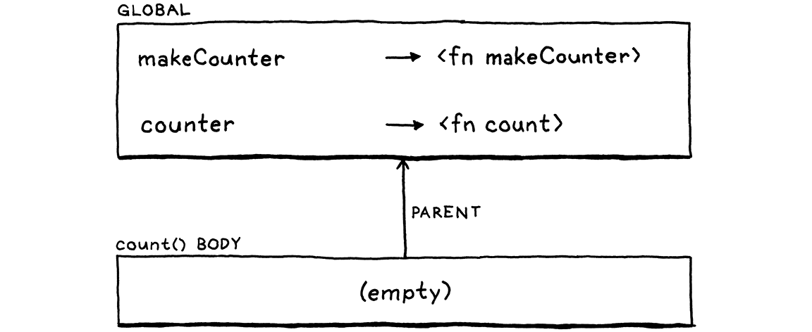

> 这也是人类思维的运作方式——将旧的想法复合成为新结构，成为新的想法，而这些想法本身又可以被用于复合，循环往复，无休无止，越来越远离每一种语言赖以生存的基本的土壤。
>
> —— Douglas R. Hofstadter, _I Am a Strange Loop_

这一章标志着很多艰苦工作的一个高潮。在前面的章节中，各自添加了一些有用的功能，但是每一章也都提供了一个拼图的碎片。我们整理这些碎片——表达式、语句、变量、控制流和词法作用域，再加上其它功能，并把他们组合起来，以支持真正的用户定义函数和函数调用。

## 10.1 函数调用

你肯定熟悉 C 语言风格的函数调用语法，但其语法可能比你意识到的更微妙。调用通常是指向命名的函数，例如：

```java
average(1, 2);
```

但是被调用函数的名称实际上并不是调用语法的一部分。被调用者（ **callee**）可以是计算结果为一个函数的任何表达式。(好吧，它必须是一个非常高优先级的表达式，但是圆括号可以解决这个问题。)例如：

```java
getCallback()();
```

这里有两个函数调用。第一对括号将`getCallback`作为其被调用者。但是第二对括号将整个`getCallback()` 表达式作为其被调用者。表达式后面的小括号表示函数调用，你可以把调用看作是一种以`(`开头的后缀运算符。

这个“运算符”比其它运算符（包括一元运算符）有更高的优先级。所以我们通过让`unary`规则跳转到新的`call`规则，将其添加到语法中[^1]。

```javascript
unary          → ( "!" | "-" ) unary | call ;
call           → primary ( "(" arguments? ")" )* ;
```

该规则匹配一个基本表达式，后面跟着 0 个或多个函数调用。如果没有括号，则解析一个简单的基本表达式。否则，每一对圆括号都表示一个函数调用，圆括号内有一个可选的参数列表。参数列表语法是：

```javascript
arguments      → expression ( "," expression )* ;
```

这个规则要求至少有一个参数表达式，后面可以跟 0 个或多个其它表达式，每两个表达式之间用`,`分隔。为了处理无参调用，`call`规则本身认为整个`arguments`生成式是可选的。

我承认，对于极其常见的 "零或多个逗号分隔的事物 "模式来说，这在语法上似乎比你想象的更难处理。有一些复杂的元语法可以更好地处理这个问题，但在我们的 BNF 和我见过的许多语言规范中，它就是如此的麻烦。

在我们的语法树生成器中，我们添加一个新节点。

_<u>tool/GenerateAst.java，在 main()方法中添加代码：</u>_

```
      "Binary   : Expr left, Token operator, Expr right",
      // 新增部分开始
      "Call     : Expr callee, Token paren, List<Expr> arguments",
      // 新增部分结束
      "Grouping : Expr expression",
```

它存储了被调用者表达式和参数表达式列表，同时也保存了右括号标记。当我们报告由函数调用引起的运行时错误时，会使用该标记的位置。


打开解析器，原来`unary()`直接跳转到`primary()`方法，将其修改为调用`call()`。

_<u>lox/Parser.java，在 unary()方法中替换一行：</u>_

```java
      return new Expr.Unary(operator, right);
    }
    // 替换部分开始
    return call();
    // 替换部分结束
  }
```

该方法定义为：

_<u>lox/Parser.java，在 unary()方法后添加[^2]：</u>_

```java
  private Expr call() {
    Expr expr = primary();

    while (true) {
      if (match(LEFT_PAREN)) {
        expr = finishCall(expr);
      } else {
        break;
      }
    }

    return expr;
  }
```

这里的代码与语法规则并非完全一致。为了保持代码简洁，我调整了一些东西——这是我们手写解析器的优点之一。但它与我们解析中缀运算符的方式类似。首先，我们解析一个基本表达式，即调用的左操作数。然后，每次看到`(`，我们就调用`finishCall()`解析调用表达式，并使用之前解析出的表达式作为被调用者。返回的表达式成为新的`expr`，我们循环检查其结果是否被调用。

解析参数列表的代码在下面的工具方法中：

_<u>lox/Parser.java，在 unary()方法后添加：</u>_

```java
  private Expr finishCall(Expr callee) {
    List<Expr> arguments = new ArrayList<>();
    if (!check(RIGHT_PAREN)) {
      do {
        arguments.add(expression());
      } while (match(COMMA));
    }

    Token paren = consume(RIGHT_PAREN,
                          "Expect ')' after arguments.");

    return new Expr.Call(callee, paren, arguments);
  }
```

这或多或少是`arguments` 语法规则翻译成代码的结果，除了我们这里还处理了无参情况。我们首先判断下一个标记是否`)`来检查这种情况。如果是，我们就不会尝试解析任何参数。

如果不是，我们就解析一个表达式，然后寻找逗号（表明后面还有一个参数）。只要我们在表达式后面发现逗号，就会继续解析表达式。当我们找不到逗号时，说明参数列表已经结束，我们继续消费预期的右括号。最终，我们将被调用者和这些参数封装成一个函数调用的 AST 节点。

### 10.1.1 最大参数数量

现在，我们解析参数的循环是没有边界的。如果你想调用一个函数并向其传递一百万个参数，解析器不会有任何问题。我们要对此进行限制吗？

其它语言采用了不同的策略。C 语言标准要求在符合标准的实现中，一个函数至少要支持 127 个参数，但是没有指定任何上限。Java 规范规定一个方法可以接受不超过 255 个参数[^3]。

Lox 的 Java 解释器实际上并不需要限制，但是设置一个最大的参数数量限制可以简化第三部分中的字节码解释器。即使是在这样奇怪的地方里，我们也希望两个解释器能够相互兼容，所以我们为 jlox 添加同样的限制。

_<u>lox/Parser.java，在 finishCall()方法中添加：</u>_

```java
      do {
        // 新增部分开始
        if (arguments.size() >= 255) {
          error(peek(), "Can't have more than 255 arguments.");
        }
        // 新增部分结束
        arguments.add(expression());
```

请注意，如果发现参数过多，这里的代码会*报告*一个错误，但是不会*抛出*该错误。抛出错误是进入恐慌模式的方法，如果解析器处于混乱状态，不知道自己在语法中处于什么位置，那这就是我们想要的。但是在这里，解析器仍然处于完全有效的状态，只是发现了太多的参数。所以它会报告这个错误，并继续执行解析。

### 10.1.2 解释函数调用

我们还没有任何可以调用的函数，所以先实现函数调用似乎有点奇怪，但是这个问题我们后面再考虑。首先，我们的解释器需要引入一个新依赖。

<u>lox/Interpreter.java</u>

```java
// 新增部分开始
import java.util.ArrayList;
// 新增部分结束
import java.util.List;
```

跟之前一样，解释工作从新的调用表达式节点对应的新的 visit 方法开始[^4]。

_<u>lox/Interpreter.java，在 visitBinaryExpr()方法后添加：</u>_

```java
  @Override
  public Object visitCallExpr(Expr.Call expr) {
    Object callee = evaluate(expr.callee);

    List<Object> arguments = new ArrayList<>();
    for (Expr argument : expr.arguments) {
      arguments.add(evaluate(argument));
    }

    LoxCallable function = (LoxCallable)callee;
    return function.call(this, arguments);
  }
```

首先，对被调用者的表达式求值。通常情况下，这个表达式只是一个标识符，可以通过它的名字来查找函数。但它可以是任何东西。然后，我们依次对每个参数表达式求值，并将结果值存储在一个列表中。

一旦我们准备好被调用者和参数，剩下的就是执行函数调用。我们将被调用者转换为 LoxCallable，然后对其调用`call()`方法来实现。任何可以像函数一样被调用的 Lox 对象的 Java 表示都要实现这个接口。这自然包括用户定义的函数，但也包括类对象，因为类会被 "调用 "来创建新的实例。稍后我们还将把它用于另一个目的。

这个新接口中没有太多内容。

_<u>lox/LoxCallable.java，创建新文件：</u>_

```java
package com.craftinginterpreters.lox;

import java.util.List;

interface LoxCallable {
  Object call(Interpreter interpreter, List<Object> arguments);
}
```

我们会传入解释器，以防实现`call()`方法的类会需要它。我们也会提供已求值的参数值列表。接口实现者的任务就是返回调用表达式产生的值。

### 10.1.3 调用类型错误

在实现`LoxCallable`之前，必须先强化一下我们的 visit 方法。这个方法忽略了两个可能出现的错误场景。第一个，如果被调用者无法被调用，会发生什么？比如：

```java
"totally not a function"();
```

在 Lox 中，字符串不是可调用的数据类型。Lox 字符串在运行时中的本质其实是 java 字符串，所以当我们把它当作`LoxCallable` 处理的时候，JVM 就会抛出`ClassCastException`。我们并不想让我们的解释器吐出一坨 java 堆栈信息然后挂掉。所以，我们自己必须先做一次类型检查。

_<u>lox/Interpreter.java，在 visitCallExpr 接口中新增：</u>_

```java
    // 新增部分开始
    if (!(callee instanceof LoxCallable)) {
      throw new RuntimeError(expr.paren,
          "Can only call functions and classes.");
    }
    // 新增部分结束
    LoxCallable function = (LoxCallable)callee;
```

我们的实现同样也是抛出错误，但它们能够被解释器捕获并优雅地展示出来。

### 10.1.4 检查元数

另一个问题与函数的**元数**有关。元数是一个花哨的术语，指一个函数或操作所期望的参数数量。一元运算符的元数是 1，二元运算符是 2，等等。对于函数来说，元数由函数声明的参数数量决定。

```java
fun add(a, b, c) {
  print a + b + c;
}
```

这个函数定义了三个形参，`a` 、`b` 和`c`，所以它的元数是 3，而且它期望有 3 个参数。那么如果你用下面的方式调用该函数会怎样：

```java
add(1, 2, 3, 4); // Too many.
add(1, 2);       // Too few.
```

不同的语言对这个问题采用了不同的方法。当然，大多数静态类型的语言在编译时都会检查这个问题，如果实参与函数元数不匹配，则拒绝编译代码。JavaScript 会丢弃你传递的所有多余参数。如果你没有传入的参数数量不足，它就会用神奇的与`null`类似但并不相同的值`undefined`来填补缺少的参数。Python 更严格。如果参数列表太短或太长，它会引发一个运行时错误。

我认为后者是一种更好的方法。传递错误的参数数量几乎总是一个错误，这也是我在实践中确实犯的一个错误。有鉴于此，语言实现能越早引起用户的注意就越好。所以对于 Lox，我们将采取 Python 的方法。在执行可调用方法之前，我们检查参数列表的长度是否与可调用方法的元数相符。

_<u>lox/Interpreter.java，在 visitCallExpr()方法中添加代码：</u>_

```java
    LoxCallable function = (LoxCallable)callee;
    // 新增部分开始
    if (arguments.size() != function.arity()) {
      throw new RuntimeError(expr.paren, "Expected " +
          function.arity() + " arguments but got " +
          arguments.size() + ".");
    }
    // 新增部分结束
    return function.call(this, arguments);
```

这就需要在`LoxCallable`接口中增加一个新方法来查询函数的元数。

_<u>lox/LoxCallable.java，在 LoxCallable 接口中新增：</u>_

```java
interface LoxCallable {
  // 新增部分开始
  int arity();
  // 新增部分结束
  Object call(Interpreter interpreter, List<Object> arguments);
```

我们可以在`call()`方法的具体实现中做元数检查。但是，由于我们会有多个实现 LoxCallable 的类，这将导致冗余的验证分散在多个类中。把它提升到访问方法中，这样我们可以在一个地方完成该功能。

## 10.2 原生函数（本地函数）

理论上我们可以调用函数了，但是我们还没有可供调用的函数。在我们实现用户自定义函数之前，现在正好可以介绍语言实现中一个重要但经常被忽视的方面——**原生函数（本地函数）**。这些函数是解释器向用户代码公开的，但它们是用宿主语言(在我们的例子中是 Java)实现的，而不是正在实现的语言(Lox)。

有时这些函数也被称为**原语**、**外部函数**或**外来函数**[^5]。由于这些函数可以在用户程序运行的时候被调用，因此它们构成了语言运行时的一部分。许多编程语言书籍都掩盖了这些内容，因为它们在概念上并不有趣。它们主要是一些比较繁重的工作。

但是说到让你的语言真正擅长做有用的事情，语言提供的本地函数是关键[^6]。本地函数提供了对基础服务的访问，所有的程序都是根据这些服务来定义的。如果你不提供访问文件系统的本地函数，那么用户在写一个读取和显示文件的程序时就会有很大的困难。

许多语言还允许用户提供自己的本地函数。这样的机制称为**外来函数接口(FFI)**、**本机扩展**、**本机接口**或类似的东西。这些机制很好，因为它们使语言实现者无需提供对底层平台所支持的每一项功能的访问。我们不会为 jlox 定义一个 FFI，但我们会添加一个本地函数，让你知道它是什么样子。

### 10.2.1 报时

当我们进入第三部分，开始着手开发更有效的 Lox 实现时，我们就会非常关心性能。性能需要测量，这也就意味着需要**基准测试**。这些代码就是用于测量解释器执行某些代码时所花费的时间。

我们可以测量启动解释器、运行基准测试代码并退出所消耗的时间，但是这其中包括很多时间开销——JVM 启动时间，操作系统欺诈等等。当然，这些东西确实很重要，但如果您只是试图验证对解释器某个部分的优化，你肯定不希望这些多余的时间开销掩盖你的结果。

一个更好的解决方案是让基准脚本本身度量代码中两个点之间的时间间隔。要做到这一点，Lox 程序需要能够报时。现在没有办法做到这一点——如果不访问计算机上的底层时钟，就无法从头实现一个可用的时钟。

所以我们要添加`clock()`，这是一个本地函数，用于返回自某个固定时间点以来所经过的秒数。两次连续调用之间的差值可用告诉你两次调用之间经过了多少时间。这个函数被定义在全局作用域内，以确保解释器能够访问这个函数。

_<u>lox/Interpreter.java，在 Interpreter 类中，替换一行：</u>_

```java
class Interpreter implements Expr.Visitor<Object>,
                             Stmt.Visitor<Void> {
  // 替换部分开始
  final Environment globals = new Environment();
  private Environment environment = globals;
  // 替换部分结束
  void interpret(List<Stmt> statements) {
```

解释器中的`environment`字段会随着进入和退出局部作用域而改变，它会跟随当前环境。新加的`globals`字段则固定指向最外层的全局作用域。


当我们实例化一个解释器时，我们将全局作用域中添加本地函数。

_<u>lox/Interpreter.java，在 Interpreter 类中新增：</u>_

```java
  private Environment environment = globals;
  // 新增部分开始
  Interpreter() {
    globals.define("clock", new LoxCallable() {
      @Override
      public int arity() { return 0; }

      @Override
      public Object call(Interpreter interpreter,
                         List<Object> arguments) {
        return (double)System.currentTimeMillis() / 1000.0;
      }

      @Override
      public String toString() { return "<native fn>"; }
    });
  }
  // 新增部分结束
  void interpret(List<Stmt> statements) {
```

这里有一个名为`clock`的变量，它的值是一个实现 LoxCallable 接口的 Java 匿名类。这里的`clock()`函数不接受参数，所以其元数为 0。`call()`方法的实现是直接调用 Java 函数并将结果转换为以秒为单位的 double 值。

如果我们想要添加其它本地函数——读取用户输入，处理文件等等——我们可以依次为它们提供实现 LoxCallable 接口的匿名类。但是在本书中，这个函数足以满足需要。

让我们从函数定义的事务中解脱出来，由用户来接管吧。

## 10.3 函数声明

我们终于可以在添加变量时就引入的`declaration`规则中添加产生式了。就像变量一样，函数声明也会绑定一个新的名称。这意味中它们只能出现在允许声明的地方。

```
declaration    → funDecl
               | varDecl
               | statement ;
```

更新后的`declaration`引用了下面的新规则：

```
funDecl        → "fun" function ;
function       → IDENTIFIER "(" parameters? ")" block ;
```

主要的`funDecl`规则使用了一个单独的辅助规则`function`。函数*声明语句*是`fun`关键字后跟实际的函数体内容。等到我们实现类的时候，将会复用`function`规则来声明方法。这些方法与函数声明类似，但是前面没有`fun`。

函数本身是一个名称，后跟带括号的参数列表和函数体。函数体是一个带花括号的块，可以使用与块语句相同的语法。参数列表则使用以下规则：

```
parameters     → IDENTIFIER ( "," IDENTIFIER )* ;
```

这就类似于前面的`arguments` 规则，区别在于参数是一个标识符，而不是一个表达式。这对于解析器来说是很多要处理的新语法，但是生成的 AST 节点没这么复杂。

_<u>tool/GenerateAst.java，在 main()方法中添加：</u>_

```java
      "Expression : Expr expression",
      // 新增部分开始
      "Function   : Token name, List<Token> params," +
                  " List<Stmt> body",
      // 新增部分结束
      "If         : Expr condition, Stmt thenBranch," +
```

函数节点有一个名称、一个参数列表(参数的名称)，然后是函数主体。我们将函数主体存储为包含在花括号中的语句列表。

在解析器中，我们把新的声明添加进去。

_<u>lox/Parser.java，在 declaration()方法中添加：</u>_

```java
    try {
      // 新增部分开始
      if (match(FUN)) return function("function");
      // 新增部分结束
      if (match(VAR)) return varDeclaration();
```

像其它语句一样，函数是通过前面的关键字来识别的。当我们遇到`fun`时，我们就调用`function`。这步操作对应于`function`语法规则，因为我们已经匹配并消费了`fun`关键字。我们会一步步构建这个方法，首先从下面的代码开始：

_<u>lox/Parser.java，在 expressionStatement()方法后添加：</u>_

```java
  private Stmt.Function function(String kind) {
    Token name = consume(IDENTIFIER, "Expect " + kind + " name.");
  }
```

现在，它只是消费了标识符标记作为函数名称。你可能会对这里的`kind`参数感到疑惑。就像我们复用语法规则一样，稍后我们也会复用`function()`方法来解析类中的方法。到时候，我们会在`kind`参数中传入 "method"，这样错误信息就会针对被解析的声明类型来展示。

接下来，我们要解析参数列表和包裹着它们的一对小括号。

_<u>lox/Parser.java，在 function()方法中添加：</u>_

```java
    Token name = consume(IDENTIFIER, "Expect " + kind + " name.");
    // 新增部分开始
    consume(LEFT_PAREN, "Expect '(' after " + kind + " name.");
    List<Token> parameters = new ArrayList<>();
    if (!check(RIGHT_PAREN)) {
      do {
        if (parameters.size() >= 255) {
          error(peek(), "Can't have more than 255 parameters.");
        }

        parameters.add(
            consume(IDENTIFIER, "Expect parameter name."));
      } while (match(COMMA));
    }
    consume(RIGHT_PAREN, "Expect ')' after parameters.");
    // 新增部分结束
  }
```

这就像在函数调用中处理参数的代码一样，只是没有拆分到一个辅助方法中。外部的`if`语句用于处理零参数的情况，内部的`while`会循环解析参数，只要能找到分隔参数的逗号。其结果是包含每个参数名称的标记列表。

就像我们处理函数调用的参数一样，我们在解析时验证是否超过了一个函数所允许的最大参数数。

最后，我们解析函数主体，并将其封装为一个函数节点。

_<u>lox/Parser.java，在 function()方法中添加：</u>_

```java
    consume(RIGHT_PAREN, "Expect ')' after parameters.");
    // 新增部分开始
    consume(LEFT_BRACE, "Expect '{' before " + kind + " body.");
    List<Stmt> body = block();
    return new Stmt.Function(name, parameters, body);
    // 新增部分结束
  }
```

请注意，在调用`block()`方法之前，我们已经消费了函数体开头的`{`。这是因为`block()`方法假定大括号标记已经匹配了。在这里消费该标记可以让我们在找不到`{`的情况下报告一个更精确的错误信息，因为我们知道当前是在一个函数声明的上下文中。

## 10.4 函数对象

我们已经解析了一些语法，通常我们要开始准备解释了，但是我们首先需要思考一下，在 Java 中如何表示一个 Lox 函数。我们需要跟踪形参，以便在函数被调用时可以将形参与实参值进行绑定。当然，我们也要保留函数体的代码，以便我们可以执行它。


这基本上就是 Stmt.Function 的内容。我们可以用这个吗？差不多，但还不够。我们还需要一个实现 LoxCallable 的类，以便我们可以调用它。我们不希望解释器的运行时阶段渗入到前端语法类中，所以我们不希望使用 Stmt.Function 本身来实现它。相反，我们将它包装在一个新类中。

_<u>lox/LoxFunction.java， 创建新文件：</u>_

```java
package com.craftinginterpreters.lox;

import java.util.List;

class LoxFunction implements LoxCallable {
  private final Stmt.Function declaration;
  LoxFunction(Stmt.Function declaration) {
    this.declaration = declaration;
  }
}
```

使用如下方式实现 LoxCallable 的`call()`方法：

_<u>lox/LoxFunction.java，在 LoxFunction()方法后添加：</u>_

```java
  @Override
  public Object call(Interpreter interpreter,
                     List<Object> arguments) {
    Environment environment = new Environment(interpreter.globals);
    for (int i = 0; i < declaration.params.size(); i++) {
      environment.define(declaration.params.get(i).lexeme,
          arguments.get(i));
    }

    interpreter.executeBlock(declaration.body, environment);
    return null;
  }
```

这几行代码是我们的解释器中最基本、最强大的部分之一。正如我们在上一章中所看到的，管理名称环境是语言实现中的核心部分。函数与此紧密相关。

参数是函数的核心，尤其是考虑到函数*封装*了其参数——函数之外的代码看不到这些参数。这意味着每个函数都会维护自己的环境，其中存储着那些变量。


此外，这个环境必须是动态创建的。每次函数*调用*都会获得自己的环境，否则，递归就会中断。如果在同一时刻对相同的函数有多次调用，那么每个调用都需要自身的环境，即便它们都是对相同函数的调用。

举例来说，下面是一个计数到 3 的复杂方法：

```js
fun count(n) {
  if (n > 1) count(n - 1);
  print n;
}

count(3);
```

假设一下，如果我们在最内层的嵌套调用中即将打印 1 的时候暂停了解释器。打印 2 和 3 的外部调用还没有打印出它们的值，所以在内存的某个地方一定有环境仍然存储着这样的数据：n 在一个上下文中被绑定到 3，在另一个上下文中被绑定到 2，而在最内层调用中绑定为 1，比如：


这就是为什么我们在每次*调用*时创建一个新的环境，而不是在函数声明时创建。我们前面看到的`call()`方法就是这样做的。在调用开始的时候，它创建了一个新环境。然后它以同步的方式遍历形参和实参列表。对于每一对参数，它用形参的名字创建一个新的变量，并将其与实参的值绑定。

所以，对于类似下面这样的代码：

```java
fun add(a, b, c) {
  print a + b + c;
}

add(1, 2, 3);
```

在调用`add()`时，解释器会创建类似下面这样的内容：


然后`call()`会告诉解释器在这个新的函数局部环境中执行函数体。在此之前，当前环境是函数被调用的位置所处的环境。现在，我们转入了为函数创建的新的参数空间中。

这就是将数据传入函数所需的全部内容。通过在执行函数主体时使用不同的环境，用同样的代码调用相同的函数可以产生不同的结果。

一旦函数的主体执行完毕，`executeBlock()`就会丢弃该函数的本地环境，并恢复调用该函数前的活跃环境。最后，`call()`方法会返回`null`，它向调用者返回`nil`。（我们会在稍后添加返回值）

从机制上讲，这段代码是非常简单的。遍历几个列表，绑定一些新变量，调用一个方法。但这就是将代码块变成有生命力的调用执行的地方。这是我在整本书中最喜欢的片段之一。如果你愿意的话，可以花点时间好好思考一下。

完成了吗？好的。注意当我们绑定参数时，我们假设参数和参数列表具有相同的长度。这是安全的，因为`visitCallExpr()`在调用`call()`之前会检查元数。它依靠报告其元数的函数来做到这一点。

_<u>lox/LoxFunction.java，在 LoxFunction()方法后添加：</u>_

```java
  @Override
  public int arity() {
    return declaration.params.size();
  }
```

这基本就是我们的函数对象表示了。既然已经到了这一步，我们也可以实现 toString()。

_<u>lox/LoxFunction.java，在 LoxFunction()方法后添加：</u>_

```java
  @Override
  public String toString() {
    return "<fn " + declaration.name.lexeme + ">";
  }
```


如果用户要打印函数的值，该方法能提供一个更漂亮的输出值。

```javascript
fun add(a, b) {
  print a + b;
}

print add; // "<fn add>".
```


### 10.4.1 解释函数声明


我们很快就会回头来完善 LoxFunction，但是现在已足够开始进行解释了。现在，我们可以访问函数声明节点了。

_<u>lox/Interpreter.java，在 visitExpressionStmt()方法后添加：</u>_

```java
  @Override
  public Void visitFunctionStmt(Stmt.Function stmt) {
    LoxFunction function = new LoxFunction(stmt);
    environment.define(stmt.name.lexeme, function);
    return null;
  }
```

这类似于我们介绍其它文本表达式的方式。我们会接收一个函数*语法*节点——函数的编译时表示形式——然后将其转换为运行时表示形式。在这里就是一个封装了语法节点的 LoxFunction 实例。


函数声明与其它文本节点的不同之处在于，声明还会将结果对象绑定到一个新的变量。因此，在创建 LoxFunction 之后，我们在当前环境中创建一个新的绑定，并在其中保存对该函数的引用。


这样，我们就可以在 Lox 中定义和调用我们自己的函数。试一下：

```javascript
fun sayHi(first, last) {
  print "Hi, " + first + " " + last + "!";
}

sayHi("Dear", "Reader");
```

我不知道你怎么想的，但对我来说，这看起来像是一种虔诚的编程语言。

## 10.5 Return 语句

我们可以通过传递参数将数据输入函数中，但是我们没有办法将结果*传出来*。如果 Lox 是像 Ruby 或 Scheme 那样的面向表达式的语言，那么函数体就是一个表达式，其值就隐式地作为函数的结果。但是在 Lox 中，函数体是一个不产生值的语句列表，所有我们需要专门的语句来发出结果。换句话说，就是`return`语句。我相信你已经能猜出语法了。

```
statement      → exprStmt
               | forStmt
               | ifStmt
               | printStmt
               | returnStmt
               | whileStmt
               | block ;

returnStmt     → "return" expression? ";" ;
```

我们又得到一个`statement`规则下的新产生式（实际上也是最后一个）。一个`return`语句就是一个`return`关键字，后跟一个可选的表达式，并以一个分号结尾。

返回值是可选的，用以支持从一个不返回有效值的函数中提前退出。在静态类型语言中，void 函数不返回值，而非 void 函数返回值。由于 Lox 是动态类型的，所以没有真正的 void 函数。在调用一个不包含`return`语句的函数时，编译器没有办法阻止你获取其结果值。

```javascript
fun procedure() {
  print "don't return anything";
}

var result = procedure();
print result; // ?
```

这意味着每个 Lox 函数都要返回一些内容，即使其中根本不包含`return`语句。我们使用`nil`，这就是为什么 LoxFunction 的`call()`实现在最后返回`null`。同样，如果你省略了`return `语句中的值，我们将其视为等价于：

```java
return nil;
```

在 AST 生成器中，添加一个新节点。

_<u>tool/GenerateAst.java，在 main()方法中添加：</u>_

```java
      "Print      : Expr expression",
      // 新增部分开始
      "Return     : Token keyword, Expr value",
      // 新增部分结束
      "Var        : Token name, Expr initializer",
```

其中保留了`return`关键字标记（这样我们可以使用该标记的位置来报告错误），以及返回的值（如果有的话）。我们像解析其它语句一样来解析它，首先识别起始的关键字。

_<u>lox/Parser.java，在 statement()方法中添加：</u>_

```java
    if (match(PRINT)) return printStatement();
    // 新增部分开始
    if (match(RETURN)) return returnStatement();
    // 新增部分结束
    if (match(WHILE)) return whileStatement();
```

分支会跳转到：

_<u>lox/Parser.java，在 printStatement()方法后添加：</u>_

```java
  private Stmt returnStatement() {
    Token keyword = previous();
    Expr value = null;
    if (!check(SEMICOLON)) {
      value = expression();
    }

    consume(SEMICOLON, "Expect ';' after return value.");
    return new Stmt.Return(keyword, value);
  }
```

在捕获先前消耗的`return`关键字之后，我们会寻找一个值表达式。因为很多不同的标记都可以引出一个表达式，所以很难判断是否存在返回值。相反，我们检查它是否不存在。因为分号不能作为表达式的开始，如果下一个标记是分号，我们就知道一定没有返回值。

### 10.5.1 从函数调用中返回

解释`return`语句是很棘手的。你可以从函数体中的任何位置返回，甚至是深深嵌套在其它语句中的位置。当返回语句被执行时，解释器需要完全跳出当前所在的上下文，完成函数调用，就像某种顶层的控制流结构。


举例来说，假设我们正在运行下面的代码，并且我们即将执行`return`语句：

```java
fun count(n) {
  while (n < 100) {
    if (n == 3) return n; // <--
    print n;
    n = n + 1;
  }
}

count(1);
```

Java 调用栈目前看起来大致如下所示：

```java
Interpreter.visitReturnStmt()
Interpreter.visitIfStmt()
Interpreter.executeBlock()
Interpreter.visitBlockStmt()
Interpreter.visitWhileStmt()
Interpreter.executeBlock()
LoxFunction.call()
Interpreter.visitCallExpr()
```

我们需要从栈顶一直回退到`call()`。我不知道你怎么想，但是对我来说，这听起来很像是异常。当我们执行`return`语句时，我们会使用一个异常来解开解释器，经过所有函数内含语句的 visit 方法，一直回退到开始执行函数体的代码。

新的 AST 节点的 visit 方法如下所示：

_<u>lox/Interpreter.java，在 visitPrintStmt()方法后添加：</u>_

```java
  @Override
  public Void visitReturnStmt(Stmt.Return stmt) {
    Object value = null;
    if (stmt.value != null) value = evaluate(stmt.value);

    throw new Return(value);
  }
```

如果我们有返回值，就对其求值，否则就使用`nil`。然后我们取这个值并将其封装在一个自定义的异常类中，并抛出该异常。

_<u>lox/Return.java，创建新文件：</u>_

```java
package com.craftinginterpreters.lox;

class Return extends RuntimeException {
  final Object value;

  Return(Object value) {
    super(null, null, false, false);
    this.value = value;
  }
}
```


这个类使用 Java 运行时异常类来封装返回值。其中那个奇怪的带有`null`和`false`的父类构造器方法，禁用了一些我们不需要的 JVM 机制。因为我们只是使用该异常类来控制流，而不是真正的错误处理，所以我们不需要像堆栈跟踪这样的开销。


我们希望可以一直跳出到函数调用开始的地方，也就是 LoxFunction 中的`call()`方法。

_<u>lox/LoxFunction.java，在 call()方法中替换一行：</u>_

```java
         arguments.get(i));
    }
    // 替换部分开始
    try {
      interpreter.executeBlock(declaration.body, environment);
    } catch (Return returnValue) {
      return returnValue.value;
    }
    // 替换部分结束
    return null;
```

我们将对`executeBlock()`的调用封装在一个 try-catch 块中。当捕获一个返回异常时，它会取出其中的值并将其作为`call()`方法的返回值。如果没有捕获任何异常，意味着函数到达了函数体的末尾，而且没有遇到`return`语句。在这种情况下，隐式地返回`nil`。

我们来试一下。我们终于有能力支持这个经典的例子——递归函数计算 Fibonacci 数[^7]：

```java
fun fib(n) {
  if (n <= 1) return n;
  return fib(n - 2) + fib(n - 1);
}

for (var i = 0; i < 20; i = i + 1) {
  print fib(i);
}
```

这个小程序练习了我们在过去几章中实现的几乎所有语言特性，包括表达式、算术运算、分支、循环、变量、函数、函数调用、参数绑定和返回。

## 10.6 局部函数和闭包

我们的函数功能已经相当全面了，但是还有一个漏洞需要修补。实际上，这是一个很大的问题，我们将会在下一章中花费大部分时间来修补它，但是我们可以从这里开始。

LoxFunction 中的`call()`实现创建了一个新的环境，并在其中绑定了函数的参数。当我向你展示这段代码时，我忽略了一个重要的问题：这个环境的父类是什么？

目前，它始终是`globals`，即顶级的全局环境。这样，如果一个标识符不是在函数体内部定义的，解释器可以在函数外部的全局作用域中查找它。在 Fibonacci 的例子中，这就是解释器如何能够在函数体中实现对`fib`的递归调用——`fib`是一个全局变量。

但请记住，在 Lox 中，允许在可以绑定名字的*任何地方*进行函数声明。其中包括 Lox 脚本的顶层，但也包括块或其他函数的内部。Lox 支持在另一个函数内定义或在一个块内嵌套的**局部函数**。

考虑下面这个经典的例子：

```java
fun makeCounter() {
  var i = 0;
  fun count() {
    i = i + 1;
    print i;
  }

  return count;
}

var counter = makeCounter();
counter(); // "1".
counter(); // "2".
```

这个例子中，`count()`使用了`i`，它是在该函数外部的 `makeCounter()`声明的。`makeCounter()` 返回对`count()`函数的引用，然后它的函数体就执行完成了。

同时，顶层代码调用了返回的`count()`函数。这就执行了`count()`函数的主体，它会对`i`赋值并读取`i`，尽管定义`i`的函数已经退出。

如果你以前从未遇到过带有嵌套函数的语言，那么这可能看起来很疯狂，但用户确实希望它能工作。唉，如果你现在运行它，当`count()`的函数体试图查找`i`时，会在对`counter()`的调用中得到一个未定义的变量错误，这是因为当前的环境链看起来像是这样的：



当我们调用`count()`时（通过`counter`中保存的引用），我们会为函数体创建一个新的空环境，它的父环境就是全局环境。我们丢失了`i`所在的`makeCounter()`环境。


我们把时间往回拨一点。我们在`makeCounter()`的函数体中声明`count()`时，环境链的样子是下面这样：


所以，在函数声明的地方，我们可以看到`i`。但是当我们从 `makeCounter()` 返回并退出其主体时，解释器会丢弃这个环境。因为解释器不会保留`count()` 外围的环境，所以要靠函数对象本身来保存它。

这种数据结构被称为**闭包**，因为它 "封闭 "并保留着函数声明的外围变量。闭包早在 Lisp 时代就已经存在了，语言黑客们想出了各种方法来实现闭包。在 jlox 中，我们将采用最简单的方式。在 LoxFunction 中，我们添加一个字段来存储环境。

_<u>lox/LoxFunction.java，在 LoxFunction 类中添加：</u>_

```java
  private final Stmt.Function declaration;
  // 新增部分开始
  private final Environment closure;
  // 新增部分结束
  LoxFunction(Stmt.Function declaration) {
```

我们在构造函数中对其初始化。

_<u>lox/LoxFunction.java，在 LoxFunction()构造方法中替换一行：</u>_

```java
  //替换部分开始
  LoxFunction(Stmt.Function declaration, Environment closure) {
    this.closure = closure;
    // 替换部分结束
    this.declaration = declaration;
```

当我们创建 LoxFunction 时，我们会捕获当前环境。

_<u>lox/Interpreter.java，在 visitFunctionStmt()方法中替换一行：</u>_

```java
    public Void visitFunctionStmt(Stmt.Function stmt) {
      // 替换部分开始
      LoxFunction function = new LoxFunction(stmt, environment);
      // 替换部分结束
      environment.define(stmt.name.lexeme, function);
```

这是函数声明时生效的环境，而不是函数被调用时的环境，这正是我们想要的。它代表了函数声明时的词法作用域。最后，当我们调用函数时，我们使用该环境作为调用的父环境，而不是直接使用`globals`。

_<u>lox/LoxFunction.java，在 call()方法中替换一行：</u>_

```java
                      List<Object> arguments) {
    // 替换部分开始
    Environment environment = new Environment(closure);
    // 替换部分结束
    for (int i = 0; i < declaration.params.size(); i++) {
```

这样就创建了一个环境链，从函数体开始，经过函数被声明的环境，然后到全局作用域。运行时环境链与源代码的文本嵌套相匹配，跟我们想要的一致。当我们调用该函数时，最终的结果是这样的：


如你所见，现在解释器可以在需要的时候找到`i`，因为它在环境链中。现在尝试运行 makeCounter()的例子，起作用了！

函数让我们对代码进行抽象、重用和编排。Lox 比之前的初级算术计算器要强大得多。唉，在我们匆匆忙忙支持闭包时，已经让一小部分动态作用域泄露到解释器中了。在下一章中，我们将深入探索词法作用域，堵住这个漏洞。

[^1]: 该规则中使用`*`符号匹配类似`fn(1)(2)(3)`的系列函数调用。这样的代码不是常见的 C 语言风格，但是在 ML 衍生的语言族中很常见。在 ML 中，定义接受多个参数的函数的常规方式是将其定义为一系列嵌套函数。每个函数接受一个参数并返回一个新函数。该函数使用下一个参数，返回另一个函数，以此类推。最终，一旦所有参数都被使用，最后一个函数就完成了操作。这种风格被称为柯里化，是以 Haskell Curry（他的名字出现在另一个广为人知的函数式语言中）的名字命名的，它被直接整合到语言的语法中，所以它不像这里看起来那么奇怪。
[^2]: 这段代码可以简化为`while (match(LEFT_PAREN))`形式，而不是使用这种愚蠢的`while (true)` 和 `break`形式。但是不用担心，稍后使用解析器处理对象属性的时候，这种写法就有意义了。
[^3]: 如果该方法是一个实例方法，则限制为 254 个参数。因为`this`（方法的接收者）就像一个被隐式传递给方法的参数一样，所以也会占用一个参数位置。
[^4]: 这是另一个微妙的语义选择。由于参数表达式可能有副作用，因此它们的执行顺序可能是用户可见的。即便如此，有些语言如 Scheme 和 C 并没有指定顺序。这样编译器可以自由地重新排序以提高效率，但这意味着如果参数没有按照用户期望的顺序计算，用户可能会感到不愉快。
[^5]: 奇怪的是，这些函数的两个名称 native 和 foreign 是反义词。也许这取决于选择这个词的人的角度。如果您认为自己生活在运行时实现中(在我们的例子中是 Java)，那么用它编写的函数就是本机的。但是，如果您站在语言用户的角度，那么运行时就是用其他“外来”语言实现的。或者本机指的是底层硬件的机器代码语言。在 Java 中，本机方法是用 C 或 c++实现并编译为本机机器码的方法。
[^6]: 几乎每种语言都提供的一个经典的本地函数是将文本打印到标准输出。在 Lox 中，我将`print`作为了内置语句，以便可以在前面的章节中看到代码结果。一旦我们有了函数，我们就可以删除之前的`print`语法并用一个本机函数替换它，从而简化语言。但这意味着书中前面的例子不能在后面章节的解释器上运行，反之亦然。所以，在这本书中，我不去修改它。但是，如果您正在为自己的语言构建一个解释器，您可能需要考虑一下。
[^7]: 你可能会注意到这是很慢的。显然，递归并不是计算斐波那契数的最有效方法，但作为一个微基准测试，它很好地测试了我们的解释器实现函数调用的速度。

---

## 习题

1、解释器会仔细检查传给函数的实参数量是否与期望的形参数量匹配。由于该检查是在运行时，针对每一次调用执行的，所以会有性能成本。Smalltalk 的实现则没有这个问题。为什么呢？

2、Lox 的函数声明语法执行了两个独立的操作。它创建了一个函数，并将其与一个名称绑定。这提高了常见情况下的可用性，即你确实想把一个名字和函数联系起来。但在函数式的代码中，你经常想创建一个函数，以便立即将它传递给其他函数或返回它。在这种情况下，它不需要一个名字。

鼓励函数式风格的语言通常支持**匿名函数**或**lambdas**——一个创建函数而不用将其与名称绑定的表达式语法。在 Lox 中加入匿名函数的语法，已支持下面的代码：

```java
fun thrice(fn) {
  for (var i = 1; i <= 3; i = i + 1) {
    fn(i);
  }
}

thrice(fun (a) {
  print a;
});
// "1".
// "2".
// "3".
```

如何处理在表达式语句中出现匿名函数表达式的棘手情况：

```java
fun () {};
```

3、下面的代码可用吗？

```java
fun scope(a) {
  var a = "local";
}
```

换句话说，一个函数的参数是跟它的局部变量在同一个作用域内，还是在一个外部作用域内？Lox 是怎么做的？你所熟悉的其他语言呢？你认为一种语言应该怎么做？
