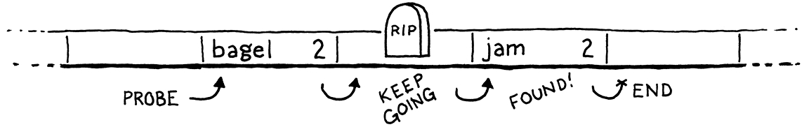

> 哈希，未知。这个词没有定义——没人知道哈希是什么。
>
> ——Ambrose Bierce, _The Unabridged Devil’s Dictionary_

在向这个发展迅速的虚拟机中添加变量之前，我们需要某种方法来根据给定的变量名称查询变量值。稍后，等到我们添加类时，也需要某种方法来存储实例中的字段。对于这些问题和其它问题，完美的数据结构就是哈希表。

你可能已经知道什么是哈希表了，即使你不知道它的名字。如果你是 Java 程序员，你把它们称为“HashMap”。C#和 Python 用户则称它们为“字典”。在 C++中，它是“无序映射”。JavaScript 中的“对象”和 Lua 中的“表”本质上都是哈希表，这赋予了它们灵活性。

哈希表（无论你的语言中怎么称呼它）是将一组**键**和一组**值**关联起来。每个键/值对是表中的一个**条目**。给定一个键，可以查找它对应的值。你可以按键添加新的键/值对或删除条目。如果你为已有的键添加新值，它就会替换原先的条目。

哈希表之所以出现在这么多的语言中，是因为它们非常强大。这种强大的能力主要来自于一个指标：给定一个键，哈希表会在常量时间[^1]内返回对应的值，_不管哈希表中有多少键_。

仔细想想，这是非常了不起的。想象一下，你有一大堆名片，我让你去找出某个人。这堆名片越大，花的时间就越长。即使这堆名片被很好地排序，而且你有足够的能力来手动进行二分查找，你的复杂度仍然是 O(log n)。但是对于哈希表来说，无论这摞名片有 10 张还是 100 万张，你找到那张特定名片所需的时间都是一样的。

## 20.1 桶数组

一个完整、快速的哈希表需要一些组件。我会通过几个小问题及其解决方案来逐一介绍它们。最终，我们将构建一个数据结构，可以将任何一组名称和它们的值关联起来。

现在，假定 Lox 在变量名称上有*更多*的限制。如果一个变量的名称只能是一个小写字母该怎么办[^2]？我们如何高效地表示一组变量名和它们的值？

由于只有 26 个可能的变量（如果你认为下划线是一个“字母”，我猜是 27 个），答案很简单。声明一个具有 26 个元素的固定大小的数组。我们遵循传统，将每个元素称为一个**桶（bucket）**。每个元素代表一个变量，`a`从索引下标 0 开始。如果数组中某个字母对应的索引位置有值，那么这个键就与该值相对应。否则的话，桶是空的，该键/值对在数据结构中不存在。


这个方案的内存占用情况很好——只是一个大小合理的数组。空桶会有一些浪费，但不是很大。没有节点指针、填充以及其它类似于链表或树的开销。

性能就更好了。给定一个变量名——它的字符——你可以减去`a`的 ASCII 值，并使用结果直接在数组中进行索引。然后，你可以查找已有的值或将新值存储到对应的槽中。没有比这更快的了。

这是一种柏拉图式的理想数据结构。快如闪电，非常简单，而且内存紧凑。当我们进一步支持更复杂的键时，就必须作出一些让步，但这仍是我们的目标所在。即使加入了哈希函数、动态调整大小和冲突解决，这仍然是每个哈希表的核心——一个可以直接索引到的连续桶数组。

### 20.1.1 负载因子和封装键

将 Lox 限制为单字母变量，会使我们作为实现者的工作更容易，但在一种只提供 26 个存储位置的语言中编程可能没有什么乐趣。如果我们稍微放宽限制，允许变量的长度到 8 个字符呢[^3]？

它足够小，我们可以将所有 8 个字符打包成一个 64 比特的整数，轻松地将字符串变成一个数字。然后我们可以把它作为数组索引。至少，如果我们能够以某种方式分配 295,148 PB 的数组，也是可以的。随着时间的推移，内存越来越便宜了，但还没那么便宜。即便我们可以创建这么大的数组，也会造成严重的浪费。除非用户会编写比我们的预期大得多的 Lox 程序，否则几乎每个桶都是空的。

尽管我们的变量键覆盖了整个 64 位数字范围，但我们显然不需要那么大的数组。相反地，我们会分配一个数组，它的容量足以容纳我们需要的条目，但又不会大得不合理。通过对数组的大小进行取模，我们将完整的 64 位键值映射到较小的范围。这样做本质上是将较大的数值范围不断折叠，直到适合较小的数组元素范围。

例如，假设我们想要存储“bagel”。我们分配一个有 8 个元素的数组[^4]，足够存储它，之后还可以存储更多。我们把键字符串当作一个 64 位整数。在 Intel 这样的小端机器上，将这些字符打包成一个 64 位的字时，会将第一个字母“b”（ASCII 值 98）放在最低的有效字节中。我们将这个整数与数组大小（8）取模以适应边界，并得到桶索引 2。然后我们像往常一样，将值存储在那里。

使用数组的大小作为模数，可以让我们将键的数值范围向下适配到任意大小的数组。因此，我们可以独立于键的范围来控制桶的数量。这就解决了我们的浪费问题，但是也引入了一个新的问题。任意两个变量，如果它们的键值除以数组大小时有相同的余数，最后都会被放在同一个桶中。键会发生**冲突**。举例来说，如果我们尝试添加“jam”，它也会出现在 2 号桶中。


我们可以通过调整数组的大小来控制这个问题。数组越大，映射到同一个桶的索引就越少，可能发生的冲突也就越少。哈希表实现者评估这种冲突的可能性的方式就是计算表的**负载因子**。它的定义是条目的数量除以桶的数量。因此，一个包含 5 个条目和 16 个元素的数组的哈希表，其负载系数为 0.3125。负载因子越大，发生冲突的可能性就越大。

减少冲突的一种方法是调整数组的大小。就像我们前面实现的动态数组一样，我们在哈希表的数组被填满时，重新分配并扩大该数组。但与常规的动态数组不同的是，我们不会等到数组填满。相反，我们选择一个理想的负载因子，当数组的负载因子超过该值时，我们就扩大数组。

## 20.2 冲突解决

即使负载因子很低，仍可能发生碰撞。[生日悖论](https://en.wikipedia.org/wiki/Birthday_problem)告诉我们，随着哈希表中条目数量的增加，碰撞的概率会很快增加。我们可以选择一个很大的数组规模来减少这种情况，但这是注定失败的。假设我们想在哈希表中存储 100 个条目，要想使碰撞几率保持在 10%以下，我们需要一个至少有 47,105 个元素的数组。要想使碰撞几率低于 1%，需要一个有 492,555 个元素的数组，每使用一个元素就需要超过 4000 个空桶。

低负载因子可以使冲突变少，但是[鸽笼原理](https://en.wikipedia.org/wiki/Pigeonhole_principle)告诉我们，我们永远无法完全消除冲突。如果你有 5 只宠物鸽，有 4 个洞来放它们，至少有一个洞最终会有不止一个鸽子。既然有 18,446,744,073,709,551,616 个不同的变量名，任何大小合理的数组都有可能在同一个桶中出现多个键。

因此，当冲突发生时，我们仍然需要优雅地处理它们。用户并不喜欢他们的编程语言只在*大多数*情况下能正确地查找变量。

### 20.2.1 拉链法

解决冲突的技术可以分为两大类。第一类是**拉链法**。每个桶中不再包含一个条目，而是包含条目的集合。在经典的实现中，每个桶都指向一个条目的链表。要查找一个条目，你要先找到它的桶，然后遍历列表，直到找到包含匹配键的条目。


在最坏的情况下，每个条目都碰撞到同一个桶中，数据结构会退化成一个无序链表，查询复杂度为*O(n)*。在实践中，通过控制负载因子和条目在桶中的分散方式，可以很容易地避免这种情况。在典型的拉链哈希表中，一个桶中很少会有超过一个或两个条目的情况。

拉链法在概念上很简单——它实际上就是一个链表数组。大多数操作实现都可以直接实现，甚至是删除（正如我们将看到的，这可能会很麻烦）。但它并不适合现代的 CPU。它有很多指针带来的开销[^5]，并且倾向于在内存中分散的小的链表节点，这对缓存的使用不是很好。

### 20.2.2 开放地址法

另一种技术称为**开放地址**或（令人困惑的）**封闭哈希**[^6]。使用这种技术时，所有的条目都直接存储在桶数组中，每个桶有一个条目。如果两个条目在同一个桶中发生冲突，我们会找一个其它的空桶来代替。

将所有条目存储在一个单一的、大的、连续的数组中，对于保持内存表示方式的简单和快速是非常好的。但它使得哈希表上的所有操作变得非常复杂。当插入一个条目时，它的桶可能已经满了，这就会让我们去查看另一个桶。而那个桶本身可能也被占用了，等等。这个查找可用存储桶的过程被称为**探测**，而检查存储桶的顺序是**探测序列**。

有很多算法[^7]可以用来确定要探测哪些桶，以及如何决定哪个条目要放在哪个桶中。这方面有大量的研究，因为即使是轻微的调整也会对性能产生很大的影响。而且，对于像哈希表这样大量使用的数据结构来说，这种性能影响涉及到跨一系列硬件功能的大量实际的程序。

依照本书的惯例，我们会选择最简单的方法来有效地完成工作。这就是良好的老式**线性探测法**。当查找一个条目时，我们先在它的键映射的桶中查找。如果它不在里面，我们就在数组的下一个元素中查找，以此类推。如果我们到了数组终点，就绕回到起点。

线性探测的好处是它对缓存友好。因为你是直接按照内存顺序遍历数组，所以它可以保持 CPU 缓存行完整且正常。坏处是，它容易**聚集**。如果你有很多具有相似键值的条目，那最终可能会产生许多相互紧挨的冲突、溢出的桶。

与拉链法相比，开放地址法可能更难理解。我认为开放地址法与拉链法是类似的，区别在于“列表”中的节点是通过桶数组本身进行的。它们之间的链接并没有存储在指针中，而是通过查看桶的顺序隐式计算的。

棘手的部分是，这些隐式的列表中可能会有多个交错在一起。让我们通过一个例子，涵盖所有有意思的情况。我们现在先不考虑值，只关心一组键。首先从一个包含 8 个桶的数组开始。


我们决定插入“bagel”。第一个字母“b”（ASCII 值是 98），对数组大小（8）取模后，将其放入 2 号桶中。


接下来，我们插入“jam”。它也应该放在 2 号桶中（106 mod 8 = 2），但是这个桶已经被占用了。我们继续探测下一个桶。它是空的，所以我们把它放入其中。


我们插入“fruit”，它愉快地落在 6 号桶中。


同样，“migas”可以放在其首选的 5 号桶中。


当我们尝试插入“eggs”时，它也想放在 5 号桶中。满了，我们跳到 6 号桶。6 号桶也满了。请注意，其中的条目并*不是*当前探测序列的一部分。“Fruit” 在其首选的 6 号桶中。因此，这里是 5 号和 6 号序列发生了碰撞，并交错在一起。我们跳过这个，最后把“eggs”放在 7 号桶中。


我们在“nuts”上遇到了同样的问题。它不能按预期进入 6 号桶中，也不能进入 7 号桶中。所以我们继续前进，但是我们已经到了数组的末端，所以我们回到 0 并将其放入 0 号桶。


在实践中，这种交错并不是什么大问题。即使是在拉链法中，我们也需要遍历列表来检查每个条目的键，因为多个键会落入同一个桶中。使用开放地址法，我们需要做同样的检查，这也涵盖了你需要遍历“属于”不同原始桶的条目的情况。

## 20.3 哈希函数

现在，我们可以为自己构建一个相当有效的表，来存储长度不超过 8 字符的变量名，但这个限制仍然令人讨厌。为了放宽最后一个限制，我们需要一种方法，将任意长度的字符串转换成固定大小的整数。

终于，我们来到了“哈希表”的“哈希”部分。哈希函数接受一些更大的数据块，并将其“哈希”生成一个固定大小的整数**哈希码**，该值取决于原始数据的每一个比特。一个好的哈希函数有三个主要目标[^8]：

- **它必须是*确定性*的**。相同的输入必须总是哈希到相同的数字。如果同一个变量在不同的时间点出现在不同的桶中，那就很难找到它了。

- **它必须是*均匀*的**。给定一组典型的输入，它应该产生一个广泛而均匀分布的输出数字范围，尽可能少地出现簇或模式。我们希望它能在整个数字范围内分散数值，以尽量减少碰撞和聚类[^9]。

- **它必须是*快速*的**。对哈希表的每个操作都需要我们首先对键进行哈希。如果哈希计算很慢，就有可能会抵消底层数组存储的速度优势。

这里有一堆名副其实的哈希函数。有些是旧的，并且针对已经不再使用的架构进行了优化。有些是为了快速设计的，有些则是加密安全的。有的利用了特定芯片的矢量指令和缓存大小，有的则旨在最大限度地提高可移植性。

有些人把设计和计算哈希函数当作自己的工作。我很佩服他们，但我在数学上还不够精明，不足以成为其中一员。所以对于 clox 来说。我选择了一个简单、常用的哈希函数[FNV-1a](http://www.isthe.com/chongo/tech/comp/fnv/)，多年来它一直为我所用。可以考虑在你的代码中尝试不同的方法，看看它们是否有什么不同。

好了，我们快速浏览了桶、负载因子、开放地址法、冲突解决和哈希函数。这里有非常多的文字，但没有多少真正的代码。如果它看起来仍然很模糊，不要担心。一旦我们完成了编码，一切都会全部就位。

## 20.4 构建哈希表

与平衡搜索树等其它经典技术相比，哈希表的好处在于，它实际的数据结构非常简单。我们进入一个新的模块。

_<u>table.h，创建新文件：</u>_

```c
#ifndef clox_table_h
#define clox_table_h

#include "common.h"
#include "value.h"

typedef struct {
  int count;
  int capacity;
  Entry* entries;
} Table;

#endif
```

哈希表是一个条目数组。就像前面的动态数组一样，我们既要跟踪数组的分配大小（容量，`capacity`）和当前存储在其中的键/值对数量（计数，`count`）。数量与容量的比值正是哈希表的负载因子。

每个条目都是这样的：

_<u>table.h，添加代码：</u>_

```c
#include "value.h"
// 新增部分开始
typedef struct {
  ObjString* key;
  Value value;
} Entry;
// 新增部分结束
typedef struct {
```

这是一个简单的键/值对。因为键总是一个字符串[^10]，我们直接存储 ObjString 指针，而不是将其包装在 Value 中。这样做速度更快，体积更小。

为了创建一个新的、空的哈希表，我们声明一个类似构造器的函数。

_<u>table.h，在结构体 Table 后添加代码：</u>_

```c
} Table;
// 新增部分开始
void initTable(Table* table);
// 新增部分结束
#endif
```

我们需要一个新的实现文件来定义它。既然说到这里，让我们把所有讨厌的依赖文件都搞定。

_<u>table.c，创建新文件：</u>_

```c
#include <stdlib.h>
#include <string.h>

#include "memory.h"
#include "object.h"
#include "table.h"
#include "value.h"

void initTable(Table* table) {
  table->count = 0;
  table->capacity = 0;
  table->entries = NULL;
}
```

就像动态值数组类型一样，哈希表最初以容量 0 和`NULL`数组开始。等到需要的时候我们才会分配一些东西。假设我们最终分配了什么，我们也需要能够释放它。

_<u>table.h，在 initTable()方法后添加代码：</u>_

```c
void initTable(Table* table);
// 新增部分开始
void freeTable(Table* table);
// 新增部分结束
#endif
```

以及其绚丽的实现：

_<u>table.c，在 initTable()方法后添加代码：</u>_

```c
void freeTable(Table* table) {
  FREE_ARRAY(Entry, table->entries, table->capacity);
  initTable(table);
}
```

同样，它看起来就像一个动态数组。实际上，你基本可以把哈希表看作是一个动态数组，它具有一个非常奇怪的插入条目策略。在这里我们不需要检查`NULL`，因为`FREE_ARRAY()`已经优雅地处理了这个问题。

### 20.4.1 哈希字符串

在我们开始向表中加入条目之前，我们需要，嗯，哈希它们。为了确保条目均匀分布在整个数组中，我们需要一个能考虑键字符串所有比特位的好的哈希函数。如果它只着眼于前几个字符，那么共享相同前缀的一系列字符串最终会碰撞在同一个桶中。

另一方面，遍历整个字符串来计算哈希值是有点慢的。如果我们每次在哈希表中查找键时都要遍历字符串，就会失去哈希表的一些性能优势。所以我们要做一件显而易见的事：缓存它。

在“object”模块的 ObjString 中，添加：

_<u>object.h，在结构体 ObjString 中添加代码：</u>_

```c
  char* chars;
  // 新增部分开始
  uint32_t hash;
  // 新增部分结束
};
```

每个 ObjString 会存储其字符串的哈希码。由于字符串在 Lox 中是不可变的，所以我们可以预先计算一次哈希代码，并确保它永远不会失效。提前缓存它是有道理的：分配字符串并复制其字符已然是一个 O(n)的操作了，所以这是一个很好的时机来执行字符串哈希的 O(n)计算。

每当我们调用内部函数来分配字符串时，我们就会传入其哈希码。

_<u>object.c，在 allocateString()方法中替换 1 行：</u>_

```c
// 替换部分开始
static ObjString* allocateString(char* chars, int length,
                                 uint32_t hash) {
  // 替换部分结束
  ObjString* string = ALLOCATE_OBJ(ObjString, OBJ_STRING);
```

该函数只是将哈希值存储在结构体中

_<u>object.c，在 allocateString()方法中添加代码：</u>_

```c
  string->chars = chars;
  // 新增部分开始
  string->hash = hash;
  // 新增部分结束
  return string;
}
```

有趣的部分是在调用者中。`allocateString()`方法在两个地方被调用：复制字符串的函数和获取现有动态分配字符串所有权的函数。我们从第一个开始。

_<u>object.c，在 copyString()方法中添加代码：</u>_

```c
ObjString* copyString(const char* chars, int length) {
  // 新增部分开始
  uint32_t hash = hashString(chars, length);
  // 新增部分结束
  char* heapChars = ALLOCATE(char, length + 1);
```

没有魔法。我们计算哈希码，然后把它传递出去。

_<u>object.c，在 copyString()方法中替换 1 行：</u>_

```c
  memcpy(heapChars, chars, length);
  heapChars[length] = '\0';
  // 替换部分开始
  return allocateString(heapChars, length, hash);
  // 替换部分结束
}
```

另一个字符串函数是类似的。

_<u>object.c，在 takeString()方法中替换 1 行：</u>_

```c
ObjString* takeString(char* chars, int length) {
  // 替换部分开始
  uint32_t hash = hashString(chars, length);
  return allocateString(chars, length, hash);
  // 替换部分结束
}
```

有趣的代码在这里：

_<u>object.c，在 allocateString()方法后添加代码：</u>_

```c
static uint32_t hashString(const char* key, int length) {
  uint32_t hash = 2166136261u;
  for (int i = 0; i < length; i++) {
    hash ^= (uint8_t)key[i];
    hash *= 16777619;
  }
  return hash;
}
```

这就是 clox 中真正的“哈希函数”。该算法被称为“FNV-1a”，是我所知道的最短的正统哈希函数。对于一本旨在向您展示每一行代码的书来说，简洁无疑是一种美德。

基本思想非常简单，许多哈希函数都遵循同样的模式。从一些初始哈希值开始，通常是一个带有某些精心选择的数学特性的常量。然后遍历需要哈希的数据。对于每个字节（有些是每个字），以某种方式将比特与哈希值混合，然后将结果比特进行一些扰乱。

“混合”和“扰乱”的含义可以变得相当复杂。不过，最终的基本目标是均匀——我们希望得到的哈希值尽可能广泛地分散在数组范围内，以避免碰撞和聚集。

### 20.4.2 插入条目

现在字符串对象已经知道了它们的哈希码，我们可以开始将它们放入哈希表了。

_<u>table.h，在 freeTable()方法后添加代码：</u>_

```c
void freeTable(Table* table);
// 新增部分开始
bool tableSet(Table* table, ObjString* key, Value value);
// 新增部分结束
#endif
```

这个函数将给定的键/值对添加到给定的哈希表中。如果该键的条目已存在，新值将覆盖旧值。如果添加了新条目，则该函数返回`true`。下面是实现：

_<u>table.c，在 freeTable()方法后添加代码：</u>_

```c
bool tableSet(Table* table, ObjString* key, Value value) {
  Entry* entry = findEntry(table->entries, table->capacity, key);
  bool isNewKey = entry->key == NULL;
  if (isNewKey) table->count++;

  entry->key = key;
  entry->value = value;
  return isNewKey;
}
```

大部分有趣的逻辑都在`findEntry()`中，我们很快就会讲到。该函数的作用是接受一个键，并找到它应该放在数组中的哪个桶里。它会返回一个指向该桶的指针——数组中 Entry 的地址。

一旦有了桶，插入就很简单了。我们更新哈希表的大小，如果我们覆盖了一个已经存在的键的值，注意不要增加计数。然后，我们将键和值复制到 Entry 中的对应字段中。

不过，我们这里还少了点什么，我们还没有分配 Entry 数组。糟糕！在我们向其中插入数据之前，需要确保已经有一个数组，而且足够大。

_<u>table.c，在 tableSet()方法中添加代码：</u>_

```c
bool tableSet(Table* table, ObjString* key, Value value) {
  // 新增部分开始
  if (table->count + 1 > table->capacity * TABLE_MAX_LOAD) {
    int capacity = GROW_CAPACITY(table->capacity);
    adjustCapacity(table, capacity);
  }
  // 新增部分结束
  Entry* entry = findEntry(table->entries, table->capacity, key);
```

这与我们之前为扩展动态数组所写的代码相似。如果没有足够的容量插入条目，我们就重新分配和扩展数组。`GROW_CAPACITY()`宏会接受现有容量，并将其增长一倍，以确保在一系列插入操作中得到摊销的常数性能。

这里一个有趣的区别是`TABLE_MAX_LOAD`常量。

_<u>table.c，添加代码：</u>_

```c
#include "value.h"
// 新增部分开始
#define TABLE_MAX_LOAD 0.75
// 新增部分结束
void initTable(Table* table) {
```

这就是我们管理表负载因子的方式。我们不会在容量全满的时候才进行扩展。相反，当数组达到 75%满时[^11]，我们会提前扩展数组。

我们很快就会讨论`adjustCapacity()`的实现。首先，我们看看你一直很好奇的`findEntry()`函数。

_<u>table.c，在 freeTable()方法后添加代码：</u>_

```c
static Entry* findEntry(Entry* entries, int capacity,
                        ObjString* key) {
  uint32_t index = key->hash % capacity;
  for (;;) {
    Entry* entry = &entries[index];
    if (entry->key == key || entry->key == NULL) {
      return entry;
    }

    index = (index + 1) % capacity;
  }
}
```

这个函数是哈希表的真正核心。它负责接受一个键和一个桶数组，并计算出该条目属于哪个桶。这个函数也是线性探测和冲突处理发挥作用的地方。我们在查询哈希表中的现有条目以及决定在哪里插入新条目时，都会使用`findEntry()`方法。

尽管如此，其中也没什么特别的。首先，我们通过取余操作将键的哈希码映射为数值边界内的一个索引值。这就给了我们一个桶索引，理想情况下，我们可以在这里找到或放置条目。

有几种情况需要检查：

- 如果数组索引处的 Entry 的键为`NULL`，则表示桶为空。如果我们使用`findEntry()`在哈希表中查找东西，这意味着它不存在。如果我们用来插入，这表明我们找到了一个可以插入新条目的地方。

- 如果桶中的键等于我们要找的键[^12]，那么这个键已经存在于表中了。如果我们在做查找，这很好——我们已经找到了要查找的键。如果我们在做插入，这意味着我们要替换该键的值，而不是添加一个新条目。

- 否则，就是桶中有一个条目，但具有不同的键。这就是一个冲突。在这种情况下，我们要开始探测。这也就是`for`循环所做的。我们从条目理想的存放位置开始。如果这个桶是空的或者有相同的键，我们就完成了。否则，我们就前进到下一个元素——这就是“线性探测”的*线性*部分——并进行检查。如果我们超过了数组的末端，第二个模运算符就会把我们重新带回起点。

当我们找到空桶或者与我们要找的桶具有相同键的桶时，我们就退出循环。你可能会考虑无限循环的问题。如果我们与所有的桶都冲突怎么办？幸运的是，因为负载因子的原因，这种情况不会发生。因为一旦数组接近满。我们就会扩展数组，所以我们知道总是会有空桶。

我们会从循环中直接返回，得到一个指向找到的 Entry 的指针，这样调用方就可以向其中插入内容或从中读取内容。回到`tableSet()`——最先调用它的函数，我们将新条目存储到返回的桶中，然后就完成了。

### 20.4.3 分配和调整

在我们将条目放入哈希表之前，我们确实需要一个地方来实际存储它们。我们需要分配一个桶数组。发生在这个函数中：

_<u>table.c，在 findEntry()方法后添加代码：</u>_

```c
static void adjustCapacity(Table* table, int capacity) {
  Entry* entries = ALLOCATE(Entry, capacity);
  for (int i = 0; i < capacity; i++) {
    entries[i].key = NULL;
    entries[i].value = NIL_VAL;
  }

  table->entries = entries;
  table->capacity = capacity;
}
```

我们创建一个包含`capacity`个条目的桶数组。分配完数组后，我们将每个元素初始化为空桶，然后将数组（及其容量）存储到哈希表的主结构体中。当我们将第一个条目插入表中时，这段代码是没有问题的，而且我们需要对数组进行第一次分配。但如果我们已经有了一个数组，并且需要增加它的容量时，怎么办？

在我们做动态数组时，我们只需使用`realloc()`，让 C 标准库把所有内容都复制过来。这对哈希表是行不通的。请记住，为了给每个条目选择存储桶，我们要用其哈希键与数组大小*取模*。这意味着，当数组大小发生变化时，条目可能会出现在不同的桶中。

这些新的桶可能会出现新的冲突，我们需要处理这些冲突。因此，获取每个条目所属位置的最简单的方法是从头重新构建哈希表，将每个条目都重新插入到新的空数组中。

_<u>table.c，在 adjustCapacity()方法中添加代码：</u>_

```c
    entries[i].value = NIL_VAL;
  }
  // 新增部分开始
  for (int i = 0; i < table->capacity; i++) {
    Entry* entry = &table->entries[i];
    if (entry->key == NULL) continue;

    Entry* dest = findEntry(entries, capacity, entry->key);
    dest->key = entry->key;
    dest->value = entry->value;
  }
  // 新增部分结束
  table->entries = entries;
```

We walk through the old array front to back. Any time we find a non-empty bucket, we insert that entry into the new array. We use `findEntry()`, passing in the _new_ array instead of the one currently stored in the Table. (This is why `findEntry()` takes a pointer directly to an Entry array and not the whole `Table` struct. That way, we can pass the new array and capacity before we’ve stored those in the struct.)

我们从前到后遍历旧数组。只要发现一个非空的桶，我们就把这个条目插入到新的数组中。我们使用`findEntry()`，传入的是*新*数组，而不是当前存储在哈希表中的旧数组。（这就是为什么`findEntry()`接受一个直接指向 Entry 数组的指针，而不是整个`Table`结构体。这样，我们就可以在将新数组和容量存储到结构体之前传递这些数据）

完成之后，我们就可以释放旧数组的内存。

_<u>table.c，在 adjustCapacity()方法中添加代码：</u>_

```c
    dest->value = entry->value;
  }
  // 新增部分开始
  FREE_ARRAY(Entry, table->entries, table->capacity);
  // 新增部分结束
  table->entries = entries;
```

这样，我们就有了一个哈希表，我们可以随心所欲地向其中塞入很多条目。它可以处理覆盖现有键，以及按需扩展自身，以保持所需的负载容量。

既然如此，我们也来定义一个辅助函数，将一个哈希表的所有条目复制到另一个哈希表中。

_<u>table.h，在 tableSet()方法后添加代码：</u>_

```c
bool tableSet(Table* table, ObjString* key, Value value);
// 新增部分开始
void tableAddAll(Table* from, Table* to);
// 新增部分结束
#endif
```

等到很久之后我们要支持方法继承时，才会需要这个能力，但是我们不妨现在就实现它，趁着我们还记得哈希表的一切内容。

_<u>table.c，在 tableSet()方法后添加代码：</u>_

```c
void tableAddAll(Table* from, Table* to) {
  for (int i = 0; i < from->capacity; i++) {
    Entry* entry = &from->entries[i];
    if (entry->key != NULL) {
      tableSet(to, entry->key, entry->value);
    }
  }
}
```

这没什么可说的。它会遍历源哈希表的桶数组。只要发现一个非空的桶，就使用我们刚定义的`tableSet()`函数将条目添加到目标哈希表中。

### 20.4.4 检索值

现在，我们的哈希表中已经包含了一些东西，让我们开始把它们取出来。给定一个键，如果有对应的条目，我们可以用这个函数来查找对应的值：

_<u>table.h，在 freeTable()方法后添加代码：</u>_

```c
void freeTable(Table* table);
// 新增部分开始
bool tableGet(Table* table, ObjString* key, Value* value);
// 新增部分结束
bool tableSet(Table* table, ObjString* key, Value value);
```

传入一个表和一个键。如果它找到一个带有该键的条目，则返回`true`，否则返回`false`。如果该条目存在，输出的`value`参数会指向结果值。

因为`findEntry()`已经完成了这项艰苦的工作，所以实现起来并不难。

_<u>table.c，在 findEntry()方法后添加代码：</u>_

```c
bool tableGet(Table* table, ObjString* key, Value* value) {
  if (table->count == 0) return false;

  Entry* entry = findEntry(table->entries, table->capacity, key);
  if (entry->key == NULL) return false;

  *value = entry->value;
  return true;
}
```

如果表完全是空的，我们肯定找不到这个条目，所以我们先检查一下。这不仅仅是一种优化——它还确保当数组为`NULL`时，我们不会试图访问桶数组。其它情况下，我们就让`findEntry()`发挥它的魔力。这将返回一个指向桶的指针。如果桶是空的（我们通过查看键是否为`NULL`来检测），那么我们就没有找到包含对应键的 Entry。如果`findEntry()`确实返回了一个非空的 Entry，那么它就是我们的匹配项。我们获取 Entry 的值并将其复制到输出参数中，这样调用方就可以得到该值。小菜一碟。

### 20.4.5 删除条目

全功能的哈希表还需要支持一个更基本的操作：删除一个条目。这看起来很明显，如果你能添加东西，你应该就能删除它，对吗？但你会惊讶于有多少关于哈希表的教程省略了这一点。

我也可以走这条路。事实上，我们在 clox 中只在 VM 的一个很小的边缘情况下会使用删除。但如果你想真正理解如何完全实现一个哈希表，这一点很重要。我能理解它们忽略这一点的想法。正如我们将看到的，从使用开放地址法的哈希表中删除数据是很棘手的[^13]。

至少声明是简单的。

_<u>table.h，在 tableSet()方法后添加代码：</u>_

```c
bool tableSet(Table* table, ObjString* key, Value value);
// 新增部分开始
bool tableDelete(Table* table, ObjString* key);
// 新增部分结束
void tableAddAll(Table* from, Table* to);
```

一个明显的方法就是插入的镜像操作。使用`findEntry()`找到条目的桶，然后把桶清空。完成了！

在没有冲突的情况下，这样做没问题。但是如果发生了冲突，那么条目所在的桶可能是一个或多个隐式探测序列的一部分。举例来说，下面是一个哈希表，包含三个键，它们有着相同的首选桶，2：


请记住，我们在遍历探测序列来查找一个条目时，如果碰到一个空桶，我们就知道已经到达了序列的末端而且该条目不存在。这就好像探测序列是一个条目的列表，而空条目终止了这个列表。

如果我们通过简单地清除 Entry 来删除“biscuit”，那么我们就会中断探测序列，让后面的条目变得孤立、不可访问。这有点像是从链表中删除了一个节点，而没有把指针从上一个节点重新链接到下一个节点。

如果我们后面尝试查找“jam”，我们会从“bagel”开始，在下一个空条目处停止，并且永远找不到它。


为了解决这个问题，大多数实现都使用了一个叫作**墓碑**的技巧。我们不会在删除时清除条目，而是将其替换为一个特殊的哨兵条目，称为“墓碑”[^14]。当我们在查找过程中顺着探测序列遍历时，如果遇到墓碑，我们*不会*把它当作是空槽而停止遍历。相反，我们会继续前进，这样删除一个条目不会破坏任何隐式冲突链，我们仍然可以找到它之后的条目。



这段代码看起来像这样：

_<u>table.c，在 tableSet()方法后添加代码：</u>_

```c
bool tableDelete(Table* table, ObjString* key) {
  if (table->count == 0) return false;

  // Find the entry.
  Entry* entry = findEntry(table->entries, table->capacity, key);
  if (entry->key == NULL) return false;

  // Place a tombstone in the entry.
  entry->key = NULL;
  entry->value = BOOL_VAL(true);
  return true;
}
```

首先，我们找到包含待删除条目的桶（如果我们没有找到，就没有什么可删除的，所以我们退出）。我们将该条目替换为墓碑。在 clox 中，我们使用`NULL`键和`true`值来表示，但任何不会与空桶或有效条目相混淆的表示形式都是可行的。

这就是删除一个条目所需要做的全部工作。简单而快速。但是所有其它操作也需要正确处理墓碑。墓碑有点像“半个”条目。它既有当前条目的一些特征，也有空条目的一些特征。

当我们在查询中遵循探测序列时，如果遇到了墓碑，我们会记录它并继续前进。

_<u>table.c，在 findEntry()方法中替换 3 行：</u>_

```c
  for (;;) {
    Entry* entry = &entries[index];
    // 替换部分开始
    if (entry->key == NULL) {
      if (IS_NIL(entry->value)) {
        // Empty entry.
        return tombstone != NULL ? tombstone : entry;
      } else {
        // We found a tombstone.
        if (tombstone == NULL) tombstone = entry;
      }
    } else if (entry->key == key) {
      // We found the key.
      return entry;
    }
    // 替换部分结束
    index = (index + 1) % capacity;
```

第一次通过一个墓碑条目时，我们将它存储在这个局部变量中：

_<u>table.c，在 findEntry()方法中添加代码：</u>_

```c
  uint32_t index = key->hash % capacity;
  // 新增部分开始
  Entry* tombstone = NULL;
  // 新增部分结束
  for (;;) {
```

如果我们遇到一个真正的空条目，那么这个键就不存在。在这种情况下，若我们经过了一个墓碑，就返回它的桶，而不是返回后面的空桶。如果我们为了插入一个节点而调用`findEntry()`，这时我们可以把墓碑桶视为空桶，并重用它来存储新条目。

像这样自动重用墓碑槽，有助于减少墓碑在桶数组中浪费的空间。在插入与删除混合使用的典型用例中，墓碑的数量会增长一段时间，然后趋于稳定。

即便如此，也不能保证大量的删除操作不会导致数组中满是墓碑。在最坏的情况下，我们最终可能没有空桶。这是很糟糕的。因为，请记住，唯一能阻止`findEntry()`中无限循环的原因是假设我们最终会命中一个空桶。

所以我们需要仔细考虑墓碑如何与表的负载因子和大小调整进行互动。关键问题是，在计算负载因子时，我们应该把墓碑当作满桶还是空桶？

### 20.4.6 墓碑计数

如果我们把墓碑当作满桶，那么我们最终得到的数组可能会比我们需要的更大，因为它人为地抬高了负载因子。有些墓碑我们可以重复使用，但是它们没有被视为未使用，所以我们最终会过早地扩展数组。

但是，如果我们把墓碑当作空桶，并且*不*将它们计入负载因子中，那么我们就有可能*没有*真正的空桶来终止查找。无限循环比几个多余的数组槽要糟糕得多，所以对于负载因子，我们把墓碑看作是满桶。

这就是我们在前面的代码中删除条目却不减少计数的原因。这个计数不再是哈希表中的条目数，而是条目数加上墓碑数。这意味着，只有当新条目进入一个完全空的桶中时，才会在插入操作中增加计数。

_<u>table.c，在 tableSet()方法中替换 1 行：</u>_

```c
  bool isNewKey = entry->key == NULL;
  // 替换部分开始
  if (isNewKey && IS_NIL(entry->value)) table->count++;
  // 替换部分结束
  entry->key = key;
```

如果我们用新条目替换墓碑，因为这个桶已经被统计过了，所以计数不会改变。

当我们调整数组的大小时，我们会分配一个新数组，并重新插入所有的现存条目。在这个过程中，我们不会把墓碑复制过来。因为无论如何我们都要重新构建探测序列，它们不会增加任何价值，而且只会减慢查找速度。这意味着我们需要重算计数，因为它可能会在调整大小的期间发生变化。所以我们把它清除掉：

_<u>table.c，在 adjustCapacity()方法中添加代码：</u>_

```c
  }
  // 新增部分开始
  table->count = 0;
  // 新增部分结束
  for (int i = 0; i < table->capacity; i++) {
```

然后，每当我们找到一个非墓碑的条目，就给它加 1。

_<u>table.c，在 adjustCapacity()方法中添加代码：</u>_

```c
    dest->value = entry->value;
    // 新增部分开始
    table->count++;
    // 新增部分结束
  }
```

这意味着，当我们增加容量时，最终在更大的数组中的条目可能会*更少*，因为所有的墓碑都被丢弃了。这有点浪费，但不是一个严重的实际问题。

我发现一个有趣的现象，支持删除条目的大部分工作都是在`findEntry()` 和`adjustCapacity()`中完成的。实际的删除逻辑是相当简单和快速的。在实践中，删除操作往往是少见的，所以你会希望哈希表在删除函数中完成尽可能多的工作，而让其它函数保持更快的速度。使用我们的墓碑方案，删除是快速的，但查找会受到影响。

我做了一个小小的基准测试，在一些不同的删除场景中验证这一点。我惊讶地发现，与在删除过程中做所有的工作来重新插入受影响的条目相比，墓碑方案最终确实更快。

但如果你仔细想想，墓碑方案并不是将删除的工作完全推给了其它操作，它更像是让删除*延迟*了。首先，它只做了很少的工作，把条目变成墓碑。当以后的查找不得不跳过它时，这可能会造成损失。但是，它也允许墓碑桶被后续的插入操作重用。这种重用是一种非常有效的方法，可以避免重新安排后续受影响的条目的成本。你基本上是回收了探测条目链中的一个节点。这是一个很巧妙的技巧。

## 20.5 字符串驻留

我们已经有了一个基本可用的哈希表，尽管它的中心有一个严重的缺陷。此外，我们还没有用它做任何事情。现在是时候解决这两个问题了，在这个过程中，我们要学习解释器中使用的一个经典技术。

哈希表不能完全工作的原因在于，当`findEntry()`检查一个现有的键是否与要查找的键相匹配时，它使用了`==`来比较两个字符串是否相等。只有当两个键在内存中是完全相同的字符串时，才会返回 true。两个具有相同字符的单独的字符串也应该被认为是相等的，但是并没有。

还记得吗？在上一章我们添加字符串时，也显式支持了逐字符比较字符串，以实现真正的值相等。我们在`findEntry()`中也可以这样做，但这很慢[^15]。

相反，我们将使用一种叫作**字符串驻留**的技术，核心问题是，在内存中不同的字符串可能包含相同的字符。尽管它们是不同的对象，它们的行为也需要像等效值一样。它们本质上是相同的，而我们必须比较它们所有的字节来检查这一点。

字符串驻留是一个数据去重的过程[^16]。我们创建一个“驻留”字符串的集合。该集合中的任何字符串都保证与其它字符串在文本上不相同。当你要驻留一个字符串时，首先从集合中查找匹配的字符串，如果找到了，就使用原来的那个。否则，说明你持有的字符串是唯一的，所以你将其添加到集合中。

通过这种方式，你知道每个字符序列在内存中只由一个字符串表示。这使得值相等变得很简单。如果两个字符串在内存中指向相同的地址，它们显然是同一个字符串，并且必须相等。而且，因为我们知道字符串是唯一的，如果两个字符串指向不同的地址，它们一定是不同的。

因此，指针相等与值相等完全匹配。这反过来又意味着，我们在`findEntry()`中使用的`==`做了正确的事情。或者说，至少在我们实现字符串驻留之后，它是对的。为了可靠地去重所有字符串，虚拟机需要能够找到创建的每个字符串。我们用一个哈希表存储这些字符串，从而实现这一点。

_<u>vm.h，在结构体 VM 中添加代码：</u>_

```c
  Value* stackTop;
  // 新增部分开始
  Table strings;
  // 新增部分结束
  Obj* objects;
```

像往常一样，我们需要引入头文件。

_<u>vm.h，添加代码：</u>_

```c
#include "chunk.h"
// 新增部分开始
#include "table.h"
// 新增部分结束
#include "value.h"
```

当我们启动一个新的虚拟机时，字符串表是空的。

_<u>vm.c，在 initVM()方法中添加代码：</u>_

```c
  vm.objects = NULL;
  // 新增部分开始
  initTable(&vm.strings);
  // 新增部分结束
}
```

而当我们关闭虚拟机时，我们要清理该表使用的所有资源。

_<u>vm.c，在 freeVM()方法中添加代码：</u>_

```c
void freeVM() {
  // 新增部分开始
  freeTable(&vm.strings);
  // 新增部分结束
  freeObjects();
```

一些语言中有单独的类型或显式步骤来驻留字符串。对于 clox，我们会自动驻留每个字符串。这意味着，每当我们创建了一个新的唯一字符串，就将其添加到表中。

_<u>object.c，在 allocateString()方法中添加代码：</u>_

```c
  string->hash = hash;
  // 新增部分开始
  tableSet(&vm.strings, string, NIL_VAL);
  // 新增部分结束
  return string;
```

我们使用这个表的方式更像是哈希*集合*而不是哈希*表*。键是字符串，而我们只关心这些，所以我们用`nil`作为值。

假定一个字符串是唯一的，这就会把它放入表中，但在此之前，我们需要实际检查字符串是否有重复。我们在两个调用`allocateString()`的高级函数中做到了这一点。这里有一个：

_<u>object.c，在 copyString()方法中添加代码：</u>_

```c
  uint32_t hash = hashString(chars, length);
  // 新增部分开始
  ObjString* interned = tableFindString(&vm.strings, chars, length,
                                        hash);
  if (interned != NULL) return interned;
  // 新增部分结束
  char* heapChars = ALLOCATE(char, length + 1);
```

当把一个字符串复制到新的 LoxString 中时，我们首先在字符串表中查找它。如果找到了，我们就不“复制”，而是直接返回该字符串的引用。如果没有找到，我们就是落空了，则分配一个新字符串，并将其存储到字符串表中。

获取字符串的所有权有点不同。

_<u>object.c，在 takeString()方法中添加代码：</u>_

```c
  uint32_t hash = hashString(chars, length);
  // 新增部分开始
  ObjString* interned = tableFindString(&vm.strings, chars, length,
                                        hash);
  if (interned != NULL) {
    FREE_ARRAY(char, chars, length + 1);
    return interned;
  }
  // 新增部分结束
  return allocateString(chars, length, hash);
```

同样，我们首先在字符串表中查找该字符串。如果找到了，在返回它之前，我们释放传入的字符串的内存。因为所有权被传递给了这个函数，我们不再需要这个重复的字符串，所以由我们释放它。

在开始编写新函数之前，还需要引入一个头文件。

_<u>object.c，添加代码：</u>_

```c
#include "object.h"
// 新增部分开始
#include "table.h"
// 新增部分结束
#include "value.h"
```

要在表中查找字符串，我们不能使用普通的`tableGet()`函数，因为它调用了`findEntry()`，这正是我们现在试图解决的重复字符串的问题。相反地，我们使用这个新函数：

_<u>table.h，在 tableAddAll()方法后添加代码：</u>_

```c
void tableAddAll(Table* from, Table* to);
// 新增部分开始
ObjString* tableFindString(Table* table, const char* chars,
                           int length, uint32_t hash);
// 新增部分结束
#endif
```

其实现如下：

_<u>table.c，在 tableAddAll()方法后添加代码：</u>_

```c
ObjString* tableFindString(Table* table, const char* chars,
                           int length, uint32_t hash) {
  if (table->count == 0) return NULL;

  uint32_t index = hash % table->capacity;
  for (;;) {
    Entry* entry = &table->entries[index];
    if (entry->key == NULL) {
      // Stop if we find an empty non-tombstone entry.
      if (IS_NIL(entry->value)) return NULL;
    } else if (entry->key->length == length &&
        entry->key->hash == hash &&
        memcmp(entry->key->chars, chars, length) == 0) {
      // We found it.
      return entry->key;
    }

    index = (index + 1) % table->capacity;
  }
}
```

看起来我们是复制粘贴了`findEntry()`。这里确实有很多冗余，但也有几个关键的区别。首先，我们传入的是我们要查找的键的原始字符数组，而不是 ObjString。在我们调用这个方法时，还没有创建 ObjString。

其次，在检查是否找到键时，我们要看一下实际的字符串。我们首先看看它们的长度和哈希值是否匹配。这些都是快速检查，如果它们不相等，那些字符串肯定不一样。

如果存在哈希冲突，我们就进行实际的逐字符的字符串比较。这是虚拟机中我们真正测试字符串是否相等的一个地方。我们在这里这样做是为了对字符串去重，然后虚拟机的其它部分可以想当然地认为，内存中不同地址的任意两个字符串一定有着不同的内容。

事实上，既然我们已经驻留了所有的字符串，我们就可以在字节码解释器中利用这一优势。当用户对两个字符串对象进行`==`时，我们不需要再检查字符了。

_<u>value.c，在 valuesEqual()方法中替换 7 行：</u>_

```c
    case VAL_NUMBER: return AS_NUMBER(a) == AS_NUMBER(b);
    // 替换部分开始
    case VAL_OBJ:    return AS_OBJ(a) == AS_OBJ(b);
    // 替换部分结束
    default:         return false; // Unreachable.
```

在创建字符串时，我们增加了一点开销来进行驻留。但作为回报，在运行时，字符串的相等操作符要快得多。这样，我们就有了一个全功能的哈希表，可以用来跟踪变量、实例或其它可能出现的任何键值对。

我们还加快了测试字符串是否相等的速度。这对于用户在字符串上的`==`操作是很好的。但在 Lox 这样的动态类型语言中，这一点更为关键，因为在这种语言中，方法调用和实例属性都是在运行时根据名称查找的。如果测试字符串是否相等是很慢的，那就意味着按名称查找方法也很慢。在面向对象的语言中，如果这一点很慢，那么一切都会变得很慢。

[^1]: 更确切地说，平均查找时间是常数。最坏情况下，性能可能会更糟。在实践中，很容易可以避免退化行为并保持在快乐的道路上。
[^2]: 这种限制并不算*太*牵强。达特茅斯大学的初版 BASIC 只允许变量名是一个字母，后面可以跟一个数字。
[^3]: 同样，这个限制也不是那么疯狂。早期的 C 语言链接器只将外部标识符的前 6 个字符视为有意义的。后面的一切都被忽略了。如果你曾好奇为什么 C 语言标准库对缩写如此着迷——比如，`strncmp()`——事实证明，这并不完全是因为当时的小屏幕（或小电视）。
[^4]: 我这里使用了 2 的幂作为数组的大小，但其实不需要这样。有些类型的哈希表在使用 2 的幂时效果最好，包括我们将在本书中建立的哈希表。其它类型则更偏爱素数作为数组大小或者是其它规则。
[^5]: 有一些技巧可以优化这一点。许多实现将第一个条目直接存储在桶中，因此在通常只有一个条目的情况下，不需要额外的间接指针。你也可以让每个链表节点存储几个条目以减少指针的开销。
[^6]: 它被称为“开放”地址，是因为条目最终可能会出现在其首选地址（桶）之外的地方。它被称为“封闭”哈希，是因为所有的条目都存储在桶数组内。
[^7]: 如果你想了解更多（你应该了解，因为其中一些真的很酷），可以看看“双重哈希(double hashing)”、“布谷鸟哈希(cuckoo hashing)”以及“罗宾汉哈希(Robin Hood hashing)”。
[^8]: 哈希函数也被用于密码学。在该领域中，“好”有一个更严格的定义，以避免暴露有关被哈希的数据的细节。值得庆幸的是，我们在本书中不需要担心这些问题。
[^9]: 哈希表最初的名称之一是“散列表”，因为它会获取条目并将其分散到整个数组中。“哈希”这个词来自于这样的想法：哈希函数将输入数据分割开来，然后将其组合成一堆，从所有这些比特位中得出一个数字。
[^10]: 在 clox 中，我们只需要支持字符串类型的键。处理其它类型的键不会增加太多复杂性。只要你能比较两个对象是否相等，并把它们简化为比特序列，就很容易将它们用作哈希键。
[^11]: 理想的最大负载因子根据哈希函数、冲突处理策略和你将会看到的典型键集而变化。由于像 Lox 这样的玩具语言没有“真实世界”的数据集，所以很难对其进行优化，所以我随意地选择了 75%。当你构建自己的哈希表时，请对其进行基准测试和调整。
[^12]: 看起来我们在用`==`判断两个字符串是否相等。这行不通，对吧？相同的字符串可能会在内存的不同地方有两个副本。不要害怕，聪明的读者。我们会进一步解决这个问题。而且，奇怪的是，是一个哈希表提供了我们需要的工具。
[^13]: 使用拉链法时，删除条目就像从链表中删除一个节点一样容易。
[^14]: 
[^15]: 在实践中，我们会首先比较两个字符串的哈希码。这样可以快速检测到几乎所有不同的字符串——如果不能，它就不是一个很好的哈希函数。但是，当两个哈希值相同时，我们仍然需要比较字符，以确保没有在不同的字符串上出现哈希冲突。
[^16]: 我猜想“intern”是“internal（内部）”的缩写。我认为这个想法是，语言的运行时保留了这些字符串的“内部”集合，而其它字符串可以由用户创建并漂浮在内存中。当你要驻留一个字符串时，你要求运行时将该字符串添加到该内部集合，并返回一个指向该字符串的指针。<BR>不同语言在字符串驻留程度以及对用户的暴露方式上有所不同。Lua 会驻留*所有*字符串，这也是 clox 要做的事情。Lisp、Scheme、Smalltalk、Ruby 和其他语言都有一个单独的类似字符串的类型“symbol（符号）”，它是隐式驻留的。（这就是为什么他们说 Ruby 中的符号“更快”）Java 默认会驻留常量字符串，并提供一个 API 让你显式地驻留传入的任何字符串。

---

## 习题

1. 在 clox 中，我们碰巧只需要字符串类型的键，所以我们构建的哈希表是针对这种键类型硬编码的。如果我们将哈希表作为一级集合暴露给 Lox 用户，那么支持不同类型的键就会很有用。

   添加对其它基本类型键的支持：数字、布尔值和`nil`。稍后，clox 会支持用户定义的类。如果我们想支持那些类的实例作为键，那会增加什么样的复杂性呢？

2. 哈希表中有很多你可以调整的旋钮，它们会影响哈希表的性能。你可以决定使用拉链法还是开放地址法。根据你采取的方式，你可以调整每个节点中存储的条目数量，或者是使用的探测策略。你可以控制哈希函数、负载因子和增长率。

   所有这些变化不仅仅是为了给 CS 博士发表论文（至少这不是它们被创造的唯一原因，是否是主要原因还有待商榷）：在哈希表能发挥作用的许多不同领域和硬件场景中，每一种都有其用途。在不同的开源系统中查找一些哈希表的实现，研究他们所做的选择，并尝试弄清楚他们为什么这样做。

3. 对哈希表进行基准测试是出了名的困难。一个哈希表的实现可能在某些键集上表现良好，而在其它键集上则表现不佳。它可能是规模较小时工作得很好，但随着规则扩展会退化，或者正好反过来。当删除操作很多时，它可能被卡住，但删除不常见时，它可能会飞起来。创建能够准确代表用户使用哈希表方式的基准是一项挑战。

   编写一些不同的基准程序来验证我们的哈希表实现。它们之间的表现有什么不同？你为什么选择这些测试用例？
