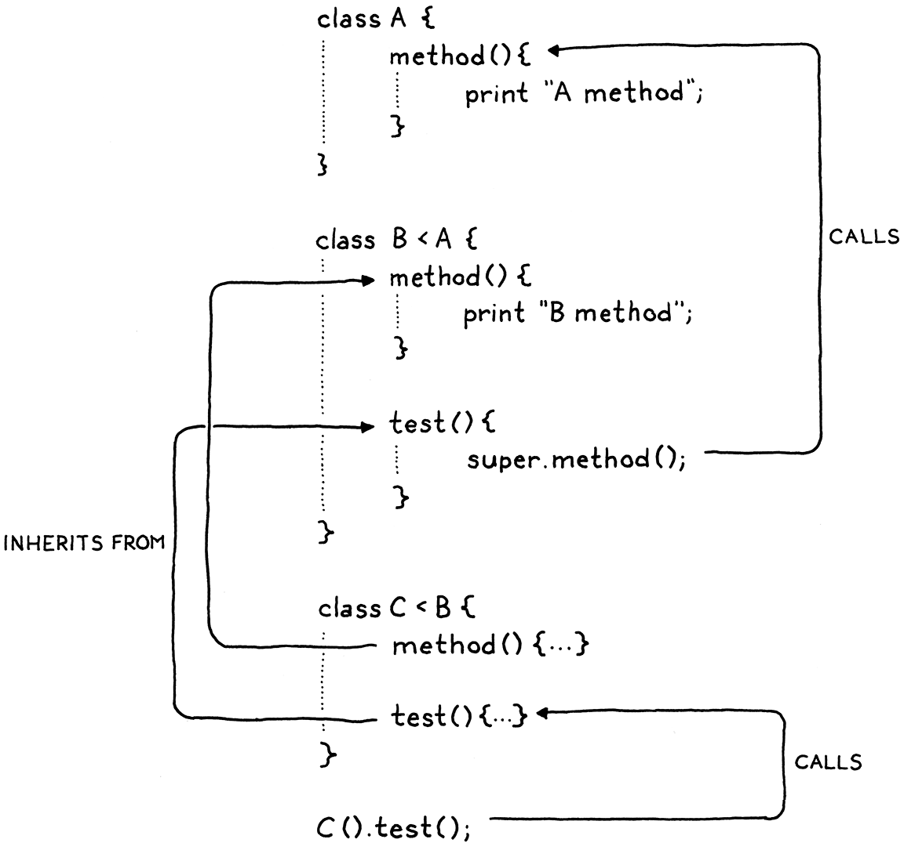

> 我们曾经是海里一团一团的东西，然后是鱼，然后是蜥蜴、老鼠、猴子，以及介于其间的数百种形态。这只手曾经是鳍，这只手曾经是爪子！在我人类的嘴里，有狼的尖牙，有兔子的凿齿，还有牛的磨牙！我们的血和我们曾经生活的大海一样咸！当我们受到惊吓时，我们皮肤上的毛发会竖起来，就像我们有毛时一样。我们就是历史！我们在成为我们的路上曾拥有的一切，我们仍然拥有。
>
> ​ —— Terry Pratchett, _A Hat Full of Sky_


你能相信吗？我们已经到了第二部分的最后一章。我们几乎已经完成了第一个 Lox 解释器。上一章中是一大堆错综复杂的面向对象特性。我无法将这些内容完全解开，但是我设法拆出来一块。在这一章，我们会添加继承来完成 Lox 中对类的支持。

继承出现在面向对象语言中，可以追溯到第一种语言 Simula。早些时候，克里斯汀·尼加德(Kristen Nygaard)和奥勒-约翰·达尔(Ole-Johan Dahl)注意到，在他们编写的模拟程序中，不同类之间存在共性。继承为他们提供了一种重用相似部分代码的方法。

## 13.1 超类和子类

鉴于这个概念叫“继承”，你可能希望他们会选择一个一致的比喻，把类称为“父”类和“子”类，但这太简单了。早在很久以前，C. A. R. Hoare 就创造了“subclass”这个术语，指的是完善另一种类型的记录类型。Simula 借用了这个术语来指代一个继承自另一个类的类。我认为直到 Smalltalk 出现后，才有人将这个词的拉丁前缀取反义[^1]，用超类（superclass）指代这种关系的另一方。

我们在 Lox 中支持继承的第一步是找到声明类时指定超类的方法。这方面有很多不同的语法。C++和 C#在子类的名字后面加一个`:`，然后是超类的名字。Java 使用 `extends` 而不是冒号。Python 则把超类放在类名后面的小括号里。Simula 把超类的名字放在关键字`class`之前。

游戏已经到了后期，我宁愿不在词法分析器中添加新的保留字或标记。我们没有`extends`或`:`，所以我们遵循 Ruby 来使用小于号（`<`）。

```java
class Doughnut {
  // General doughnut stuff...
}

class BostonCream < Doughnut {
  // Boston Cream-specific stuff...
}
```

为了在语法中实现这一点，我们在目前的`classDecl`规则中加一个新的可选子句。

```
classDecl      → "class" IDENTIFIER ( "<" IDENTIFIER )?
                 "{" function* "}" ;
```


在类的名称后面，可以有一个`<`，后跟超类的名称。超类子句是可选的，因为一个类不一定要有超类。与 Java 等面向对象的语言不同，Lox 没有所有东西都继承的一个根“Object”类，所以当你省略超类子句时，该类就没有超类，甚至连隐含的都没有。

我们想在类声明的 AST 节点中捕捉这个新语法。

_<u>tool/GenerateAst.java，在 main()方法中，替换一行：</u>_

```java
      "Block      : List<Stmt> statements",
      // 替换部分开始
      "Class      : Token name, Expr.Variable superclass, List<Stmt.Function> methods",
      // 替换部分结束
      "Expression : Expr expression",
```

你可能会惊讶，我们把超类的名字存为一个 Expr.Variable，而不是一个 Token。语法将一个超类子句限制为一个标识符，但是在运行时，这个标识符是当作变量访问来执行的。在解析器早期将名称封装在 Expr.Variable 内部，这样可以给我们提供一个对象，在分析器中可以将分析信息附加在其中。

新的解析器代码直接遵循语法。

_<u>lox/Parser.java，在 classDeclaration()中添加：</u>_

```java
    Token name = consume(IDENTIFIER, "Expect class name.");
    // 新增部分开始
    Expr.Variable superclass = null;
    if (match(LESS)) {
      consume(IDENTIFIER, "Expect superclass name.");
      superclass = new Expr.Variable(previous());
    }
    // 新增部分结束
    consume(LEFT_BRACE, "Expect '{' before class body.");
```

一旦我们（可能）解析到一个超类声明，就将其保存到 AST 节点中。

_<u>lox/Parser.java，在 classDeclaration()方法中，替换一行：</u>_

```java
    consume(RIGHT_BRACE, "Expect '}' after class body.");
    // 替换部分开始
    return new Stmt.Class(name, superclass, methods);
    // 替换部分结束
  }
```

如果我们没有解析到超类子句，超类表达式将是`null`。我们必须确保后面的操作会对其进行检查。首先是分析器。

_<u>lox/Resolver.java，在 visitClassStmt()方法中添加：</u>_

```java
    define(stmt.name);
    // 新增部分开始
    if (stmt.superclass != null) {
      resolve(stmt.superclass);
    }
    // 新增部分结束
    beginScope();
```

类声明的 AST 节点有一个新的子表达式，所以我们要遍历并分析它。因为类通常是在顶层声明的，超类的名称很可能是一个全局变量，所以这一步通常没有什么作用。然而，Lox 运行在区块内的类声明，所以超类名称有可能指向一个局部变量。在那种情况下，我们需要保证能被它被分析。

即使是善意的程序员有时也会写出奇怪的代码，所以在这里我们需要考虑一个愚蠢的边缘情况。看看这个：

```ruby
class Oops < Oops {}
```

这种代码不可能做什么有用的事情，如果我们尝试让运行时去执行它，将会打破解释器对继承链中没有循环的期望。最安全的做法是静态地检测这种情况，并将其作为一个错误报告出来。

_<u>lox/Resolver.java，在 visitClassStmt()方法中添加：</u>_

```java
    define(stmt.name);
    // 新增部分开始
    if (stmt.superclass != null &&
        stmt.name.lexeme.equals(stmt.superclass.name.lexeme)) {
      Lox.error(stmt.superclass.name,
          "A class can't inherit from itself.");
    }
    // 新增部分结束
    if (stmt.superclass != null) {
```

如果代码分析没有问题，AST 节点就会被传递到解释器。

_<u>lox/Interpreter.java，在 visitClassStmt()方法中添加：</u>_

```java
  public Void visitClassStmt(Stmt.Class stmt) {
    // 新增部分开始
    Object superclass = null;
    if (stmt.superclass != null) {
      superclass = evaluate(stmt.superclass);
      if (!(superclass instanceof LoxClass)) {
        throw new RuntimeError(stmt.superclass.name,
            "Superclass must be a class.");
      }
    }
    // 新增部分结束
    environment.define(stmt.name.lexeme, null);
```

如果类中有超类表达式，我们就对其求值。因为我们可能会得到其它类型的对象，我们在运行时必须检查我们希望作为超类的对象是否确实是一个类。如果我们允许下面这样的代码，就会发生不好的事情：

```ruby
var NotAClass = "I am totally not a class";

class Subclass < NotAClass {} // ?!
```

假设检查通过，我们继续。执行类声明语句会把类的语法表示（AST 节点）转换为其运行时表示（一个 LoxClass 对象）。我们也需要把超类对象传入该类对象中。我们将超类传递给构造函数。

_<u>lox/Interpreter.java，在 visitClassStmt()方法中替换一行：</u>_

```java
      methods.put(method.name.lexeme, function);
    }
    // 替换部分开始
    LoxClass klass = new LoxClass(stmt.name.lexeme,
        (LoxClass)superclass, methods);
    // 替换部分结束
    environment.assign(stmt.name, klass);
```

构造函数将它存储到一个字段中。

_<u>lox/LoxClass.java， LoxClass()构造函数中，替换一行：</u>_

```java
  // 替换部分开始
  LoxClass(String name, LoxClass superclass,
           Map<String, LoxFunction> methods) {
    this.superclass = superclass;
    // 替换部分结束
    this.name = name;
```

字段我们在这里声明：

_<u>lox/LoxClass.java，在 LoxClass 类中添加：</u>_

```java
  final String name;
  // 新增部分开始
  final LoxClass superclass;
  // 新增部分结束
  private final Map<String, LoxFunction> methods;
```

有了这个，我们就可以定义一个类作为其它类的子类。现在，拥有一个超类究竟有什么用呢？

## 13.2 继承方法

继承自另一个类，意味着对于超类适用的一切，对于子类或多或少也应该适用。在静态类型的语言中，这包含了很多含义。子类也必须是一个子类型，而且内存布局是可控的，这样你就可以把一个子类实例传递给一个期望超类的函数，而它仍然可以正确地访问继承的字段。

Lox 是一种动态类型的语言，所以我们的要求要简单得多。基本上，这意味着如果你能在超类的实例上调用某些方法，那么当给你一个子类的实例时，你也应该能调用这个方法。换句话说，方法是从超类继承的。

这符合继承的目标之一——为用户提供一种跨类重用代码的方式。在我们的解释器中实现这一点是非常容易的。

_<u>lox/LoxClass.java，在 findMethod()方法中添加：</u>_

```java
      return methods.get(name);
    }
    // 新增部分开始
    if (superclass != null) {
      return superclass.findMethod(name);
    }
    // 新增部分结束
    return null;
```

这就是它的全部内容。当我们在一个实例上查找一个方法时，如果我们在实例的类中找不到它，就沿着超类继承链递归查找。试一下这个：

```javascript
class Doughnut {
  cook() {
    print "Fry until golden brown.";
  }
}

class BostonCream < Doughnut {}

BostonCream().cook();
```

好了，一半的继承特性只用了三行 Java 代码就完成了。

## 13.3 调用超类方法

在`findMethod()`方法中，我们首先在当前类中查找，然后遍历超类链。如果在子类和超类中包含相同的方法，那么子类中的方法将优先于或**覆盖**超类的方法。这有点像内部作用域中的变量对外部作用域的遮蔽。

如果子类想要完全*替换*超类的某些行为，那就正好。但是，在实践中，子类通常想改进超类的行为。他们想要做一些专门针对子类的操作，但是也想要执行原来超类中的行为。

然而，由于子类已经重写了该方法，所有没有办法指向原始的方法。如果子类的方法试图通过名字来调用它，将会递归到自身的重写方法上。我们需要一种方式来表明“调用这个方法，但是要直接在我的超类上寻找，忽略我内部的重写方法”。Java 中使用`super`实现这一点，我们在 Lox 中使用相同的语法。下面是一个例子：

```javascript
class Doughnut {
  cook() {
    print "Fry until golden brown.";
  }
}

class BostonCream < Doughnut {
  cook() {
    super.cook();
    print "Pipe full of custard and coat with chocolate.";
  }
}

BostonCream().cook();
```

如果你运行该代码，应该打印出：

```
Fry until golden brown.
Pipe full of custard and coat with chocolate.
```

我们有了一个新的表达式形式。`super`关键字，后跟一个点和一个标识符，以使用该名称查找方法。与`this`调用不同，该搜索是从超类开始的。

### 13.3.1 语法

在`this`使用中，关键字有点像一个魔法变量，而表达式是一个单独的标记。但是对于`super`，随后的`.`和属性名是`super`表达式不可分割的一部分。你不可能只有一个单独的`super`标记。

```java
print super; // Syntax error.
```

因此，我们在语法中的`primary`规则添加新子句时要包含属性访问。

```scala
primary        → "true" | "false" | "nil" | "this"
               | NUMBER | STRING | IDENTIFIER | "(" expression ")"
               | "super" "." IDENTIFIER ;
```

通常情况下，`super`表达式用于方法调用，但是，与普通方法一样，参数列表并不是表达式的一部分。相反，`super`调用是一个`super`属性访问，然后跟一个函数调用。与其它方法调用一样，你可以获得超类方法的句柄，然后单独运行它。

```javascript
var method = super.cook;
method();
```

因此，`super`表达式本身只包含`super`关键字和要查找的方法名称。对应的语法树节点为：

_<u>tool/GenerateAst.java，在 main()方法中添加：</u>_

```java
      "Set      : Expr object, Token name, Expr value",
      // 新增部分开始
      "Super    : Token keyword, Token method",
      // 新增部分结束
      "This     : Token keyword",
```

按照语法，需要在我们现有的`primary`方法中添加新代码。

_<u>lox/Parser.java，在 primary()方法中添加：</u>_

```java
      return new Expr.Literal(previous().literal);
    }
    // 新增部分开始
    if (match(SUPER)) {
      Token keyword = previous();
      consume(DOT, "Expect '.' after 'super'.");
      Token method = consume(IDENTIFIER,
          "Expect superclass method name.");
      return new Expr.Super(keyword, method);
    }
    // 新增部分结束
    if (match(THIS)) return new Expr.This(previous());
```

开头的`super`关键字告诉我们遇到了一个`super`表达式，之后我们消费预期中的`.`和方法名称。

### 13.3.2 语义

之前，我说过`super`表达式从“超类”开始查找方法，但是是哪个超类？一个不太成熟的答案是方法被调用时的外围对象`this`的超类。在很多情况下，这碰巧产生了正确的行为，但实际上这是不正确的。请看：

```javascript
class A {
  method() {
    print "A method";
  }
}

class B < A {
  method() {
    print "B method";
  }

  test() {
    super.method();
  }
}

class C < B {}

C().test();
```

将这个程序转换为 Java、c#或 c++，它将输出“A method”，这也是我们希望 Lox 做的。当这个程序运行时，在`test`方法体中，`this`是 C 的一个实例，C 是超类是 B，但这不是查找应该开始的地方。如果是这样，我们就会命中 B 的`method()`。


相反，查找应该从包含`super`表达式的类的超类开始。在这个例子中，由于`test()`是在 B 中定义的，它内部的`super`表达式应该在 B 的超类 A 中开始查找。



执行流程看起来是这样的：

1. 我们在 C 的一个实例上调用`test()`。

2. 这就进入了从 B 中继承的`test()`方法，其中又会调用`super.method()`。

3. B 的超类是 A，所以链接到 A 中的`method()`，程序会打印出“A method”。

因此，为了对`super`表达式求值，我们需要访问围绕方法调用的类的超类。可惜的是，在解释器中执行`super`表达式的地方，我们并没有那么容易获得。

我们可以从 LoxFunction 添加一个字段，以存储指向拥有该方法的 LoxClass 的引用。解释器会保存当前正在执行的 LoxFunction 的引用，这样稍后在遇到`super`表达式时就可以找到它。从它开始，可以得到方法的 LoxClass，然后找到它的超类。

这需要很多管道。在上一章中，我们添加对`this`的支持时遇到了类似的问题。在那种情况下，我们使用已有的环境和闭包机制保存了指向当前对象的引用。那我们是否可以做类似的事情来存储超类？嗯，如果答案是否定的，我就不会问这个问题了，所以……是的。

一个重要的区别是，我们在方法被访问时绑定了`this`。同一个方法可以在不同的实例上被调用，而且每个实例都需要有自己的`this`。对于`super`表达式，超类是*类声明本身*的一个固定属性。每次对某个`super`表达式求值时，超类都是同一个。

这意味着我们可以在执行类定义时，为超类创建一个环境。在定义方法之前，我们创建一个新环境，将类的超类与名称`super`绑定。


当我们为每个方法创建 LoxFunction 运行时表示时，也就是这个方法闭包中获取的环境。之后，放方法被调用时会绑定`this`，超类环境会成为方法环境的父环境，就像这样：


这是一个复杂的机制，但是我们会一步一步完成它。在我们可以在运行时创建环境之前，我们需要在分析器中处理对应的作用域。

_<u>lox/Resolver.java，在 visitClassStmt()方法中添加：</u>_

```java
      resolve(stmt.superclass);
    }
    // 新增部分开始
    if (stmt.superclass != null) {
      beginScope();
      scopes.peek().put("super", true);
    }
    // 新增部分结束
    beginScope();
```

如果该类声明有超类，那么我们就在其所有方法的外围创建一个新的作用域。在这个作用域中，我们会定义名称`super`。一旦我们完成了对该类中方法的分析，就丢弃这个作用域。

_<u>lox/Resolver.java，在 visitClassStmt()方法中添加：</u>_

```java
    endScope();
    // 新增部分开始
    if (stmt.superclass != null) endScope();
    // 新增部分结束
    currentClass = enclosingClass;
```

这是一个小优化，但是我们只在类真的有超类时才会创建超类环境。在没有超类的情况下，创建超类环境是没有意义的，因为无论如何里面都不会存储超类。

在作用域链中定义`super`后，我们就能够分析`super`表达式了。

_<u>lox/Resolver.java，在 visitSetExpr()方法后添加：</u>_

```java
  @Override
  public Void visitSuperExpr(Expr.Super expr) {
    resolveLocal(expr, expr.keyword);
    return null;
  }
```

我们把`super`标记当作一个变量进行分析。分析结果保存了解释器要在环境链上找到超类所在的环境需要的跳数。

这段代码在解释器中也有对应。当我们执行子类定义时，创建一个新环境。

_<u>lox/Interpreter.java，在 visitClassStmt()方法中添加：</u>_

```java
        throw new RuntimeError(stmt.superclass.name,
            "Superclass must be a class.");
      }
    }

    environment.define(stmt.name.lexeme, null);
    // 新增部分开始
    if (stmt.superclass != null) {
      environment = new Environment(environment);
      environment.define("super", superclass);
    }
    // 新增部分结束
    Map<String, LoxFunction> methods = new HashMap<>();
```

在这个环境中，我们保存指向超类的引用——即我们在运行时现在拥有的超类的实际 LoxClass 对象。然后我们为每个方法创建 LoxFunction。这些函数将捕获当前环境（也就是我们刚刚绑定“super”的那个）作为其闭包，像我们需要的那样维系着超类。一旦这些完成，我们就弹出环境。

_<u>lox/Interpreter.java，在 visitClassStmt()方法中添加：</u>_

```java
    LoxClass klass = new LoxClass(stmt.name.lexeme,
        (LoxClass)superclass, methods);
    // 新增部分开始
    if (superclass != null) {
      environment = environment.enclosing;
    }
    // 新增部分结束
    environment.assign(stmt.name, klass);
```

我们现在已经准备好解释`super`表达式了。这会分为很多部分，所以我们逐步构建这个方法。

_<u>lox/Interpreter.java，在 visitSetExpr()方法后添加：</u>_

```java
  @Override
  public Object visitSuperExpr(Expr.Super expr) {
    int distance = locals.get(expr);
    LoxClass superclass = (LoxClass)environment.getAt(
        distance, "super");
  }
```

首先，我们要做之前铺垫的工作。我们通过在适当环境中查找“super”来找到外围类的超类。

当我们访问方法时，还需要将`this`与访问该方法的对象进行绑定。在像`doughnut.cook`这样的表达式中，对象是我们通过对`doughnut`求值得到的内容。在像`super.cook`这样的`super`表达式中，当前对象隐式地与我们正使用的当前对象相同。换句话说，就是`this`。即使我们在超类中查找方法，*实例*仍然是`this`。


不幸的是，在`super`表达式中，我们没有一个方便的节点可以让分析器将`this`对应的跳数保存起来。幸运的是，我们可以控制环境链的布局。绑定`this`的环境总是存储在保存`super`的环境中。

_<u>lox/Interpreter.java，在 visitSuperExpr()方法中添加：</u>_

```java
    LoxClass superclass = (LoxClass)environment.getAt(
        distance, "super");
    // 新增部分开始
    LoxInstance object = (LoxInstance)environment.getAt(
        distance - 1, "this");
    // 新增部分结束
  }
```
将距离偏移 1，在那个内部环境中查找“this”。我承认这个代码不是最优雅的，但是它是有效的。

现在我们准备查找并绑定方法，从超类开始。

_<u>lox/Interpreter.java，在 visitSuperExpr()方法中添加：</u>_

```java
    LoxInstance object = (LoxInstance)environment.getAt(
        distance - 1, "this");
    // 新增部分开始
    LoxFunction method = superclass.findMethod(expr.method.lexeme);
    return method.bind(object);
    // 新增部分结束
  }
```

这几乎与查找 get 表达式方法的代码完全一样，区别在于，我们是在超类上调用`findMethod()` ，而不是在当前对象的类。

基本上就是这样了。当然，除了我们可能找不到方法之外。所以，我们要对其检查。

_<u>lox/Interpreter.java，在 visitSuperExpr()方法中添加：</u>_

```java
    LoxFunction method = superclass.findMethod(expr.method.lexeme);
    // 新增部分开始
    if (method == null) {
      throw new RuntimeError(expr.method,
          "Undefined property '" + expr.method.lexeme + "'.");
    }
    // 新增部分结束
    return method.bind(object);
  }
```

这就对了！试着运行一下前面那个 BostonCream 的例子。如果你我都做对了，它的结果应该是：

```
Fry until golden brown.
Pipe full of custard and coat with chocolate.
```

### 13.3.3 super 的无效使用

像以前的语言特性一样，当用户写出正确的代码时，我们的语言实现也会做成正确的事情，但我们还没有在解释器中对错误代码进行防御。具体来说，考虑以下代码：

```java
class Eclair {
  cook() {
    super.cook();
    print "Pipe full of crème pâtissière.";
  }
}
```

这个类中有一个`super`表达式，但是没有超类。在运行时，计算`super`表达式的代码假定`super`已经被成功分析，并且可以在环境中找到超类。但是在这里会失败，因为没有超类，也就没有超类对应的外围环境。JVM 会抛出一个异常，我们的解释器也会因此崩溃。

见鬼，还有更简单的`super`错误用法：

```java
super.notEvenInAClass();
```

我们可以在运行时通过检查“super”是否查找成功而处理此类错误。但是我们可以只通过查看源代码静态地知道，Eclair 没有超类，因此也就没有`super`表达式可以在其中生效。同样的，在第二个例子中，我们知道`super`表达式甚至不在方法体内。

尽管 Lox 是动态类型的，但这并不意味着我们要将一切都推迟到运行时。如果用户犯了错误，我们希望能帮助他们尽早发现，所以我们会在分析器中静态地报告这些错误。

首先，在我们用来追踪当前访问代码外围类的类型的枚举中添加一个新值。

_<u>lox/Resolver.java，在 ClassType 枚举中添加代码，首先在上一行后面加“,”：</u>_

```java
    NONE,
    CLASS,
    // 新增部分开始
    SUBCLASS
    // 新增部分结束
  }
```

我们将用它来区分我们是否在一个有超类的类中。当我们分析一个类的声明时，如果该类是一个子类，我们就设置该值。

_<u>lox/Resolver.java，在 visitClassStmt()方法中添加：</u>_

```java
    if (stmt.superclass != null) {
      // 新增部分开始
      currentClass = ClassType.SUBCLASS;
      // 新增部分结束
      resolve(stmt.superclass);
```

然后，当我们分析`super`表达式时，会检查当前是否在一个允许使用`super`表达式的作用域中。

_<u>lox/Resolver.java，在 visitSuperExpr()方法中添加：</u>_

```java
  public Void visitSuperExpr(Expr.Super expr) {
    // 新增部分开始
    if (currentClass == ClassType.NONE) {
      Lox.error(expr.keyword,
          "Can't use 'super' outside of a class.");
    } else if (currentClass != ClassType.SUBCLASS) {
      Lox.error(expr.keyword,
          "Can't use 'super' in a class with no superclass.");
    }
    // 新增部分结束
    resolveLocal(expr, expr.keyword);
```

如果不是，那就是用户出错了。

## 13.4 总结

我们成功了！最后的错误处理是完成 Lox 语言的 Java 实现所需的最后一块代码。这是一项真正的成就，你应该为此感到自豪。在过去的十几章和一千多行代码中，我们已经学习并实现了：

- [tokens and lexing](http://craftinginterpreters.com/scanning.html), 标记与词法
- [abstract syntax trees](http://craftinginterpreters.com/representing-code.html), 抽象语法树
- [recursive descent parsing](http://craftinginterpreters.com/parsing-expressions.html), 递归下降分析
- prefix and infix expressions, 前缀、中缀表达式
- runtime representation of objects, 对象的运行时表示
- [interpreting code using the Visitor pattern](http://craftinginterpreters.com/evaluating-expressions.html), 使用 Visitor 模式解释代码
- [lexical scope](http://craftinginterpreters.com/statements-and-state.html), 词法作用域
- environment chains for storing variables, 保存变量的环境链
- [control flow](http://craftinginterpreters.com/control-flow.html), 控制流
- [functions with parameters](http://craftinginterpreters.com/functions.html), 有参函数
- closures, 闭包
- [static variable resolution and error detection](http://craftinginterpreters.com/resolving-and-binding.html), 静态变量分析与错误检查
- [classes](http://craftinginterpreters.com/classes.html), 类
- constructors, 构造函数
- fields, 字段
- methods, and finally, 方法
- inheritance. 继承


所有这些都是我们从头开始做的，没有借助外部依赖和神奇工具。只有你和我，我们的文本编辑器，Java 标准库中的几个集合类，以及 JVM 运行时。

这标志着第二部分的结束，但不是这本书的结束。休息一下，也许可以编写几个 Lox 程序在你的解释器中运行一下（你可能需要添加一些本地方法来支持读取用户的输入等操作）。当你重新振作之后，我们将开始下一次冒险。

[^1]: “Super-”和“sub-”在拉丁语中表示“上面”和“下面”。把继承树想象成一个根在顶部的家族树——在这个图上，子类就在超类的下面。更一般地说，“sub-”指的是细化或被更一般的概念所包含的事物。在动物学中，子类指的是对更大的生物类的一个精细分类。在集合论中，子集被一个更大的超集包含，该超集中包含子集的所有元素，可能还有更多元素。集合论和编程语言在类型论中相遇，就产生了“超类型”和“子类型”。在静态类型的面向对象语言中，一个子类通常也是其超类的一个子类型。

---

## 习题

1. Lox 只支持*单继承*——一个类可以有一个超类，这是唯一跨类复用方法的方式。其它语言中已经探索出了各种方法来更自由地跨类重用和共享功能：mixins, traits, multiple inheritance, virtual inheritance, extension methods, 等等。

   如果你要在 Lox 中添加一些类似的功能，你会选择哪种，为什么？如果你有勇气的话（这时候你应该有勇气了），那就去添加它。

2. 在 Lox 中，与其它大多数面向对象语言一样，当查找一个方法时，我们从类的底层开始向上查找——子类的方法优先于超类的方法。为了在覆盖方法中访问超类方法，你可以使用`super`。

   [BEAT](https://beta.cs.au.dk/)语言采用了[相反的方法](http://journal.stuffwithstuff.com/2012/12/19/the-impoliteness-of-overriding-methods/)。当你调用一个方法时，它从类继承结构的顶层开始向下寻找。超类方法的优先级高于子类方法。为了访问子类的方法，超类方法可以调用`inner`，这有点像是`super`的反义词。它与继承层次结构中的下一级方法相连接。

   超类方法控制着子类何时何地可以改进其行为。如果超类方法根本没有调用`inner`，那么子类就无法覆盖或修改超类的行为。

   去掉 Lox 目前的覆盖和`super`行为，用 BEAT 的语义来替换。简而言之：

     当调用类上的方法时，优先选择类继承链中最高的方法。


     在方法体内部，`inner`调用会在继承链中包含`inner`的类和包含`this`的类之间，查找具有相同名称的最近的子类中的方法。如果没有匹配的方法，`inner`调用不做任何事情。

   举例来说：

   ```java
   class Doughnut {
     cook() {
       print "Fry until golden brown.";
       inner();
       print "Place in a nice box.";
     }
   }

   class BostonCream < Doughnut {
     cook() {
       print "Pipe full of custard and coat with chocolate.";
     }
   }

   BostonCream().cook();
   ```

   这应该输出：

   ```
   Fry until golden brown.
   Pipe full of custard and coat with chocolate.
   Place in a nice box.
   ```

3. 在介绍 Lox 的那一章，我让你想出几个你认为该语言缺少的功能。现在你知道了如何构建一个解释器，请实现其中的一个功能。
