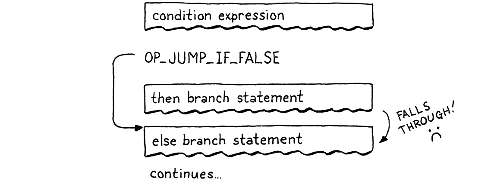
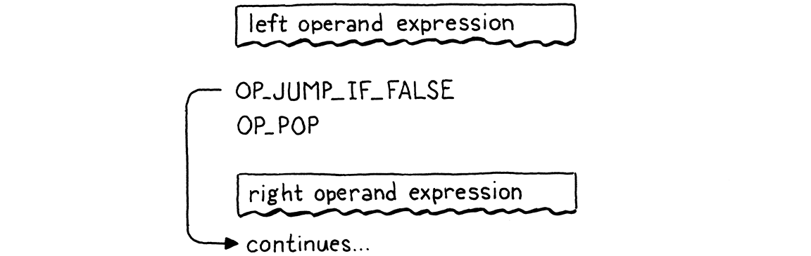
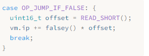

> 我们头脑中想象的秩序就像一张网，或者像一架梯子，用来达到某种目的。但事后你必须把梯子扔掉，因为你会发现，即使它有用，也毫无意义。
>
> ​ —— Umberto Eco, _The Name of the Rose_

虽然花了一些时间，但我们终于准备好向虚拟机中添加控制流了。在我们为 jlox 构建的树遍历解释器中，我们以 Java 的方式实现了控制流。为了执行 Lox 的`if`语句，我们使用 Java 的`if`语句来执行所选的分支。这是可行的，但并不是完全令人满意。JVM 本身或原生 CPU 如何实现`if`语句呢？现在我们有了自己的字节码虚拟机，我们可以回答这个问题。

当我们谈论“控制流”时，我们指的是什么？我们所说的“流”是指执行过程在程序文本中的移动方式。就好像电脑里有一个小机器人在我们的代码里游荡，在这里或那里执行一些零零碎碎的片段。流就是机器人所走的路径，通过*控制*机器人，我们驱动它执行某些代码片段。

在 jlox 中，机器人的关注点（*当前*代码位）是隐式的，它取决于哪些 AST 节点被存储在各种 Java 变量中，以及我们正在运行的 Java 代码是什么。在 clox 中，它要明确得多。VM 的`ip`字段存储了当前字节码指令的地址。该字段的值正是我们在程序中的“位置”。

执行操作通常是通过增加`ip`进行的。但是我们可以随意地改变这个变量。为了实现控制流，所需要做的就是以更有趣的方式改变`ip`。最简单的控制流结构是没有`else`子句的`if`语句：

```c
if (condition) print("condition was truthy");
```

虚拟机会计算条件表达式对应的字节码。如果结构是真，则继续执行主体中的`print`语句。有趣的是当条件为假的时候，这种情况下，执行会跳过 then 分支并执行下一条语句。

要想跳过一大块代码，我们只需将`ip`字段设置为其后代码的字节码指令的地址。为了*有条件地*跳过一些代码，我们需要一条指令来查看栈顶的值。如果它是假，就在`ip`上增加一个给定的偏移量，跳过一系列指令。否则，它什么也不做，并照常执行下一条指令。

当我们编译成字节码时，代码中显式的嵌套块结构就消失了，只留下一系列扁平的指令。Lox 是一种[结构化的编程语言](https://en.wikipedia.org/wiki/Structured_programming)，但 clox 字节码却不是。正确的（或者说错误的，取决于你怎么看待它）字节码指令集可以跳转到代码块的中间位置，或从一个作用域跳到另一个作用域。

虚拟机会很高兴地执行这些指令，即使其结果会导致堆栈处于未知的、不一致的状态。因此，尽管字节码是非结构化的，我们也要确保编译成只生成与 Lox 本身保持相同结构和嵌套的干净代码。

这就是真正的 CPU 的行为方式。即使我们可能会使用高级语言对它们进行编程，这些语言能够规定格式化控制流，但编译器也会将其降级为原生跳转。在底层，事实证明 goto 是唯一真正的控制流。

不管这么说，我并不是故意要搞得这么哲学化。重要的是，如果我们有一个条件跳转指令，就足以实现 Lox 的`if`语句了，只要它没有`else`子句。让我们开始吧。

## 23.1 If 语句

这么多章了，你知道该怎么做。任何新特性都是从前端开始的，如果沿着管道进行工作。`if`语句是一个，嗯，语句，所以我们通过语句将它连接到解析器。

_<u>compiler.c，在 statement()语句中添加代码：</u>_

```c
  if (match(TOKEN_PRINT)) {
    printStatement();
  // 新增部分开始
  } else if (match(TOKEN_IF)) {
    ifStatement();
  // 新增部分结束
  } else if (match(TOKEN_LEFT_BRACE)) {
```

如果我们看到`if`关键字，就把编译工作交给这个函数[^1]：

_<u>compiler.c，在 expressionStatement()方法后添加代码：</u>_

```c
static void ifStatement() {
  consume(TOKEN_LEFT_PAREN, "Expect '(' after 'if'.");
  expression();
  consume(TOKEN_RIGHT_PAREN, "Expect ')' after condition.");

  int thenJump = emitJump(OP_JUMP_IF_FALSE);
  statement();

  patchJump(thenJump);
}
```

首先我们编译条件表达式（用小括号括起来）。在运行时，这会将条件值留在栈顶。我们将通过它来决定是执行 then 分支还是跳过它。

然后我们生成一个新的`OP_JUMP_IF_ELSE`指令。这条指令有一个操作数，用来表示`ip`的偏移量——要跳过多少字节的代码。如果条件是假，它就按这个值调整`ip`，就像这样：


但我们有个问题。当我们写`OP_JUMP_IF_FALSE`指令的操作数时，我们怎么知道要跳多远？我们还没有编译 then 分支，所以我们不知道它包含多少字节码。

为了解决这个问题，我们使用了一个经典的技巧，叫作**回填（backpatching）**。我们首先生成跳转指令，并附上一个占位的偏移量操作数，我们跟踪这个半成品指令的位置。接下来，我们编译 then 主体。一旦完成，我们就知道要跳多远。所以我们回去将占位符替换为真正的偏移量，现在我们可以计算它了。这有点像在已编译代码的现有结构上打补丁。


我们将这个技巧编码为两个辅助函数。

_<u>compiler.c，在 emitBytes()方法后添加代码：</u>_

```c
static int emitJump(uint8_t instruction) {
  emitByte(instruction);
  emitByte(0xff);
  emitByte(0xff);
  return currentChunk()->count - 2;
}
```

第一个程序会生成一个字节码指令，并为跳转偏移量写入一个占位符操作数。我们把操作码作为参数传入，因为稍后我们会有两个不同的指令都使用这个辅助函数。我们使用两个字节作为跳转偏移量的操作数。一个 16 位的偏移量可以让我们跳转 65535 个字节的代码，这对于我们的需求来说应该足够了[^2]。

该函数会返回生成的指令在字节码块中的偏移量。编译完 then 分支后，我们将这个偏移量传递给这个函数：

_<u>compiler.c，在 emitConstant()方法后添加代码：</u>_

```c
static void patchJump(int offset) {
  // -2 to adjust for the bytecode for the jump offset itself.
  int jump = currentChunk()->count - offset - 2;

  if (jump > UINT16_MAX) {
    error("Too much code to jump over.");
  }

  currentChunk()->code[offset] = (jump >> 8) & 0xff;
  currentChunk()->code[offset + 1] = jump & 0xff;
}
```

这个函数会返回到字节码中，并将给定位置的操作数替换为计算出的跳转偏移量。我们在生成下一条希望跳转的指令之前调用`patchJump()`，因此会使用当前字节码计数来确定要跳转的距离。在`if`语句的情况下，就是在编译完 then 分支之后，并在编译下一个语句之前。

这就是在编译时需要做的。让我们来定义新指令。

_<u>chunk.h，在枚举 OpCode 中添加代码：</u>_

```c
  OP_PRINT,
  // 新增部分开始
  OP_JUMP_IF_FALSE,
  // 新增部分结束
  OP_RETURN,
```

在虚拟机中，我们让它这样工作：

_<u>vm.c，在 run()方法中添加代码：</u>_

```c
        break;
      }
      // 新增部分开始
      case OP_JUMP_IF_FALSE: {
        uint16_t offset = READ_SHORT();
        if (isFalsey(peek(0))) vm.ip += offset;
        break;
      }
      // 新增部分结束
      case OP_RETURN: {
```

这是我们添加的第一个需要 16 位操作数的指令。为了从字节码块中读出这个指令，需要使用一个新的宏。

_<u>vm.c，在 run()方法中添加代码：</u>_

```c
#define READ_CONSTANT() (vm.chunk->constants.values[READ_BYTE()])
// 新增部分开始
#define READ_SHORT() \
    (vm.ip += 2, (uint16_t)((vm.ip[-2] << 8) | vm.ip[-1]))
// 新增部分结束
#define READ_STRING() AS_STRING(READ_CONSTANT())
```

它从字节码块中抽取接下来的两个字节，并从中构建出一个 16 位无符号整数。和往常一样，当我们结束之后要清理宏。

_<u>vm.c，在 run()方法中添加代码：</u>_

```c
#undef READ_BYTE
// 新增部分开始
#undef READ_SHORT
// 新增部分结束
#undef READ_CONSTANT
```

读取偏移量之后，我们检查栈顶的条件值。如果是假，我们就将这个跳转偏移量应用到`ip`上。否则，我们就保持`ip`不变，执行会自动进入跳转指令的下一条指令。

在条件为假的情况下，我们不需要做任何其它工作。我们已经移动了`ip`，所以当外部指令调度循环再次启动时，将会在新指令处执行，跳过了 then 分支的所有代码[^3]。

请注意，跳转指令并没有将条件值弹出栈。因此，我们在这里还没有全部完成，因为还在堆栈上留下了一个额外的值。我们很快就会把它清理掉。暂时先忽略这个问题，我们现在在 Lox 中已经有了可用的`if`语句，只需要一条小指令在虚拟机运行时支持它。

### 23.1.1 Else 子句

一个不支持`else`子句的`if`语句就像没有 Gomez 的 Morticia Addams（《亚当斯一家》）。因此，在我们编译完 then 分支之后，我们要寻找`else`关键字。如果找到了，则编译 else 分支。

_<u>compiler.c，在 ifStatement()方法中添加代码：</u>_

```c
  patchJump(thenJump);
  // 新增部分开始
  if (match(TOKEN_ELSE)) statement();
  // 新增部分结束
}
```

当条件为假时，我们会跳过 then 分支。如果存在 else 分支，`ip`就会出现在其字节码的开头处。但这还不够。下面是对应的流：



如果条件是真，则按照要求执行 then 分支。但在那之后，执行会直接转入到 else 分支。糟糕！当条件为真时，执行完 then 分支后，我们需要跳过 else 分支。这样，无论哪种情况，我们都只执行一个分支，像这样：


为了实现这一点，我们需要从 then 分支的末端再进行一次跳转。

_<u>compiler.c，在 ifStatement()方法中添加代码：</u>_

```c
  statement();
  // 新增部分开始
  int elseJump = emitJump(OP_JUMP);
  // 新增部分结束
  patchJump(thenJump);
```

我们在 else 主体结束后修补这个偏移量。

_<u>compiler.c，在 ifStatement()方法中添加代码：</u>_

```c
  if (match(TOKEN_ELSE)) statement();
  // 新增部分开始
  patchJump(elseJump);
  // 新增部分结束
}
```

在执行完 then 分支后，会跳转到 else 分支之后的下一条语句。与其它跳转不同，这个跳转是无条件的。我们一定会接受该跳转，所以我们需要另一条指令来表达它。

_<u>chunk.h，在枚举 OpCode 中添加代码：</u>_

```c
  OP_PRINT,
  // 新增部分开始
  OP_JUMP,
  // 新增部分结束
  OP_JUMP_IF_FALSE,
```

我们这样来解释它：

_<u>vm.c，在 run()方法中添加代码：</u>_

```c
        break;
      }
      // 新增部分开始
      case OP_JUMP: {
        uint16_t offset = READ_SHORT();
        vm.ip += offset;
        break;
      }
      // 新增部分结束
      case OP_JUMP_IF_FALSE: {
```

这里没有什么特别出人意料的——唯一的区别就是它不检查条件，并且一定会应用偏移量。

我们现在有了 then 和 else 分支，所以已经接近完成了。最后一点是清理我们遗留在栈上的条件值。请记住，每个语句都要求是 0 堆栈效应——在语句执行完毕后，堆栈应该与之前一样高。

我们可以让`OP_JUMP_IF_FALSE`指令自身弹出条件值，但很快我们会对不希望弹出条件值的逻辑运算符使用相同的指令。相对地，我们在编译`if`语句时，会让编译器生成几条显式的`OP_POP`指令，我们需要注意生成的代码中的每一条执行路径都要弹出条件值。

当条件为真时，我们会在进入 then 分支的代码前弹出该值。

_<u>compiler.c，在 ifStatement()方法中添加代码：</u>_

```c
  int thenJump = emitJump(OP_JUMP_IF_FALSE);
  // 新增部分开始
  emitByte(OP_POP);
  // 新增部分结束
  statement();
```

否则，我们就在 else 分支的开头弹出它。

_<u>compiler.c，在 ifStatement()方法中添加代码：</u>_

```c
  patchJump(thenJump);
  // 新增部分开始
  emitByte(OP_POP);
  // 新增部分结束
  if (match(TOKEN_ELSE)) statement();
```

这里的这个小指令也意味着每个`if`语句都有一个隐含的 else 分支，即使用户没有写`else`子句。在用户没有写 else 子句的情况下，这个分支所做的就是丢弃条件值。

完整正确的流看起来是这样的：


如果你跟踪整个过程，可以看到它总是只执行一个分支，并确保条件值首先被弹出。剩下的就是一点反汇编程序的支持了。

_<u>debug.c，在 disassembleInstruction()方法中添加代码：</u>_

```c
      return simpleInstruction("OP_PRINT", offset);
    // 新增部分开始
    case OP_JUMP:
      return jumpInstruction("OP_JUMP", 1, chunk, offset);
    case OP_JUMP_IF_FALSE:
      return jumpInstruction("OP_JUMP_IF_FALSE", 1, chunk, offset);
    // 新增部分结束
    case OP_RETURN:
```

这两条指令具有新格式，有着 16 位的操作数，因此我们添加了一个新的工具函数来反汇编它们。

_<u>debug.c，在 byteInstruction()方法后添加代码：</u>_

```c
static int jumpInstruction(const char* name, int sign,
                           Chunk* chunk, int offset) {
  uint16_t jump = (uint16_t)(chunk->code[offset + 1] << 8);
  jump |= chunk->code[offset + 2];
  printf("%-16s %4d -> %d\n", name, offset,
         offset + 3 + sign * jump);
  return offset + 3;
}
```

就这样，这就是一个完整的控制流结构。如果这是一部 80 年代的电影，蒙太奇音乐就该响起了，剩下的控制流语法就会自行完成。唉，80 年代已经过去很久了，所以我们得自己打磨了。

## 23.2 逻辑运算符

你可能还记得 jlox 中的实现，但是逻辑运算符`and`和`or`并不仅仅是另一对像`+`和`-`一样的二元运算符。因为它们是短路的，根据左操作数的值，有可能不会对右操作数求值，它们的工作方式 更像是控制流表达式。

它们基本上是带有`else`子句的`if`语句的小变体。解释它们的最简单的方法是向你展示编译器代码以及它在字节码中生成的控制流。从`and`开始，我们把它挂接到表达式解析表中：

_<u>compiler.c，替换 1 行：</u>_

```c
  [TOKEN_NUMBER]        = {number,   NULL,   PREC_NONE},
  // 替换部分开始
  [TOKEN_AND]           = {NULL,     and_,   PREC_AND},
  // 替换部分结束
  [TOKEN_CLASS]         = {NULL,     NULL,   PREC_NONE},
```

这就交给了一个新的解析器函数。

_<u>compiler.c，在 defineVariable()方法后添加代码：</u>_

```c
static void and_(bool canAssign) {
  int endJump = emitJump(OP_JUMP_IF_FALSE);

  emitByte(OP_POP);
  parsePrecedence(PREC_AND);

  patchJump(endJump);
}
```

在这个方法被调用时，左侧的表达式已经被编译了。这意味着，在运行时，它的值将会在栈顶。如果这个值为假，我们就知道整个`and`表达式的结果一定是假，所以我们跳过右边的操作数，将左边的值作为整个表达式的结果。否则，我们就丢弃左值，计算右操作数，并将它作为整个`and`表达式的结果。

这四行代码正是产生这样的结果。流程看起来像这样：



现在你可以看到为什么`OP_JUMP_IF_FALSE`要将值留在栈顶。当`and`左侧的值为假时，这个值会保留下来，成为整个表达式的结果[^4]。

### 23.2.1 逻辑 or 运算符

`or`运算符有点复杂。首先，我们将它添加到解析表中。

_<u>compiler.c，替换 1 行：</u>_

```c
  [TOKEN_NIL]           = {literal,  NULL,   PREC_NONE},
  // 替换部分开始
  [TOKEN_OR]            = {NULL,     or_,    PREC_OR},
  // 替换部分结束
  [TOKEN_PRINT]         = {NULL,     NULL,   PREC_NONE},
```

当解析器处理中缀`or`标识时，会调用这个：

_<u>compiler.c，在 number()方法后添加代码：</u>_

```c
static void or_(bool canAssign) {
  int elseJump = emitJump(OP_JUMP_IF_FALSE);
  int endJump = emitJump(OP_JUMP);

  patchJump(elseJump);
  emitByte(OP_POP);

  parsePrecedence(PREC_OR);
  patchJump(endJump);
}
```

在`or`表达式中，如果左侧值为*真*，那么我们就跳过右侧的操作数。因此，当值为真时，我们需要跳过。我们可以添加一条单独的指令，但为了说明编译器如何自由地将语言的语义映射为它想要的任何指令序列，我会使用已有的跳转指令来实现它。

当左侧值为假时，它会做一个小跳跃，跳过下一条语句。该语句会无条件跳过右侧操作数的代码。当值为真时，就会进行该跳转。流程看起来是这样的：


说实话，这并不是最好的方法。（这种方式中）需要调度的指令更多，开销也更大。没有充足的理由说明为什么`or`要比`and`慢。但是，可以在不增加任何新指令的前提下实现两个运算符，这是有趣的。请原谅我的放纵。

好了，这就是 Lox 中的三个分支结构。我的意思是，这些控制流特性只能在代码上*向前*跳转。其它语言中通常有某种多路分支语句，如`switch`，也许还有条件表达式`?:`，但 Lox 保持简单。

## 23.3 While 语句

这就将我们带到了*循环*语句，循环语句会向后跳转，使代码可以多次执行。Lox 只有两种循环结构`while`和`for`。`while`循环要简单（得多），所以我们从这里开始。

_<u>compiler.c，在 statement()方法中添加代码：</u>_

```c
    ifStatement();
  // 新增部分开始
  } else if (match(TOKEN_WHILE)) {
    whileStatement();
  // 新增部分结束
  } else if (match(TOKEN_LEFT_BRACE)) {
```

当我们遇到`while`标识时，调用：

_<u>compiler.c，在 printStatement()方法后添加代码：</u>_

```c
static void whileStatement() {
  consume(TOKEN_LEFT_PAREN, "Expect '(' after 'while'.");
  expression();
  consume(TOKEN_RIGHT_PAREN, "Expect ')' after condition.");

  int exitJump = emitJump(OP_JUMP_IF_FALSE);
  emitByte(OP_POP);
  statement();

  patchJump(exitJump);
  emitByte(OP_POP);
}
```

大部分跟`if`语句相似——我们编译条件表达式（强制用括号括起来）。之后是一个跳转指令，如果条件为假，会跳过后续的主体语句。

我们在编译完主体之后对跳转指令进行修补，并注意在每个执行路径上都要弹出栈顶的条件值。与`if`语句的唯一区别就是循环[^5]。看起来像这样：

_<u>compiler.c，在 whileStatement()方法中添加代码：</u>_

```c
  statement();
  // 新增部分开始
  emitLoop(loopStart);
  // 新增部分结束
  patchJump(exitJump);
```

在主体之后，我们调用这个函数来生成一个“循环”指令。该指令需要知道往回跳多远。当向前跳时，我们必须分两个阶段发出指令，因为在发出跳跃指令前，我们不知道要跳多远。现在我们没有这个问题了。我们已经编译了要跳回去的代码位置——就在条件表达式之前。

我们所需要做的就是在编译时捕获这个位置。

_<u>compiler.c，在 whileStatement()方法中添加代码：</u>_

```c
static void whileStatement() {
  // 新增部分开始
  int loopStart = currentChunk()->count;
  // 新增部分结束
  consume(TOKEN_LEFT_PAREN, "Expect '(' after 'while'.");
```

在执行完`while`循环后，我们会一直跳到条件表达式之前。这样，我们就可以在每次迭代时都重新对条件表达式求值。我们在`loopStar`中存储字节码块中当前的指令数，作为我们即将编译的条件表达式在字节码中的偏移量。然后我们将该值传给这个辅助函数：

_<u>compiler.c，在 emitBytes()方法后添加代码：</u>_

```c
static void emitLoop(int loopStart) {
  emitByte(OP_LOOP);

  int offset = currentChunk()->count - loopStart + 2;
  if (offset > UINT16_MAX) error("Loop body too large.");

  emitByte((offset >> 8) & 0xff);
  emitByte(offset & 0xff);
}
```

这有点像`emitJump()`和`patchJump()` 的结合。它生成一条新的循环指令，该指令会无条件地*向回*跳转给定的偏移量。和跳转指令一样，其后还有一个 16 位的操作数。我们计算当前指令到我们想要跳回的`loopStart`之间的偏移量。`+2`是考虑到了`OP_LOOP`指令自身操作数的大小，这个操作数我们也需要跳过。

从虚拟机的角度看，`OP_LOOP` 和`OP_JUMP`之间实际上没有语义上的区别。两者都只是在`ip`上加了一个偏移量。我们本可以用一条指令来处理这两者，并给该指令传入一个有符号的偏移量操作数。但我认为，这样做更容易避免手动将一个有符号的 16 位整数打包到两个字节所需要的烦人的位操作，况且我们有可用的操作码空间，为什么不使用呢？

新指令如下：

_<u>chunk.h，在枚举 OpCode 中添加代码：</u>_

```c
  OP_JUMP_IF_FALSE,
  // 新增部分开始
  OP_LOOP,
  // 新增部分结束
  OP_RETURN,
```

在虚拟机中，我们这样实现它：

_<u>vm.c，在 run()方法中添加代码：</u>_

```c
      }
      // 新增部分开始
      case OP_LOOP: {
        uint16_t offset = READ_SHORT();
        vm.ip -= offset;
        break;
      }
      // 新增部分结束
      case OP_RETURN: {
```

与`OP_JUMP`唯一的区别就是这里使用了减法而不是加法。反汇编也是相似的。

_<u>debug.c，在 disassembleInstruction()方法中添加代码：</u>_

```c
      return jumpInstruction("OP_JUMP_IF_FALSE", 1, chunk, offset);
    // 新增部分开始
    case OP_LOOP:
      return jumpInstruction("OP_LOOP", -1, chunk, offset);
    // 新增部分结束
    case OP_RETURN:
```

这就是我们的`while`语句。它包含两个跳转——一个是有条件的前向跳转，用于在不满足条件的时候退出循环；另一个是在执行完主体代码后的无条件跳转。流程看起来如下：


## 23.4 For 语句

Lox 中的另一个循环语句是古老的`for`循环，继承自 C 语言。与`while`循环相比，它有着更多的功能。它有三个子句，都是可选的：

- 初始化器可以是一个变量声明或一个表达式。它会在整个语句的开头运行一次。
- 条件子句是一个表达式。就像`while`循环一样，如果其计算结果为假，就退出循环。
- 增量表达式在每次循环迭代结束时运行一次。

在 jlox 中，解析器将`for`循环解构为一个`while`循环与其主体前后的一些额外内容的合成 AST。我们会做一些类似的事情，不过我们不会使用 AST 之类的东西。相反，我们的字节码编译器将使用我们已有的跳转和循环指令。

我们将从`for`关键字开始，逐步完成整个实现。

_<u>compiler.c，在 statement()方法中添加代码：</u>_

```c
    printStatement();
  // 新增部分开始
  } else if (match(TOKEN_FOR)) {
    forStatement();
  // 新增部分结束
  } else if (match(TOKEN_IF)) {
```

它会调用一个辅助函数。如果我们只支持`for(;;)`这样带有空子句的`for`循环，那么我们可以这样实现它：

_<u>compiler.c，在 expressionStatement()方法后添加代码：</u>_

```c
static void forStatement() {
  consume(TOKEN_LEFT_PAREN, "Expect '(' after 'for'.");
  consume(TOKEN_SEMICOLON, "Expect ';'.");

  int loopStart = currentChunk()->count;
  consume(TOKEN_SEMICOLON, "Expect ';'.");
  consume(TOKEN_RIGHT_PAREN, "Expect ')' after for clauses.");

  statement();
  emitLoop(loopStart);
}
```

首先是一堆强制性的标点符号。然后我们编译主体。与`while`循环一样，我们在主体的顶部记录字节码的偏移量，并在之后生成一个循环指令跳回该位置。现在我们已经有了一个无限循环的有效实现。

### 23.4.1 初始化子句

现在我们要添加第一个子句，初始化器。它只在主体之前执行一次，因此编译很简单。

_<u>compiler.c，在 forStatement()方法中替换 1 行：</u>_

```c
  consume(TOKEN_LEFT_PAREN, "Expect '(' after 'for'.");
  // 替换部分开始
  if (match(TOKEN_SEMICOLON)) {
    // No initializer.
  } else if (match(TOKEN_VAR)) {
    varDeclaration();
  } else {
    expressionStatement();
  }
  // 替换部分结束
  int loopStart = currentChunk()->count;
```

语法有点复杂，因为我们允许出现变量声明或表达式。我们通过是否存在`var`关键字来判断是哪种类型。对于表达式，我们调用`expressionStatement()`而不是`expression()`。它会查找分号（我们这里也需要一个分号），并生成一个`OP_POP`指令来丢弃表达式的值。我们不希望初始化器在堆栈中留下任何东西。

如果`for`语句声明了一个变量，那么该变量的作用域应该限制在循环体中。我们通过将整个语句包装在一个作用域中来确保这一点。

_<u>compiler.c，在 forStatement()方法中添加代码：</u>_

```c
static void forStatement() {
  // 新增部分开始
  beginScope();
  // 新增部分结束
  consume(TOKEN_LEFT_PAREN, "Expect '(' after 'for'.");
```

然后我们在结尾关闭这个作用域。

_<u>compiler.c，在 forStatement()方法中添加代码：</u>_

```c
  emitLoop(loopStart);
  // 新增部分开始
  endScope();
  // 新增部分结束
}
```

### 23.4.2 条件子句

接下来，是可以用来退出循环的条件表达式。

_<u>compiler.c，在 forStatement()方法中替换 1 行：</u>_

```c
  int loopStart = currentChunk()->count;
  // 替换部分开始
  int exitJump = -1;
  if (!match(TOKEN_SEMICOLON)) {
    expression();
    consume(TOKEN_SEMICOLON, "Expect ';' after loop condition.");

    // Jump out of the loop if the condition is false.
    exitJump = emitJump(OP_JUMP_IF_FALSE);
    emitByte(OP_POP); // Condition.
  }
  // 替换部分结束
  consume(TOKEN_RIGHT_PAREN, "Expect ')' after for clauses.");
```

因为子句是可选的，我们需要查看它是否存在。如果子句被省略，下一个标识一定是分号，所以我们通过查找分号来进行判断。如果没有分号，就一定有一个条件表达式。

在这种情况下，我们对它进行编译。然后，就像`while`一样，我们生成一个条件跳转指令，如果条件为假则退出循环。因为跳转指令将值留在了栈上，我们在执行主体之前将值弹出。这样可以确保当条件值为真时，我们会丢弃这个值。

在循环主体之后，我们需要修补跳转指令。

_<u>compiler.c，在 forStatement()方法中添加代码：</u>_

```c
  emitLoop(loopStart);
  // 新增部分开始
  if (exitJump != -1) {
    patchJump(exitJump);
    emitByte(OP_POP); // Condition.
  }
  // 新增部分结束
  endScope();
}
```

我们只在有条件子句的时候才会这样做。如果没有条件子句，就没有需要修补的跳转指令，堆栈中也没有条件值需要弹出。

### 23.4.3 增量子句

我把非常复杂的增量子句部分留到最后。从文本上看，它出现在循环主体之前，但却是在主体*之后*执行。如果我们将其解析为 AST，并在单独的处理过程中生成代码，就可以简单地遍历并编译`for`语句 AST 的主体字段，然后再编译其增量子句。

不幸的是，我们不能稍后再编译增量子句，因为我们的编译器只对代码做了一次遍历。相对地，我们会*跳过*增量子句，运行主体，*跳回*增量子句，运行它，然后进入下一个迭代。

我知道，这有点奇怪，但是，这总比在 C 语言中手动管理内存中的 AST 要好，对吗？代码如下：

_<u>compiler.c，在 forStatement()方法中替换 1 行：</u>_

```c
  }
  // 替换部分开始
  if (!match(TOKEN_RIGHT_PAREN)) {
    int bodyJump = emitJump(OP_JUMP);
    int incrementStart = currentChunk()->count;
    expression();
    emitByte(OP_POP);
    consume(TOKEN_RIGHT_PAREN, "Expect ')' after for clauses.");

    emitLoop(loopStart);
    loopStart = incrementStart;
    patchJump(bodyJump);
  }
  // 替换部分结束
  statement();
```

同样，它也是可选的。因为这是最后一个子句，下一个标识是右括号。当存在增加子句时，我们需要立即编译它，但是它还不应该执行。因此，首先我们生成一个无条件跳转指令，该指令会跳过增量子句的代码进入循环体中。

接下来，我们编译增量表达式本身。这通常是一个赋值语句。不管它是什么，我们执行它只是为了它的副作用，所以我们也生成一个弹出指令丢弃该值。

最后一部分有点棘手。首先，我们生成一个循环指令。这是主循环，会将我们带到`for`循环的顶部——如果有条件表达式的话，就回在它前面。这个循环发生在增量语句之后，因此增量语句是在每次循环迭代结束时执行的。

然后我们更改`loopStart`，指向增量表达式开始处的偏移量。之后，当我们在主体语句结束之后生成循环指令时，就会跳转到增量表达式，而不是像没有增量表达式时那样跳转到循环顶部。这就是我们如何在主体之后运行增量子句的办法。

这很复杂，但一切都解决了。一个包含所有子句的完整循环会被编译为类似这样的流程：


与 jlox 中实现`for`循环一样，我们不需要接触运行时。所有这些都被编译到虚拟机已经支持的原始控制流中。在这一章中，我们向前迈出了一大步——clox 现在图灵完整了。我们还讨论了相当多的新语法：三种语句和两种表达式形式。即便如此，我们也只用了三个简单的新指令。对于我们的虚拟机架构来说，这是一个相当不错的努力-回报比。

[^1]: 你有没有注意到，`if`关键字后面的`(`实际上没有什么用处？如果没有它，语言也会很明确，而且容易解析，比如：<BR>`if condition) print("looks weird");`<BR>结尾的`)`是有用的，因为它将条件表达式和主体分隔开。有些语言使用`then`关键字来代替。但是开头的`(`没有任何作用。它之所以存在，是因为不匹配的括号在我们人类看来很糟糕。
[^2]: 一些指令集中有单独的“长”跳转指令，这些指令会接受更大的操作数，当你需要跳转更远的距离时可以使用。
[^3]: 我说过我们不会使用 C 的`if`语句来实现 Lox 的控制流，但我们在这里确实使用了`if`语句来决定是否偏移指令指针。但我们并没有真正使用 C 语言来实现控制流。如果我们想的话，可以用纯粹的算术做到同样的事情。假设我们有一个函数`falsey()`，它接受一个 Lox Value，如果是假则返回 1，否则返回 0。那我们可以这样实现跳转指令：<BR><BR>`falsey()`函数可能会使用一些控制流来处理不同的值类型，但这是该函数的实现细节，并不影响我们的虚拟机如何处理自己的控制流。
[^4]: 我们的操作码范围中还有足够的空间，所以我们可以为隐式弹出值的条件跳转和不弹出值的条件跳转制定单独的指令。但我想尽量在书中保持简约。在你的字节码虚拟机中，值得探索添加更多的专用指令，看看它们是如何影响性能的。
[^5]: 真的开始怀疑我对逻辑运算符使用相同的跳转指令的决定了。

---

## 习题

1. 为了执行`switch`语句，首先要计算括号内的 switch 值表达式。然后遍历分支。对于每个分支，计算其值表达式。如果 case 值等于 switch 值，就执行 case 下的语句，然后退出`switch`语句。否则，就尝试下一个 case 分支。如果没有匹配的分支，并且有`default`子句，就执行其中的语句。

   为了让事情更简单，我们省略了 fall through 和`break`语句。每个 case 子句在其语句完成后会自动跳转到 switch 语句的结尾。

2. `continue`语句直接跳转到最内层的封闭循环的顶部，跳过循环体的其余部分。在`for`循环中，如果有增量子句，`continue`会跳到增量子句。如果`continue`子句没有被包含在循环中，则是一个编译时错误。

   一定要考虑作用域问题。当执行`continue`语句时，在循环体内或嵌套在循环体中的代码块内声明的局部变量应该如何处理？

3. 自 Algol 68 以来，控制流结构基本没有变化。从那时起，语言的发展就专注于使代码更具有声明性和高层次，因此命令式控制流并没有得到太多的关注。

   为了好玩，可以试着为 Lox 发明一个有用的新的控制流功能。它可以是现有形式的改进，也可以是全新的东西。实践中，在这种较低的表达层次上，很难想出足够有用的东西来抵消迫使用户学习不熟悉的符号和行为的代价，但这是一个练习设计技能的好机会。

---

## 设计笔记：认为 GOTO 有害

发现我们在 Lox 中的所有漂亮的结构化控制流实际上都被编译成原始的非结构化跳转，就像《Scooby Doo》中怪兽撕下脸上的面具一样。一直以来都是 goto！只不过这一次，怪物藏在面具下。我们都知道 goto 是魔鬼。但是……为什么呢？

的确，你可以用 goto 编写极度难以维护的代码。但我认为现在的大多数程序员都没有亲身经历过这种情况。这种风格已经很久没有出现了。如今，它只是我们在篝火旁的恐怖故事里会提到的一个恶棍。

我们之所以很少亲自面对这个怪物，是因为 Edsger Dijkstra 用他那封著名的信件“Go To Statement Considered Harmful”杀死了它，这封信发表在《ACM 通讯》(1968 年 3 月刊)上。彼时围绕结构化编程的争论已经激烈了一段时间，双方都有支持者，但我认为 Dijkstra 最突出的贡献就是有效地结束了争论。今天的大多数新语言都没有非结构化的跳转语句。

一封一页半的信，几乎以一己之力摧毁了一种语言特性，这一定是相当令人印象深刻的东西。如果你还没有读过，我鼓励你读一下。它是计算机科学知识的开山之作，是我们部落的祖传歌曲之一。同时，它也是阅读学术性 CS 文章的一个很好的、简短的练习，这是一个很有用的技能。

【也就是说，你是否能克服 Dijkstra 那令人难以忍受的虚伪谦虚、自我吹嘘的写作风格：

> 最近，我发现了为什么 goto 语句是使用会产生灾难性的影响。……当时我并没有太重视这个发现；现在我把我的想法提交出来进行发表，是因为在最近关于这个问题的讨论中，有人敦促我这样做。

嗯，这是我众多发现中的又一项。我甚至懒得把它写下来，都是吵吵嚷嚷的群众求我写。】

我把它读了好几遍，还有一些批评、回复和评论。我最后的感受充其量是喜忧参半。在很高的层次上来说，我是支持他的。他的总体论点是这样的：

1. 作为程序员，我们编写程序——静态文本——但我们关心的是实际运行的程序——它的动态行为。
2. 相比之下，我们更擅长对静态事物进行推理，而不是动态事物。（他没有提供任何证据来支持这一说法，但我接受这个说法）
3. 因此，我们越能使程序的动态执行反映其文本结构，就越好。

这是一个良好的开端。让我们注意到编写的代码和机器内部运行的代码之间的分离是一个有趣的见解。然后，他试图在程序文本和执行之间定义一种“对应关系”。对于一个几乎在整个职业生涯中都倡导更严格的编程的人来说，他的定义是相当简单的。他说：

> 现在让我们考虑一下，如何能够描述一个过程的进展。（你可以用一种非常具体的方式来思考这个问题：假设一个过程，被看做是一系列操作的时间序列，在一个任意的操作之后停止，我们必须要固定哪些数据，才能重做整个过程，并达到完全相同的点）

想象一下这样的情况，你有两台计算机，在完全相同的输入上运行相同的程序，所以这是完全确定性的。在执行过程中，你可以在任意点暂停其中一个函数。你需要向另一台计算机发送什么数据才能让它完全像第一台那样暂停。

如果你的程序只允许像赋值这样的简单语句，这很容易。你只需要知道你执行的最后一条语句之后的那一个点。基本上就是一个断点，即我们虚拟机中的`ip`或错误信息中的行号。添加`if`和`switch`这样的分支控制流并不会改变什么。即时标记点指向分支内部，我们仍然可以知道我们在哪里。

一旦增加了函数调用，就需要更多的数据才行。你可以在函数中间位置暂停第一台计算机，但是该函数可能会从多个地方调用。要想在*整个程序执行*的同一时刻暂停第二台机器，你就需要在*正确*调用该函数的时机暂停它。

因此，你不仅需要知道当前的语句，而且，对于尚未返回的函数调用，你也需要知道调用点的位置。换句话说，就是调用堆栈，尽管我认为 Dijkstra 写这个的时候，这个术语还不存在。有趣。

他指出，循环使事情变得更难。如果你在循环体中间暂停，你就不知道运行了多少次迭代。所以他说你还需要记录迭代数。而且，由于循环可以嵌套，所以你需要一个堆栈（估计是与调用栈指针交错在一起，因为你也可能在外部调用的循环中）。

这就是奇怪的地方。所以，我们现在真的有了一些进展，你希望他解释 goto 是如何破坏这一切的。相反，他说：

> 无节制地使用 goto 语句会产生一个直接的后果，那就是很难找到一组有意义的坐标来描述进程的进展。

他没有证明这很困难，也没有说明原因。他就是这么说了一下。他确实说过有一种方法是无法令人满意的：

> 当然，有了 goto 语句，我们仍然可以通过一个计数器来唯一性地描述进程，计数器计算自程序启动以来所执行的操作的数量（即一种规范化的时钟）。困难的是，这样的坐标虽然是唯一的，但完全没有帮助。

但是……这就是循环计数器的作用，而且他对这些计数器很满意。并不是每个循环都是简单地“对于 0 到 10 的每个整数”的递增计数。许多是带有复杂条件的`while`循环。

举一个比较接近的例子，考虑一下 clox 中的核心字节码执行循环。Dijkstra 认为这个循环很容易处理，因为我们可以简单地计算循环运行了多少次来推断它的进度。但是，对于某些用户编译的 Lox 程序中执行的每条指令，该循环都会运行一次。知道它执行了 6201 条字节码指令真的能告诉我们这些虚拟机维护者关于解释器状态的任何信息吗？

事实上，这个特殊的例子指出了一个更深层次的事实。Böhm 和 Jacopini 证明，*任何*使用 goto 的控制流都可以转换为只使用排序、循环和分支的控制流。我们的字节码解释器核心循环就是一个活生生的例子：它实现了 clox 字节码指令集的非结构化控制流，而本身没有使用任何 goto。

这似乎提供了一种反驳 Dijkstra 主张的论点：你可以为使用 goto 的程序定义一个对应关系，将其转换为不使用 goto 的程序，然后使用该程序的对应关系，根据他的说法，这是可接受的，因为它只使用了分支和循环。

但是，老实说，我的论点也很弱。我认为我们两个人基本上都在做假数学，用假逻辑来做一个应该是经验性的、以人为本的论证。Dijkstra 是对的，一些使用 goto 的代码真的很糟糕。通过使用结构化控制流，其中的大部分内容可以也应该变成更清晰的代码。

从语言中消除 goto，你肯定可以避免使用 goto 写出糟糕的代码。对我们所有的生产力来说，迫使用户使用结构化控制流，并使用这些结构写出类似 goto 的代码，可能是一场净胜。

但我有时会怀疑我们是否把孩子和洗澡水一起倒掉了。在没有 goto 的情况下，我们常常求助于更复杂的结构化模式。“循环中的分支”就是一个典型的例子。另一个例子是使用保护变量退出一系列的嵌套循环：

```c
// See if the matrix contains a zero.
bool found = false;
for (int x = 0; x < xSize; x++) {
  for (int y = 0; y < ySize; y++) {
    for (int z = 0; z < zSize; z++) {
      if (matrix[x][y][z] == 0) {
        printf("found");
        found = true;
        break;
      }
    }
    if (found) break;
  }
  if (found) break;
}
```

【你可以在每个循环的条件子句的开头插入`!found &&`，而不需要使用`break`语句（它们本身就是一种有限的 goto 式结构）】

这真的比下面的形式好吗：

```c
for (int x = 0; x < xSize; x++) {
  for (int y = 0; y < ySize; y++) {
    for (int z = 0; z < zSize; z++) {
      if (matrix[x][y][z] == 0) {
        printf("found");
        goto done;
      }
    }
  }
}
done:
```

我想我真正不喜欢的是，我们现在基于恐惧来进行语言设计和工程决策。如今，很少有人对 goto 的问题和好处有任何微妙的了解。相反，我们只是认为它“被认为是有害的”。就我个人而言，我从不觉得教条是高质量创造性工作的良好开端。
