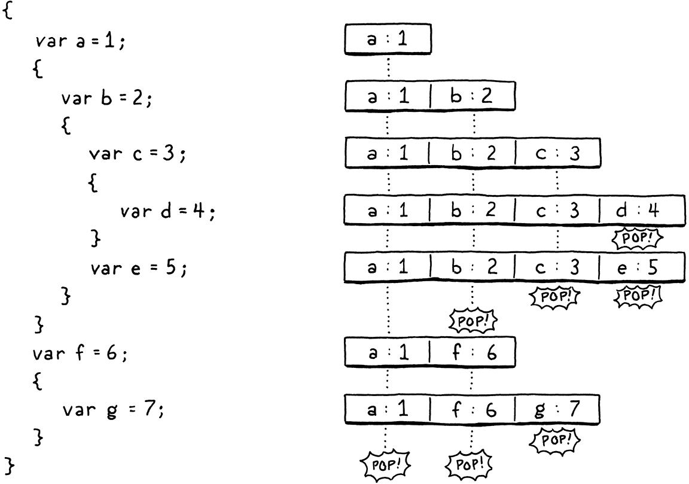

> _随着想象力的不断涌现_
>
> _未知事物的形式，诗人的笔_
>
> _把它们变成形状，变成虚无_
>
> _当地的居住地和名字。_
>
> ​ —— William Shakespeare, _A Midsummer Night’s Dream_

[上一章](../../global-variables/readme/)介绍了 clox 中的变量，但是只介绍了全局变量。在本章中，我们将进一步支持块、块作用域和局部变量。在 jlox 中，我们设法将所有这些内容和全局变量打包成一章。对于 clox 来说，这需要两章的工作量，坦率的说，部分原因是在 C 语言中一切都要花费更多的精力。

但更重要的原因是，我们处理局部变量的方法与我们实现全局变量的方法截然不同。全局变量在 Lox 中是后期绑定的。这里的“后期”是指“在编译后分析”。这有利于保持编译器的简单性，但不利于性能。局部变量是语言中最常用的部分之一。如果局部变量很慢，那么*一切*都是缓慢的。因此，对于局部变量，我们希望采取尽可能高效的策略[^1]。

幸运的是，词法作用域可以帮助我们。顾名思义，词法作用域意味着我们可以通过查看程序文本来解析局部变量——局部变量*不是*后期绑定的。我们在编译器中所做的任何处理工作都不必在运行时完成，因此局部变量的实现将在很大程度上依赖于编译器。

## 22.1 表示局部变量

在现代，实现一门编程语言的好处是，可以参考已经发展了很长时间的其它语言。那么，C 和 Java 是如何管理它们的局部变量的呢？当然是在堆栈上！它们通常使用芯片和操作系统支持的本地堆栈机制。这对我们来说有点太底层了，但是在 clox 的虚拟世界中，我们有自己的堆栈可以使用。

现在，我们只使用它来保存**临时变量**——我们在计算表达式时需要记住的短期数据块。只要我们不妨碍这些数据，我们也可以把局部变量塞到栈中。这对性能很有帮助。为一个新的局部变量分配空间只需要递增`stackTop`指针，而释放也同样是递减的过程。从已知的栈槽访问变量是一种索引数组的查询。

不过，我们确实需要小心。虚拟机希望栈的行为就像，嗯，一个栈。我们必须接受只能在栈顶分配新的局部变量，而且我们必须接受只有局部变量上方的栈槽没有数据时，才能丢弃该变量。此外，我们还需要保证临时变量不受干扰。

方便的是，Lox 的设计与这些约束条件是一致的[^2]。新的局部变量总是通过声明语句创建的。语句不会嵌套在表达式内，所以当一个语句开始执行时，栈中没有任何临时变量。代码块是严格嵌套的。当一个块结束时，它总会带走最内部、最近声明的局部变量。因为这些也是最后进入作用域的局部变量，所以它们应该位于栈顶（我们期望它所在的位置）。

逐步执行这段示例代码，查看局部变量是如何进入和离开作用域的：



看到它们如何完美地适应堆栈了吗？看来，栈可以在运行时存储局部变量。但是我们可以更进一步。我们不仅知道它们会在栈上，而且我们甚至可以确定它们在栈上的精确位置。因为编译器确切地知道任何时间点上有哪些局部变量在作用域中，因此它可以在编译过程中有效地模拟堆栈，并注意每个变量在栈中的位置。

我们将利用这一点，对于读取和存储局部变量的字节码指令，把这些栈偏移量作为其操作数。这使得局部变量非常快——就像索引数组一样简单[^3]。

我们需要在编译器中跟踪大量状态，以使整个程序运行起来，让我们就从那里开始。在 jlox 中，我们使用“环境”HashMap 链来跟踪当前在作用域中的局部变量。这是一种经典的、教科书式的词法作用域表示方式。对于 clox，像往常一样，我们更接近于硬件。所有的状态都保存了一个新的结构体中。

_<u>compiler.c，在结构体 ParseRule 后添加代码：</u>_

```c
} ParseRule;
// 新增部分开始
typedef struct {
  Local locals[UINT8_COUNT];
  int localCount;
  int scopeDepth;
} Compiler;
// 新增部分结束
Parser parser;
```

我们有一个简单、扁平的数组，其中包含了编译过程中每个时间点上处于作用域内的所有局部变量[^4]。它们在数组中的顺序与它们的声明在代码中出现的顺序相同。由于我们用来编码局部变量的指令操作数是一个字节，所以我们的虚拟机对同时处于作用域内的局部变量的数量有一个硬性限制。这意味着我们也可以给局部变量数组一个固定的大小。

_<u>common.h，添加代码：</u>_

```c
#define DEBUG_TRACE_EXECUTION
// 新增部分开始
#define UINT8_COUNT (UINT8_MAX + 1)
// 新增部分结束
#endif
```

回到 Compiler 结构体中，`localCount`字段记录了作用域中有多少局部变量——有多少个数组槽在使用。我们还会跟踪“作用域深度”。这指的是我们正在编译的当前代码外围的代码块数量。

我们的 Java 解释器使用了一个 map 链将每个块的变量与其它块分开。这一次，我们根据变量出现的嵌套级别对其进行编号。0 是全局作用域，1 是第一个顶层块，2 是它内部的块，你懂的。我们用它来跟踪每个局部变量属于哪个块，这样当一个块结束时，我们就知道该删除哪些局部变量。

数组中的每个局部变量都是这样的：

_<u>compiler.c，在结构体 ParseRule 后添加代码：</u>_

```c
} ParseRule;
// 新增部分开始
typedef struct {
  Token name;
  int depth;
} Local;
// 新增部分结束
typedef struct {
```

我们存储变量的名称。当我们解析一个标识符时，会将标识符的词素与每个局部变量名称进行比较，以找到一个匹配项。如果你不知道变量的名称，就很难解析它。`depth`字段记录了声明局部变量的代码块的作用域深度。这就是我们现在需要的所有状态。

这与我们在 jlox 中使用的表示方式非常不同，但我们用它仍然可以回答编译器需要向词法环境提出的所有相同的问题。下一步是弄清楚编译器如何获取这个状态。如果我们是有原则的工程师，我们应该给前端的每个函数添加一个参数，接受一个指向 Compiler 的指针。我们在一开始就创建一个 Compiler，并小心地在将它贯穿于每个函数的调用中……但这意味着要对我们已经写好的代码进行大量无聊的修改，所以这里用一个全局变量代替[^5]：

_<u>compiler.c，在变量 parser 后添加代码：</u>_

```c
Parser parser;
// 新增部分开始
Compiler* current = NULL;
// 新增部分结束
Chunk* compilingChunk;
```

下面是一个用于初始化编译器的小函数：

_<u>compiler.c，在 emitConstant()方法后添加代码：</u>_

```c
static void initCompiler(Compiler* compiler) {
  compiler->localCount = 0;
  compiler->scopeDepth = 0;
  current = compiler;
}
```

当我们第一次启动虚拟机时，我们会调用它使所有东西进入一个干净的状态。

_<u>compiler.c，在 compile()方法中添加代码：</u>_

```c
  initScanner(source);
  // 新增部分开始
  Compiler compiler;
  initCompiler(&compiler);
  // 新增部分结束
  compilingChunk = chunk;
```

我们的编译器有了它需要的数据，但还没有对这些数据的操作。没有办法创建或销毁作用域，添加和解析变量。我们会在需要的时候添加这些功能。首先，让我们开始构建一些语言特性。

## 22.2 块语句

在能够使用局部变量之前，我们需要一些局部作用域。它们来自于两方面：函数体和代码块。函数是一大块工作，我们在后面的章节中处理，因此现在我们只做块[^6]。和往常一样，我们从语法开始。我们要介绍的新语法是：

```javascript
statement      → exprStmt
               | printStmt
               | block ;

block          → "{" declaration* "}" ;
```

块是一种语句，所以它的规则是在`statement`生成式中。对应的编译代码如下：

_<u>compiler.c，在 statement()方法中添加代码：</u>_

```c
  if (match(TOKEN_PRINT)) {
    printStatement();
  // 新增部分开始
  } else if (match(TOKEN_LEFT_BRACE)) {
    beginScope();
    block();
    endScope();
  // 新增部分结束
  } else {
```

解析完开头的花括号之后，我们使用这个辅助函数[^7]来编译块的其余部分：

_<u>compiler.c，在 expression()方法后添加代码：</u>_

```c
static void block() {
  while (!check(TOKEN_RIGHT_BRACE) && !check(TOKEN_EOF)) {
    declaration();
  }

  consume(TOKEN_RIGHT_BRACE, "Expect '}' after block.");
}
```

它会一直解析声明和语句，直到遇见右括号。就像我们在解析器中的所有循环一样，我们也要检查标识流是否结束。这样一来，如果有一个格式不正确的程序缺少右括号，编译器也不会卡在循环里。

执行代码块只是意味着一个接一个地执行其中包含的语句，所以不需要编译它们。从语义上讲，块所做的事就是创建作用域。在我们编译块的主体之前，我们会调用这个函数进入一个新的局部作用域：

_<u>compiler.c，在 endCompiler()方法后添加代码：</u>_

```c
static void beginScope() {
  current->scopeDepth++;
}
```

为了“创建”一个作用域，我们所做的就是增加当前的深度。这当然比 jlox 快得多，因为 jlox 为每个作用域分配了全新的 HashMap。有了`beginScope()`，你大概能猜到`endScope()`会做什么。

_<u>compiler.c，在 beginScope()方法后添加代码：</u>_

```c
static void endScope() {
  current->scopeDepth--;
}
```

这就是块和作用域的全部内容——或多或少吧——现在我们准备在其中添加一些变量。

## 22.3 声明局部变量

通常我们会从解析开始，但是我们的编译器已经支持了解析和编译变量声明。我们现在已经有了`var`语句、标识符表达式和赋值语句。只是编译器假设所有的变量都是全局变量。所以，我们不需要任何新的解析支持，我们只需要将新的作用域语义与已有的代码连接起来。


变量声明的解析从`varDeclaration()`开始，并依赖于其它几个函数。首先，`parseVariable()`会使用标识符标识作为变量名称，将其词素作为字符串添加到字节码块的常量表中，然后返回它的常量表索引。接着，在`varDeclaration()`编译完初始化表达式后，会调用`defineVariable()`生成字节码，将变量的值存储到全局变量哈希表中。

这两个辅助函数都需要一些调整以支持局部变量。在`parseVariable()`中，我们添加：

_<u>compiler.c，在 parseVariable()方法中添加代码：</u>_

```c
  consume(TOKEN_IDENTIFIER, errorMessage);
  // 新增部分开始
  declareVariable();
  if (current->scopeDepth > 0) return 0;
  // 新增部分结束
  return identifierConstant(&parser.previous);
```

首先，我们“声明”这个变量。我一会儿会说到这是什么意思。之后，如果我们在局部作用域中，则退出函数。在运行时，不会通过名称查询局部变量。不需要将变量的名称放入常量表中，所以如果声明在局部作用域内，则返回一个假的表索引。

在`defineVariable()`中，如果处于局部作用域内，就需要生成一个字节码来存储局部变量。它看起来是这样的：

_<u>compiler.c，在 defineVariable()方法中添加代码：</u>_

```c
static void defineVariable(uint8_t global) {
  // 新增部分开始
  if (current->scopeDepth > 0) {
    return;
  }
  // 新增部分结束
  emitBytes(OP_DEFINE_GLOBAL, global);
```

等等，什么？是的，就是这样。没有代码会在运行时创建局部变量。想想虚拟机现在处于什么状态。它已经执行了变量初始化表达式的代码（如果用户省略了初始化，则是隐式的`nil`），并且该值作为唯一保留的临时变量位于栈顶。我们还知道，新的局部变量会被分配到栈顶……这个值已经在那里了。因此，没有什么可做的。临时变量直接*成为*局部变量。没有比这更有效的方法了。


好的，那“声明”是怎么回事呢？它的作用如下：

_<u>compiler.c，在 identifierConstant()方法后添加代码：</u>_

```c
static void declareVariable() {
  if (current->scopeDepth == 0) return;

  Token* name = &parser.previous;
  addLocal(*name);
}
```

在这里，编译器记录变量的存在。我们只对局部变量这样做，所以如果在顶层全局作用域中，就直接退出。因为全局变量是后期绑定的，所以编译器不会跟踪它所看到的关于全局变量的声明。

但是对于局部变量，编译器确实需要记住变量的存在。这就是声明的作用——将变量添加到编译器在当前作用域内的变量列表中。我们使用另一个新函数来实现这一点。

_<u>compiler.c，在 identifierConstant()方法后添加代码：</u>_

```c
static void addLocal(Token name) {
  Local* local = &current->locals[current->localCount++];
  local->name = name;
  local->depth = current->scopeDepth;
}
```

这会初始化编译器变量数组中下一个可用的 Local。它存储了变量的名称和持有变量的作用域的深度[^8]。

我们的实现对于一个正确的 Lox 程序来说是没有问题的，但是对于无效的代码呢？我们还是以稳健为目标。第一个要处理的错误其实不是用户的错，而是虚拟机的限制。使用局部变量的指令通过槽的索引来引用变量。该索引存储在一个单字节操作数中，这意味着虚拟机一次最多只能支持 256 个局部变量。

如果我们试图超过这个范围，不仅不能在运行时引用变量，而且编译器也会覆盖自己的局部变量数组。我们要防止这种情况。

_<u>compiler.c，在 addLocal()方法中添加代码：</u>_

```c
static void addLocal(Token name) {
  // 新增部分开始
  if (current->localCount == UINT8_COUNT) {
    error("Too many local variables in function.");
    return;
  }
  // 新增部分结束
  Local* local = &current->locals[current->localCount++];
```

接下来的情况就有点棘手了。考虑一下：

```javascript
{
  var a = "first";
  var a = "second";
}
```

在顶层，Lox 允许使用与之前声明的变量相同的名称重新声明一个变量，因为这在 REPL 中很有用。但在局部作用域中，这就有些奇怪了。这很可能是一个误用，许多语言（包括我们的 Lox）都把它作为一个错误[^9]。

请注意，上面的代码跟这个是不同的：

```c
{
  var a = "outer";
  {
    var a = "inner";
  }
}
```

在*不同的*作用域中有两个同名变量是可以的，即使作用域重叠，以至于两个变量是同时可见的。这就是遮蔽，而 Lox 确实允许这样做。只有在*同一个*局部作用域中有两个同名的变量才是错误的。

我们这样检测这个错误[^10]：

_<u>compiler.c，在 declareVariable()方法中添加代码：</u>_

```c
  Token* name = &parser.previous;
  // 新增部分开始
  for (int i = current->localCount - 1; i >= 0; i--) {
    Local* local = &current->locals[i];
    if (local->depth != -1 && local->depth < current->scopeDepth) {
      break;
    }

    if (identifiersEqual(name, &local->name)) {
      error("Already a variable with this name in this scope.");
    }
  }
  // 新增部分结束
  addLocal(*name);
}
```

局部变量在声明时被追加到数组中，这意味着当前作用域始终位于数组的末端。当我们声明一个新的变量时，我们从末尾开始，反向查找具有相同名称的已有变量。如果是当前作用域中找到，我们就报告错误。此外，如果我们已经到达了数组开头或另一个作用域中的变量，我们就知道已经检查了当前作用域中的所有现有变量。

为了查看两个标识符是否相同，我们使用这个方法：

_<u>compiler.c，在 identifierConstant()方法后添加代码：</u>_

```c
static bool identifiersEqual(Token* a, Token* b) {
  if (a->length != b->length) return false;
  return memcmp(a->start, b->start, a->length) == 0;
}
```

既然我们知道两个词素的长度，那我们首先检查它[^11]。对于很多不相等的字符串，在这一步就很快失败了。如果长度相同，我们就使用`memcmp()`检查字符。为了使用`memcmp()`，我们需要引入一下。

_<u>compiler.c，添加代码：</u>_

```c
#include <stdlib.h>
// 新增部分开始
#include <string.h>
// 新增部分结束
#include "common.h"
```

有了这个，我们就能创造出变量。但是，它们会停留在声明它们的作用域之外，像幽灵一样。当一个代码块结束时，我们需要让其中的变量安息。

_<u>compiler.c，在 endScope()方法中添加代码：</u>_

```c
  current->scopeDepth--;
  // 新增部分开始
  while (current->localCount > 0 &&
         current->locals[current->localCount - 1].depth >
            current->scopeDepth) {
    emitByte(OP_POP);
    current->localCount--;
  }
  // 新增部分结束
}
```

当我们弹出一个作用域时，后向遍历局部变量数组，查找在刚刚离开的作用域深度上声明的所有变量。我们通过简单地递减数组长度来丢弃它们。

这里也有一个运行时的因素。局部变量占用了堆栈中的槽位。当局部变量退出作用域时，这个槽就不再需要了，应该被释放。因此，对于我们丢弃的每一个变量，我们也要生成一条`OP_POP`指令，将其从栈中弹出[^12]。

## 22.4 使用局部变量

我们现在可以编译和执行局部变量的声明了。在运行时，它们的值就在栈中应在的位置上。让我们开始使用它们吧。我们会同时完成变量访问和赋值，因为它们在编译器中涉及相同的函数。

我们已经有了获取和设置全局变量的代码，而且像优秀的小软件工程师一样，我们希望尽可能多地重用现有的代码。就像这样：

_<u>compiler.c，在 namedVariable()方法中替换 1 行：</u>_

```c
static void namedVariable(Token name, bool canAssign) {
  // 替换部分开始
  uint8_t getOp, setOp;
  int arg = resolveLocal(current, &name);
  if (arg != -1) {
    getOp = OP_GET_LOCAL;
    setOp = OP_SET_LOCAL;
  } else {
    arg = identifierConstant(&name);
    getOp = OP_GET_GLOBAL;
    setOp = OP_SET_GLOBAL;
  }
  // 替换部分结束
  if (canAssign && match(TOKEN_EQUAL)) {
```

我们不对变量访问和赋值对应的字节码指令进行硬编码，而是使用了一些 C 变量。首先，我们尝试查找具有给定名称的局部变量，如果我们找到了，就使用处理局部变量的指令。否则，我们就假定它是一个全局变量，并使用现有的处理全局变量的字节码。

再往下一点，我们使用这些变量来生成正确的指令。对于赋值：

_<u>compiler.c，在 namedVariable()方法中替换 1 行：</u>_

```c
  if (canAssign && match(TOKEN_EQUAL)) {
    expression();
    // 替换部分开始
    emitBytes(setOp, (uint8_t)arg);
    // 替换部分结束
  } else {
```

对于访问：

_<u>compiler.c，在 namedVariable()方法中替换 1 行：</u>_

```c
    emitBytes(setOp, (uint8_t)arg);
  } else {
    // 替换部分开始
    emitBytes(getOp, (uint8_t)arg);
    // 替换部分结束
  }
```

本章的核心，也就是解析局部变量的部分，在这里：

_<u>compiler.c，在 identifiersEqual()方法后添加代码：</u>_

```c
static int resolveLocal(Compiler* compiler, Token* name) {
  for (int i = compiler->localCount - 1; i >= 0; i--) {
    Local* local = &compiler->locals[i];
    if (identifiersEqual(name, &local->name)) {
      return i;
    }
  }

  return -1;
}
```

尽管如此，它还是很直截了当的。我们会遍历当前在作用域内的局部变量列表。如果有一个名称与标识符相同，则标识符一定指向该变量。我们已经找到了它！我们后向遍历数组，这样就能找到最后一个带有该标识符的已声明变量。这可以确保内部的局部变量能正确地遮蔽外围作用域中的同名变量。

在运行时，我们使用栈中槽索引来加载和存储局部变量，因此编译器在解析变量之后需要计算索引。每当一个变量被声明，我们就将它追加到编译器的局部变量数组中。这意味着第一个局部变量在索引 0 的位置，下一个在索引 1 的位置，以此类推。换句话说，编译器中的局部变量数组的布局与虚拟机堆栈在运行时的布局完全相同。变量在局部变量数组中的索引与其在栈中的槽位相同。多么方便啊！

如果我们在整个数组中都没有找到具有指定名称的变量，那它肯定不是局部变量。在这种情况下，我们返回`-1`，表示没有找到，应该假定它是一个全局变量。

### 22.4.1 解释局部变量

我们的编译器发出了两条新指令，我们来让它们发挥作用。首先是加载一个局部变量：

_<u>chunk.h，在枚举 OpCode 中添加代码：</u>_

```c
  OP_POP,
  // 新增部分开始
  OP_GET_LOCAL,
  // 新增部分结束
  OP_GET_GLOBAL,
```

还有其实现[^13]：

_<u>vm.c，在 run()方法中添加代码：</u>_

```c
      case OP_POP: pop(); break;
      // 新增部分开始
      case OP_GET_LOCAL: {
        uint8_t slot = READ_BYTE();
        push(vm.stack[slot]);
        break;
      }
      // 新增部分结束
      case OP_GET_GLOBAL: {
```

它接受一个单字节操作数，用作局部变量所在的栈槽。它从索引处加载值，然后将其压入栈顶，在后面的指令可以找到它。

接下来是赋值：

_<u>chunk.h，在枚举 OpCode 中添加代码：</u>_

```c
  OP_GET_LOCAL,
  // 新增部分开始
  OP_SET_LOCAL,
  // 新增部分结束
  OP_GET_GLOBAL,
```

你大概能预测到它的实现。

_<u>vm.c，在 run()方法中添加代码：</u>_

```c
      }
      // 新增部分开始
      case OP_SET_LOCAL: {
        uint8_t slot = READ_BYTE();
        vm.stack[slot] = peek(0);
        break;
      }
      // 新增部分结束
      case OP_GET_GLOBAL: {
```

它从栈顶获取所赋的值，然后存储到与局部变量对应的栈槽中。注意，它不会从栈中弹出值。请记住，赋值是一个表达式，而每个表达式都会产生一个值。赋值表达式的值就是所赋的值本身，所以虚拟机要把值留在栈上。

如果不支持这两条新指令，我们的反汇编程序就不完整了。

_<u>debug.c，在 disassembleInstruction()方法中添加代码：</u>_

```c
      return simpleInstruction("OP_POP", offset);
    // 新增部分开始
    case OP_GET_LOCAL:
      return byteInstruction("OP_GET_LOCAL", chunk, offset);
    case OP_SET_LOCAL:
      return byteInstruction("OP_SET_LOCAL", chunk, offset);
    // 新增部分结束
    case OP_GET_GLOBAL:
```

编译器将局部变量编译为直接的槽访问。局部变量的名称永远不会离开编译器，根本不可能进入字节码块。这对性能很好，但对内省(自我观察)来说就不那么好了。当我们反汇编这些指令时，我们不能像全局变量那样使用变量名称。相反，我们只显示槽号[^14]。

_<u>debug.c，在 simpleInstruction()方法后添加代码：</u>_

```c
static int byteInstruction(const char* name, Chunk* chunk,
                           int offset) {
  uint8_t slot = chunk->code[offset + 1];
  printf("%-16s %4d\n", name, slot);
  return offset + 2;
}
```

### 22.4.2 另一种作用域边界情况

我们已经花了一些时间来处理部分关于作用域的奇怪的边界情况。我们确保变量遮蔽能正确工作。如果同一个局部作用域中的两个变量具有相同的名称，我们会报告错误。由于我并不完全清楚的原因，变量作用域似乎有很多这样的问题。我从来没有见过一种语言让人感觉绝对优雅[^15]。

在本章结束之前，我们还有一个边界情况需要处理。回顾一下我们第一次在 [jlox 中实现变量解析](../../resolving-and-binding/readme/)时，遇到的这个奇怪的东西：

```
{
  var a = "outer";
  {
    var a = a;
  }
}
```

我们当时通过将一个变量的声明拆分为两个阶段来解决这个问题，在这里我们也要这样做：


一旦变量声明开始——换句话说，在它的初始化式之前——名称就会在当前作用域中声明。变量存在，但处于特殊的“未初始化”状态。然后我们编译初始化式。如果在表达式中的任何一个时间点，我们解析了一个指向该变量的标识符，我们会发现它还没有初始化，并报告错误。在我们完成初始化表达式的编译之后，把变量标记为已初始化并可供使用。

为了实现这一点，当声明一个局部变量时，我们需要以某种方式表明“未初始化”状态。我们可以在 Local 中添加一个新字段，但我们还是在内存方面更节省一些。相对地，我们将变量的作用域深度设置为一个特殊的哨兵值`-1`。

_<u>compiler.c，在 addLocal()方法中替换 1 行：</u>_

```c
  local->name = name;
  // 替换部分开始
  local->depth = -1;
  // 替换部分结束
}
```

稍后，一旦变量的初始化式编译完成，我们将其标记为已初始化。

_<u>compiler.c，在 defineVariable()方法中添加代码：</u>_

```c
  if (current->scopeDepth > 0) {
    // 新增部分开始
    markInitialized();
    // 新增部分结束
    return;
  }
```

实现如下：

_<u>compiler.c，在 parseVariable()方法后添加代码：</u>_

```c
static void markInitialized() {
  current->locals[current->localCount - 1].depth =
      current->scopeDepth;
}
```

所这就是编译器中“声明”和“定义”变量的真正含义。“声明”是指变量被添加到作用域中，而“定义”是变量可以被使用的时候。

当解析指向局部变量的引用时，我们会检查作用域深度，看它是否被完全定义。

_<u>compiler.c，在 resolveLocal()方法中添加代码：</u>_

```c
    if (identifiersEqual(name, &local->name)) {
      // 新增部分开始
      if (local->depth == -1) {
        error("Can't read local variable in its own initializer.");
      }
      // 新增部分结束
      return i;
```

如果变量的深度是哨兵值，那这一定是在变量自身的初始化式中对该变量的引用，我们会将其报告为一个错误。

这一章就讲到这里！我们添加了块、局部变量和真正的词法作用域。鉴于我们为变量引入了完全不同的运行时表示形式，我们不必编写很多代码。这个实现最终是相当干净和高效的。

你会注意到，我们写的几乎所有的代码都在编译器中。在运行时，只有两个小指令。你会看到，相比于 jlox，这是 clox 中的一个持续的趋势[^16]。优化器工具箱中最大的锤子就是把工作提前到编译器中，这样你就不必在运行时做这些工作了。在本章中，这意味着要准确地解析每个局部变量占用的栈槽。这样，在运行时就不需要进行查找或解析。

[^1]: 函数参数也被大量使用。它们也像局部变量一样工作，因此我们将会对它们使用同样的实现技术。
[^2]: 这种排列方式显然不是巧合。我将 Lox 设计成可以单遍编译为基于堆栈的字节码。但我没必要为了适应这些限制对语言进行过多的调整。它的大部分设计应该感觉很自然。<BR>这在很大程度上是因为语言的历史与单次编译紧密联系在一起，其次是基于堆栈的架构。Lox 的块作用域遵循的传统可以追溯到 BCPL。作为程序员，我们对一门语言中什么是“正常”的直觉，即使在今天也会受到过去的硬件限制的影响。
[^3]: 在本章中，局部变量从虚拟机堆栈数组的底部开始，并在那里建立索引。当我们添加函数时，这个方案就变得有点复杂了。每个函数都需要自己的堆栈区域来存放参数和局部变量。但是，正如我们将看到的，这并没有如你所想那样增加太多的复杂性。
[^4]: 我们正在编写一个单遍编译器，所以对于如何在数组中对变量进行排序，我们并没有太多的选择。
[^5]: 特别说明，如果我们想在多线程应用程序中使用编译器（可能有多个编译器并行运行），那么使用全局变量是一个坏主意。
[^6]: 仔细想想，“块”是个奇怪的名字。作为比喻来说，“块”通常意味着一个不可分割的小单元，但出于某种原因，Algol 60 委员会决定用它来指代一个复合结构——一系列语句。我想，还有更糟的情况，Algol 58 将`begin`和`end`称为“语句括号”。
[^7]: 在后面编译函数体时，这个方法会派上用场。
[^8]: 担心作为变量名称的字符串的生命周期吗？Local 直接存储了标识符对应 Token 结构体的副本。Token 存储了一个指向其词素中第一个字符的指针，以及词素的长度。该指针指向正在编译的脚本或 REPL 输入语句的源字符串。<BR>只要这个字符串在整个编译过程中存在——你知道，它一定存在，我们正在编译它——那么所有指向它的标识都是正常的。
[^9]: 有趣的是，Rust 语言确实允许这样做，而且惯用代码也依赖于此。
[^10]: 暂时先不用关心那个奇怪的`depth != -1`部分。我们稍后会讲到。
[^11]: 如果我们能检查它们的哈希值，将是一个不错的小优化，但标识不是完整的 LoxString，所以我们还没有计算出它们的哈希值。
[^12]: 当多个局部变量同时退出作用域时，你会得到一系列的`OP_POP`指令，这些指令会被逐个解释。你可以在你的 Lox 实现中添加一个简单的优化，那就是专门的`OP_POPN`指令，该指令接受一个操作数，作为弹出的槽位的数量，并一次性弹出所有槽位。
[^13]: 把局部变量的值压到栈中似乎是多余的，因为它已经在栈中较低的某个位置了。问题是，其它字节码指令只能查找*栈顶*的数据。这也是我们的字节码指令集基于堆栈的主要表现。[基于寄存器](http://www.craftinginterpreters.com/a-virtual-machine.html#design-note)的字节码指令集避免了这种堆栈技巧，其代价是有着更多操作数的大型指令。
[^14]: 如果我们想为虚拟机实现一个调试器，在编译器中擦除局部变量名称是一个真正的问题。当用户逐步执行代码时，他们希望看到局部变量的值按名称排列。为了支持这一点，我们需要输出一些额外的信息，以跟踪每个栈槽中的局部变量的名称。
[^15]: 没有，即便 Scheme 也不是。
[^16]: 你可以把静态类型看作是这种趋势的一个极端例子。静态类型语言将所有的类型分析和类型错误处理都在编译过程中进行了整理。这样，运行时就不必浪费时间来检查值是否具有适合其操作的类型。事实上，在一些静态类型语言（如 C）中，你甚至不*知道*运行时的类型。编译器完全擦除值类型的任何表示，只留下空白的比特位。

---

## 习题

1. 我们这个简单的局部变量数组使得计算每个局部变量的栈槽很容易。但这意味着，当编译器解析一个变量的引用时，我们必须对数组进行线性扫描。

   想出一些更有效的方法。你认为这种额外的复杂性是否值得？

2. 其它语言中如何处理这样的代码：

   ```javascript
   var a = a;
   ```

   如果这是你的语言，你会怎么做？为什么？

3. 许多语言中，对可以重新赋值的变量与不能重新赋值的变量进行了区分。在 Java 中，`final`修饰符可以阻止你对变量进行赋值。在 JavaScript 中，用`let`声明的变量可以被赋值，但用`const`声明的变量不能被赋值。`Swift`将`let`视为单次赋值，并对可赋值变量使用`var`。`Scala`和`Kotlin`则使用`val`和`var`。

   选一个关键字作为单次赋值变量的形式添加到 Lox 中。解释一下你的选择，然后实现它。试图赋值给一个用新关键字声明的变量应该会引起编译错误。

4. 扩展 Lox，允许作用域中同时有超过 256 个局部变量。
