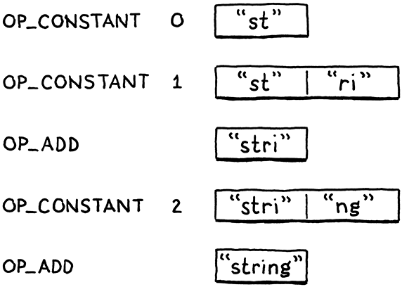

> “啊？对琐碎的劳动有点反感？”医生挑了挑眉毛，“可以理解，但这是错误的。一个人应该珍惜那些让身体忙碌，但让思想和心灵不受束缚的琐碎工作。”（泰德-威廉姆斯，《龙骨椅》）
>
> ​ ——Tad Williams, _The Dragonbone Chair_

我们的小虚拟机现在可以表示三种类型的值：数字，布尔值和`nil`。这些类型有两个重要的共同点：它们是不可变的，它们很小。数字是最大的，而它仍可以被 2 个 64 比特的字容纳。这是一个足够小的代价，我们可以为所有值都支付这个代价，即使是不需要那么多空间的布尔值和 nil。

不幸的是，字符串就没有这么小了。一个字符串没有最大的长度，即使我们人为地将其限制在 255 个字符[^1]，这对于每个单独的值来说仍然花费了太多的内存。
å
我们需要一种方法来支持那些大小变化（有时变化很大）的值。这正是堆上动态分配的设计目的。我们可以根据需要分配任意多的字节。我们会得到一个指针，当值在虚拟机中流动时，我们会用该指针来跟踪它。

## 19.1 值与对象

将堆用于较大的、可变大小的值，将栈用于较小的、原子性的值，这就导致了两级表示形式。每个可以存储在变量中或从表达式返回的 Lox 值都是一个 Value。对于小的、固定大小的类型（如数字），有效载荷直接存储在 Value 结构本身。

如果对象比较大，它的数据就驻留在堆中。那么 Value 的有效载荷就是指向那块内存的一个指针。我们最终会在 clox 中拥有一些堆分配的类型：字符串、实例、函数，你懂的。每个类型都有自己独特的数据，但它们也有共同的状态，我们未来的[垃圾收集器](../../garbage-collection/readme/)会用这些状态来管理它们的内存。


我们将这个共同的表示形式称为“Obj”[^2]。每个状态位于堆上的 Lox 值都是一个 Obj。因此，我们可以使用一个新的 ValueType 来指代所有堆分配的类型。

_<u>value.h，在枚举 ValueType 中添加代码：</u>_

```c
  VAL_NUMBER,
  // 新增部分开始
  VAL_OBJ
  // 新增部分结束
} ValueType;
```

当 Value 的类型是`VAL_OBJ`时，有效载荷是一个指向堆内存的指针，因此我们在联合体中为其添加另一种情况。

_<u>value.h，在结构体 Value 中添加代码：</u>_

```c
    double number;
    // 新增部分开始
    Obj* obj;
    // 新增部分结束
  } as;
```

正如我们对其它值类型所做的那样，我们提供了几个有用的宏来处理 Obj 值。

_<u>value.h，在结构体 Value 后添加代码：</u>_

```c
#define IS_NUMBER(value)  ((value).type == VAL_NUMBER)
// 新增部分开始
#define IS_OBJ(value)     ((value).type == VAL_OBJ)
// 新增部分结束
#define AS_BOOL(value)    ((value).as.boolean)
```

如果给定的 Value 是一个 Obj，则该值计算结果为`true`。如果这样，我们可以使用这个：

_<u>value.h，添加代码：</u>_

```c
#define IS_OBJ(value)     ((value).type == VAL_OBJ)
// 新增部分开始
#define AS_OBJ(value)     ((value).as.obj)
// 新增部分结束
#define AS_BOOL(value)    ((value).as.boolean)
```

它会从值中提取 Obj 指针。我们也可以反其道而行之。

_<u>value.h，添加代码：</u>_

```c
#define NUMBER_VAL(value) ((Value){VAL_NUMBER, {.number = value}})
// 新增部分开始
#define OBJ_VAL(object)   ((Value){VAL_OBJ, {.obj = (Obj*)object}})
// 新增部分结束
typedef struct {
```

该方法会接受一个 Obj 指针，并将其包装成一个完整的 Value。

## 19.2 结构体继承

每个堆分配的值都是一个 Obj，但 Obj 并不都是一样的。对于字符串，我们需要字符数组。等我们有了实例，它们需要自己的数据字段。一个函数对象需要的是其字节码块。我们如何处理不同的有效载荷和大小？我们不能像 Value 那样使用另一个联合体，因为这些大小各不相同。

相对地，我们会使用另一种技术。它已经存在了很久，以至于 C 语言规范为它提供了明确的支持，但我不知道它是否有一个正式的名字。这是一个[类型双关](https://en.wikipedia.org/wiki/Type_punning)的例子，但这个术语太宽泛了。鉴于没有更好的想法，我将其称为**结构体继承**，因为它依赖于结构体，并大致遵循了面向对象语言中状态的单继承工作方式。

与带标签的联合体一样，每个 Obj 开头都是一个标签字段，用于识别它是什么类型的对象——字符串、实例，等等。接下来是有效载荷字段。每种类型都有自己单独的结构，而不是各类型结构的联合体。棘手的部分是如何统一处理这些结构，因为 C 没有继承或多态的概念。我很快就会对此进行解释，但是首先让我们先弄清楚一些基本的东西。

“Obj”这个名称本身指的是一个结构体，它包含所有对象类型共享的状态。它有点像对象的“基类”。由于值和对象之间存在一些循环依赖关系，我们在“value”模块中对其进行前置声明。

_<u>value.h，添加代码：</u>_

```c
#include "common.h"
// 新增部分开始
typedef struct Obj Obj;
// 新增部分结束
typedef enum {
```

实际的定义是在一个新的模块中。

_<u>object.h，创建新文件：</u>_

```c
#ifndef clox_object_h
#define clox_object_h

#include "common.h"
#include "value.h"

struct Obj {
  ObjType type;
};

#endif
```

现在，它只包含一个类型标记。不久之后，我们将为内存管理添加一些其它的簿记信息。类型枚举如下：

_<u>object.h，添加代码：</u>_

```c
#include "value.h"
// 新增部分开始
typedef enum {
  OBJ_STRING,
} ObjType;
// 新增部分结束
struct Obj {
```

显然，等我们在后面的章节中添加了更多的堆分配类型之后，这个枚举会更有用。因为我们会经常访问这些标记类型，所以有必要编写一个宏，从给定的 Value 中提取对象类型标签。

_<u>object.h，添加代码：</u>_

```c
#include "value.h"
// 新增部分开始
#define OBJ_TYPE(value)        (AS_OBJ(value)->type)
// 新增部分结束
typedef enum {
```

这是我们的基础。

现在，让我们在其上建立字符串。字符串的有效载荷定义在一个单独的结构体中。同样，我们需要对其进行前置声明。

_<u>value.h，添加代码：</u>_

```c
typedef struct Obj Obj;
// 新增部分开始
typedef struct ObjString ObjString;
// 新增部分结束
typedef enum {
```

这个定义与 Obj 是并列的。

_<u>object.h，在结构体 Obj 后添加代码：</u>_

```c
};
// 新增部分开始
struct ObjString {
  Obj obj;
  int length;
  char* chars;
};
// 新增部分结束
#endif
```

字符串对象中包含一个字符数组。这些字符存储在一个单独的、由堆分配的数组中，这样我们就可以按需为每个字符串留出空间。我们还会保存数组中的字节数。这并不是严格必需的，但可以让我们迅速知道为字符串分配了多少内存，而不需要遍历字符数组寻找空结束符。

因为 ObjString 是一个 Obj，它也需要所有 Obj 共有的状态。它通过将第一个字段置为 Obj 来实现这一点。C 语言规定，结构体的字段在内存中是按照它们的声明顺序排列的。此外，当结构体嵌套时，内部结构体的字段会在适当的位置展开。所以 Obj 和 ObjString 的内存看起来是这样的：


注意 ObjString 的第一个字节是如何与 Obj 精确对齐的。这并非巧合——是 C 语言强制要求的[^3]。这是为实现一个巧妙的模式而设计的：你可以接受一个指向结构体的指针，并安全地将其转换为指向其第一个字段的指针，反之亦可。

给定一个`ObjString*`，你可以安全地将其转换为`Obj*`，然后访问其中的`type`字段。每个 ObjString“是”一个 Obj，这里的“是”指 OOP 意义上的“是”。等我们稍后添加其它对象类型时，每个结构体都会有一个 Obj 作为其第一个字段。任何代码若想要面向所有对象，都可以把它们当做基础的`Obj*`，并忽略后面可能出现的任何其它字段。

你也能反向操作。给定一个`Obj*`，你可以将其“向下转换”为一个`ObjString*`。当然，你需要确保你的`Obj*`指针确实指向一个实际的 ObjString 中的`obj`字段。否则，你就会不安全地重新解释内存中的随机比特位。为了检测这种类型转换是否安全，我们再添加另一个宏。

_<u>object.h，添加代码：</u>_

```c
#define OBJ_TYPE(value)        (AS_OBJ(value)->type)
// 新增部分开始
#define IS_STRING(value)       isObjType(value, OBJ_STRING)
// 新增部分结束
typedef enum {
```

它接受一个 Value，而不是原始的`Obj*`，因为虚拟机中的大多数代码都使用 Value。它依赖于这个内联函数：

_<u>object.h，在结构体 ObjString 后添加代码：</u>_

```c
};
// 新增部分开始
static inline bool isObjType(Value value, ObjType type) {
  return IS_OBJ(value) && AS_OBJ(value)->type == type;
}
// 新增部分结束
#endif
```

突击测试：为什么不直接把这个函数体放在宏中？与其它函数相比，这个函数有什么不同？对，这是因为函数体使用了两次`value`。宏的展开方式是在主体中形参名称出现的每个地方插入实参*表达式*。如果一个宏中使用某个参数超过一次，则该表达式就会被求值多次。

如果这个表达式有副作用，那就不好了。如果我们把`isObjType()`的主体放到宏的定义中，假设你这么使用

```c
IS_STRING(POP())
```

那么它就会从堆栈中弹出两个值！使用函数可以解决这个问题。

只要我们确保在创建某种类型的 Obj 时正确设置了类型标签，这个宏就会告诉我们何时将一个值转换为特定的对象类型是安全的。我们可以用下面这些函数来做转换：

_<u>object.h，添加代码：</u>_

```c
#define IS_STRING(value)       isObjType(value, OBJ_STRING)
// 新增部分开始
#define AS_STRING(value)       ((ObjString*)AS_OBJ(value))
#define AS_CSTRING(value)      (((ObjString*)AS_OBJ(value))->chars)
// 新增部分结束
typedef enum {
```

这两个宏会接受一个 Value，其中应当包含一个指向堆上的有效 ObjString 指针。第一个函数返回 `ObjString*` 指针。第二个函数更进一步返回了字符数组本身，因为这往往是我们最终需要的。

## 19.3 字符串

好了，我们的虚拟机现在可以表示字符串值了。现在是时候向语言本身添加字符串了。像往常一样，我们从前端开始。词法解析器已经将字符串字面量标识化了，所以现在轮到解析器了。

_<u>compiler.c，替换 1 行：</u>_

```c
  [TOKEN_IDENTIFIER]    = {NULL,     NULL,   PREC_NONE},
  // 替换一行开始
  [TOKEN_STRING]        = {string,   NULL,   PREC_NONE},
  // 替换一行结束
  [TOKEN_NUMBER]        = {number,   NULL,   PREC_NONE},
```

当解析器遇到一个字符串标识时，会调用这个解析函数：

_<u>compiler.c，在 number()方法后添加代码：</u>_

```c
static void string() {
  emitConstant(OBJ_VAL(copyString(parser.previous.start + 1,
                                  parser.previous.length - 2)));
}
```

这里直接从词素中获取字符串的字符[^4]。`+1`和`-2`部分去除了开头和结尾的引号。然后，它创建了一个字符串对象，将其包装为一个 Value，并塞入常量表中。

为了创建字符串，我们使用了在`object.h`中声明的`copyString()`。

_<u>object.h，在结构体 ObjString 后添加代码：</u>_

```c
};
// 新增部分开始
ObjString* copyString(const char* chars, int length);
// 新增部分结束
static inline bool isObjType(Value value, ObjType type) {
```

编译器模块需要引入它。

_<u>compiler.h，添加代码：</u>_

```c
#define clox_compiler_h
// 新增部分开始
#include "object.h"
// 新增部分结束
#include "vm.h"
```

我们的“object”模块有了一个实现文件，我们在其中定义新函数。

_<u>object.c，创建新文件：</u>_

```c
#include <stdio.h>
#include <string.h>

#include "memory.h"
#include "object.h"
#include "value.h"
#include "vm.h"

ObjString* copyString(const char* chars, int length) {
  char* heapChars = ALLOCATE(char, length + 1);
  memcpy(heapChars, chars, length);
  heapChars[length] = '\0';
  return allocateString(heapChars, length);
}
```

首先，我们在堆上分配一个新数组，其大小刚好可以容纳字符串中的字符和末尾的结束符，使用这个底层宏来分配一个具有给定元素类型和数量的数组：

_<u>memory.h，添加代码：</u>_

```c
#include "common.h"
// 新增部分开始
#define ALLOCATE(type, count) \
    (type*)reallocate(NULL, 0, sizeof(type) * (count))
// 新增部分结束
#define GROW_CAPACITY(capacity) \
```

有了数组以后，就把词素中的字符复制过来并终止[^5]。

你可能想知道为什么 ObjString 不能直接执行源字符串中的原始字符。由于连接等字符串操作，一些 ObjString 会在运行时被动态创建。这些字符串显然需要为字符动态分配内存，这也意味着该字符串不再需要这些内存时，要*释放*它们。

如果我们有一个 ObjString 存储字符串字面量，并且试图释放其中指向原始的源代码字符串的字符数组，糟糕的事情就会发生。因此，对于字面量，我们预先将字符复制到堆中。这样一来，每个 ObjString 都能可靠地拥有自己的字符数组，并可以释放它。

创建字符串对象的真正工作发生在这个函数中：

_<u>object.c，添加代码：</u>_

```c
#include "vm.h"
// 新增部分开始
static ObjString* allocateString(char* chars, int length) {
  ObjString* string = ALLOCATE_OBJ(ObjString, OBJ_STRING);
  string->length = length;
  string->chars = chars;
  return string;
}
// 新增部分结束
```

它在堆上创建一个新的 ObjString，然后初始化其字段。这有点像 OOP 语言中的构建函数。因此，它首先调用“基类”的构造函数来初始化 Obj 状态，使用了一个新的宏。

_<u>object.c，添加代码：</u>_

```c
#include "vm.h"
// 新增部分开始
#define ALLOCATE_OBJ(type, objectType) \
    (type*)allocateObject(sizeof(type), objectType)
// 新增部分结束
static ObjString* allocateString(char* chars, int length) {
```

跟前面的宏一样，这个宏[^6]的存在主要是为了避免重复地将`void*`转换回期望的类型。实际的功能在这里：

_<u>object.c，添加代码：</u>_

```c
#define ALLOCATE_OBJ(type, objectType) \
    (type*)allocateObject(sizeof(type), objectType)
// 新增部分开始
static Obj* allocateObject(size_t size, ObjType type) {
  Obj* object = (Obj*)reallocate(NULL, 0, size);
  object->type = type;
  return object;
}
// 新增部分结束
static ObjString* allocateString(char* chars, int length) {
```

它在堆上分配了一个给定大小的对象。注意，这个大小*不仅仅*是 Obj 本身的大小。调用者传入字节数，以便为被创建的对象类型留出额外的载荷字段所需的空间。

然后它初始化 Obj 状态——现在这只是个类型标签。这个函数会返回到 `allocateString()`，它来完成对 ObjString 字段的初始化。就是这样，我们可以编译和执行字符串字面量了。

## 19.4 字符串操作

我们的花哨的字符串已经就位了，但是它们还没有发挥什么作用。一个好的第一步是使现有的打印代码不要排斥新的值类型。

_<u>value.c，在 printValue()方法中添加代码：</u>_

```c
    case VAL_NUMBER: printf("%g", AS_NUMBER(value)); break;
    // 新增部分开始
    case VAL_OBJ: printObject(value); break;
    // 新增部分结束
  }
```

如果该值是一个堆分配的对象，它会调用“object”模块中的一个辅助函数。

_<u>object.h，在 copyString()方法后添加代码：</u>_

```c
ObjString* copyString(const char* chars, int length);
// 新增部分开始
void printObject(Value value);
// 新增部分结束
static inline bool isObjType(Value value, ObjType type) {
```

对应的实现的这样的：

_<u>object.c，在 copyString()方法后添加代码：</u>_

```c
void printObject(Value value) {
  switch (OBJ_TYPE(value)) {
    case OBJ_STRING:
      printf("%s", AS_CSTRING(value));
      break;
  }
}
```

我们现在只有一个对象类型，但是这个函数在后续的章节中会出现更多 case 分支。对于字符串对象，只是简单地将字符数组作为 C 字符串打印出来[^7]。

相等运算符也需要优雅地处理字符串。考虑一下：

```c
"string" == "string"
```

这是两个独立的字符串字面量。编译器会对`copyString()`进行两次单独的调用，创建两个不同的 ObjString 对象，并将它们作为两个常量存储在字节码块中。它们是堆中的不同对象。但是我们的用户（也就是我们）希望字符串的值是相等的。上面的表达式计算结果应该是`true`。这需要一点特殊的支持。

_<u>value.c，在 valuesEqual()中添加代码：</u>_

```c
    case VAL_NUMBER: return AS_NUMBER(a) == AS_NUMBER(b);
    // 新增部分开始
    case VAL_OBJ: {
      ObjString* aString = AS_STRING(a);
      ObjString* bString = AS_STRING(b);
      return aString->length == bString->length &&
          memcmp(aString->chars, bString->chars,
                 aString->length) == 0;
    }
    // 新增部分结束
    default:         return false; // Unreachable.
```

如果两个值都是字符串，那么当它们的字符数组中包含相同的字符时，它们就是相等的，不管它们是两个独立的对象还是完全相同的一个对象。这确实意味着字符串相等比其它类型的相等要慢，因为它必须遍历整个字符串。我们稍后会对此进行修改，但目前这为我们提供了正确的语义。

最后，为了使用`memcmp()`和“object”模块中的新内容，我们需要一些引入。这里：

_<u>value.c，添加代码：</u>_

```c
#include <stdio.h>
// 新增部分开始
#include <string.h>
// 新增部分结束
#include "memory.h"
```

还有这里：

_<u>value.c，添加代码：</u>_

```c
#include <string.h>
// 新增部分开始
#include "object.h"
// 新增部分结束
#include "memory.h"
```

### 19.4.1 连接

成熟的语言都提供了很多处理字符串的操作——访问单个字符、字符串长度、改变大小写、分割、连接、搜索等。当你实现自己的语言时，你可能会想要所有这些。但是在本书中，我们还是让事情保持简单。

我们对字符串支持的唯一有趣的操作是`+`。如果你在两个字符串对象上使用这个操作符，它会产生一个新的字符串，是两个操作数的连接。由于 Lox 是动态类型的，因此我们在编译时无法判断需要哪种行为，因为我们在运行时才知道操作数的类型。因此，`OP_ADD`指令会动态地检查操作数，并选择正确的操作。

_<u>vm.c，在 run()方法中替换 1 行：</u>_

```c
      case OP_LESS:     BINARY_OP(BOOL_VAL, <); break;
      // 替换部分开始
      case OP_ADD: {
        if (IS_STRING(peek(0)) && IS_STRING(peek(1))) {
          concatenate();
        } else if (IS_NUMBER(peek(0)) && IS_NUMBER(peek(1))) {
          double b = AS_NUMBER(pop());
          double a = AS_NUMBER(pop());
          push(NUMBER_VAL(a + b));
        } else {
          runtimeError(
              "Operands must be two numbers or two strings.");
          return INTERPRET_RUNTIME_ERROR;
        }
        break;
      }
      // 替换部分结束
      case OP_SUBTRACT: BINARY_OP(NUMBER_VAL, -); break;
```

如果两个操作数都是字符串，则连接。如果都是数字，则相加。任何其它操作数类型的组合都是一个运行时错误[^8]。

为了连接字符串，我们定义一个新函数。

_<u>vm.c，在 isFalsey()方法后添加代码：</u>_

```c
static void concatenate() {
  ObjString* b = AS_STRING(pop());
  ObjString* a = AS_STRING(pop());

  int length = a->length + b->length;
  char* chars = ALLOCATE(char, length + 1);
  memcpy(chars, a->chars, a->length);
  memcpy(chars + a->length, b->chars, b->length);
  chars[length] = '\0';

  ObjString* result = takeString(chars, length);
  push(OBJ_VAL(result));
}
```

这是相当繁琐的，因为处理字符串的 C 语言代码往往是这样。首先，我们根据操作数的长度计算结果字符串的长度。我们为结果分配一个字符数组，然后将两个部分复制进去。与往常一样，我们要小心地确保这个字符串被终止了。

为了调用`memcpy()`，虚拟机需要引入头文件。

_<u>vm.c，添加代码：</u>_

```c
#include <stdio.h>
// 新增部分开始
#include <string.h>
// 新增部分结束
#include "common.h"
```

最后，我们生成一个 ObjString 来包含这些字符。这次我们使用一个新函数`takeString()`。

_<u>object.h，在结构体 ObjString 后添加代码：</u>_

```c
};
// 新增部分开始
ObjString* takeString(char* chars, int length);
// 新增部分结束
ObjString* copyString(const char* chars, int length);
```

其实现如下：

_<u>object.c，在 allocateString()方法后添加代码：</u>_

```c
ObjString* takeString(char* chars, int length) {
  return allocateString(chars, length);
}
```

前面的`copyString()`函数假定它*不能*拥有传入的字符的所有权。相对地，它保守地在堆上创建了一个 ObjString 可以拥有的字符的副本。对于传入的字符位于源字符串中间的字面量来说，这样做是正确的。

但是，对于连接，我们已经在堆上动态地分配了一个字符数组。再做一个副本是多余的（而且意味着`concatenate()`必须记得释放它的副本）。相反，这个函数要求拥有传入字符串的所有权。

通常，将这个功能拼接在一起需要引入一些头文件。

_<u>vm.c，添加代码：</u>_

```c
#include "debug.h"
// 新增部分开始
#include "object.h"
#include "memory.h"
// 新增部分结束
#include "vm.h"
```

## 19.5 释放对象

看看这个看似无害的表达式：

```c
"st" + "ri" + "ng"
```

当编译器在处理这个表达式时，会为这三个字符串字面量分别分配一个 ObjString，将它们存储到字节码块的常量表中[^9]，并生成这个字节码：

```c
0000    OP_CONSTANT         0 "st"
0002    OP_CONSTANT         1 "ri"
0004    OP_ADD
0005    OP_CONSTANT         2 "ng"
0007    OP_ADD
0008    OP_RETURN
```

前两条指令将`"st"`和`"ri"`压入栈中。然后`OP_ADD`将它们弹出并连接。这会在堆上动态分配一个新的`"stri"`字符串。虚拟机将它压入栈中，然后压入`"ng"`常量。最后一个`OP_ADD`会弹出`"stri"`和`"ng"`，将它们连接起来，并将结果`"string"`压入栈。很好，这就是我们所期望的。

但是，请等一下。那个`"stri"`字符串怎么样了？我们动态分配了它，然后虚拟机在将其与`"ng"`连接后丢弃了它。我们把它从栈中弹出，不再持有对它的引用，但是我们从未释放它的内存。我们遇到了典型的内存泄露。

当然，Lox 程序完全可以忘记中间的字符串，也不必担心释放它们。Lox 代表用户自动管理内存。管理内存的责任并没有*消失*，相反，它落到了我们这些虚拟机实现者的肩上。

完整的解决方案是一个[垃圾回收器](http://www.craftinginterpreters.com/garbage-collection.html)，在程序运行时回收不使用的内存。在我们准备着手那个项目之前，还有一些其它的事情要做[^10]。在那之前，我们只是侥幸运行。我们等待添加收集器的时间越长，它就越难做。

今天我们至少应该做到最基本的一点：确保虚拟机可以找到每一个分配的对象，即使 Lox 程序本身不再引用它们，从而避免*泄露*内存。高级内存管理程序会使用很多复杂的技术来分配和跟踪对象的内存。我们将采取最简单的实用方法。

我们会创建一个链表存储每个 Obj。虚拟机可以遍历这个列表，找到在堆上分配的每一个对象，无论用户的程序或虚拟机的堆栈是否仍然有对它的引用。

我们可以定义一个单独的链表节点结构体，但那样我们也必须分配这些节点。相反，我们会使用**侵入式列表**——Obj 结构体本身将作为链表节点。每个 Obj 都有一个指向链中下一个 Obj 的指针。

_<u>object.h，在结构体 Obj 中添加代码：</u>_

```c
struct Obj {
  ObjType type;
  // 新增部分开始
  struct Obj* next;
  // 新增部分结束
};
```

VM 存储一个指向表头的指针。

_<u>vm.h，在结构体 VM 中添加代码：</u>_

```c
  Value* stackTop;
  // 新增部分开始
  Obj* objects;
  // 新增部分结束
} VM;
```

当我们第一次初始化 VM 时，没有分配的对象。

_<u>vm.c，在 initVM()方法中添加代码：</u>_

```c
  resetStack();
  // 新增部分开始
  vm.objects = NULL;
  // 新增部分结束
}
```

每当我们分配一个 Obj 时，就将其插入到列表中。

_<u>object.c，在 allocateObject()方法中添加代码：</u>_

```c
  object->type = type;
  // 新增部分开始
  object->next = vm.objects;
  vm.objects = object;
  // 新增部分结束
  return object;
```

由于这是一个单链表，所以最容易插入的地方是头部。这样，我们就不需要同时存储一个指向尾部的指针并保持对其更新。

“object”模块直接使用了“vm”模块的`vm`变量，所以我们需要将该变量公开到外部。

_<u>vm.h，在枚举 InterpretResult 后添加代码：</u>_

```c
} InterpretResult;
// 新增部分开始
extern VM vm;
// 新增部分结束
void initVM();
```

最终，垃圾收集器会在虚拟机仍在运行时释放内存。但是，即便如此，当用户的程序完成时，通常仍会有未使用的对象驻留在内存中。VM 也应该释放这些对象。

这方面没有什么复杂的逻辑。一旦程序完成，我们就可以释放*每个*对象。我们现在可以也应该实现它。

_<u>vm.c，在 freeVM()方法中添加代码：</u>_

```c
void freeVM() {
  // 新增部分开始
  freeObjects();
  // 新增部分结束
}
```

我们早先定义的空函数终于有了用武之地！它调用了这个方法：

_<u>memory.h，在 reallocate()方法后添加代码：</u>_

```c
void* reallocate(void* pointer, size_t oldSize, size_t newSize);
// 新增部分开始
void freeObjects();
// 新增部分结束
#endif
```

下面是释放对象的方法：

_<u>memory.c，在 reallocate()后添加代码：</u>_

```c
void freeObjects() {
  Obj* object = vm.objects;
  while (object != NULL) {
    Obj* next = object->next;
    freeObject(object);
    object = next;
  }
}
```

这是 CS 101 教科书中关于遍历链表并释放其节点的实现。对于每个节点，我们调用：

_<u>memory.c，在 reallocate()方法后添加代码：</u>_

```c
static void freeObject(Obj* object) {
  switch (object->type) {
    case OBJ_STRING: {
      ObjString* string = (ObjString*)object;
      FREE_ARRAY(char, string->chars, string->length + 1);
      FREE(ObjString, object);
      break;
    }
  }
}
```

我们不仅释放了 Obj 本身。因为有些对象类型还分配了它们所拥有的其它内存，我们还需要一些特定于类型的代码来处理每种对象类型的特殊需求。在这里，这意味着我们释放字符数组，然后释放 ObjString。它们都使用了最后一个内存管理宏。

_<u>memory.h，添加代码：</u>_

```c
    (type*)reallocate(NULL, 0, sizeof(type) * (count))
// 新增部分开始
#define FREE(type, pointer) reallocate(pointer, sizeof(type), 0)
// 新增部分结束
#define GROW_CAPACITY(capacity) \
```

这是围绕`reallocate()`的一个小包装[^11]，可以将分配的内存“调整”为零字节。

Using `reallocate()` to free memory might seem pointless. Why not just call `free()`? Later, this will help the VM track how much memory is still being used. If all allocation and freeing goes through `reallocate()`, it’s easy to keep a running count of the number of bytes of allocated memory.

像往常一样，我们需要一个 include 将所有东西连接起来

_<u>memory.h，添加代码：</u>_

```c
#include "common.h"
// 新增部分开始
#include "object.h"
// 新增部分结束
#define ALLOCATE(type, count) \
```

然后是实现文件：

_<u>memory.c，添加代码：</u>_

```c
#include "memory.h"
// 新增部分开始
#include "vm.h"
// 新增部分结束
void* reallocate(void* pointer, size_t oldSize, size_t newSize) {
```

这样一来，我们的虚拟机就不会再泄露内存了。像一个好的 C 程序一样，它会在退出之前进行清理。但在虚拟机运行时，它不会释放任何对象。稍后，当可以编写长时间运行的 Lox 程序时，虚拟机在运行过程中会消耗越来越多的内存，在整个程序完成之前不会释放任何一个字节。

We won’t address that until we’ve added [a real garbage collector](http://www.craftinginterpreters.com/garbage-collection.html), but this is a big step. We now have the infrastructure to support a variety of different kinds of dynamically allocated objects. And we’ve used that to add strings to clox, one of the most used types in most programming languages. Strings in turn enable us to build another fundamental data type, especially in dynamic languages: the venerable [hash table](http://www.craftinginterpreters.com/hash-tables.html). But that’s for the next chapter . . .

在添加真正的垃圾收集器之前，我们不会解决这个问题，但这是一个很大的进步。我们现在拥有了支持各种不同类型的动态分配对象的基础设施。我们利用这一点在 clox 中加入了字符串，这是大多数编程语言中最常用的类型之一。字符串反过来又使我们能够构建另一种基本的数据类型，尤其是在动态语言中：古老的哈希表。但这是下一章的内容了……

[^1]: UCSD Pascal，Pascal 最早的实现之一，就有这个确切的限制。Pascal 字符串开头是长度值，而不是像 C 语言那样用一个终止的空字符表示字符串的结束。因为 UCSD 只使用一个字节来存储长度，所以字符串不能超过 255 个字符。
[^2]: 当然，“Obj”是“对象（object）”的简称。
[^3]: 语言规范中的关键部分是：<BR>$ 6.7.2.1 13<BR>在一个结构体对象中，非位域成员和位域所在的单元的地址按照它们被声明的顺序递增。一个指向结构对象的指针，经过适当转换后，指向其第一个成员（如果该成员是一个位域，则指向其所在的单元），反之亦然。在结构对象中可以有未命名的填充，但不允许在其开头。
[^4]: 如果 Lox 支持像`\n`这样的字符串转义序列，我们会在这里对其进行转换。既然不支持，我们就可以原封不动地接受这些字符。
[^5]: 我们需要自己终止字符串，因为词素指向整个源字符串中的一个字符范围，并且没有终止符。<BR>由于 ObjString 明确存储了长度，我们*可以*让字符数组不终止，但是在结尾处添加一个终止符只花费一个字节，并且可以让我们将字符数组传递给期望带终止符的 C 标准库函数。
[^6]: 我承认这一章涉及了大量的辅助函数和宏。我试图让代码保持良好的分解，但这导致了一些分散的小函数。等我们以后重用它们时，将会得到回报。
[^7]: 我说过，终止字符串会有用的。
[^8]: 这比大多数语言都要保守。在其它语言中，如果一个操作数是字符串，另一个操作数可以是任何类型，在连接这两个操作数之前会隐式地转换为字符串。<BR>我认为这是一个很好的特性，但是需要为每种类型编写冗长的“转换为字符串”的代码，所以我在 Lox 中没有支持它。
[^9]: 下面是每条指令执行后的堆栈：
[^10]: 我见过很多人在实现看语言的大部分内容之后，才试图开始实现 GC。对于在开发语言时通常会运行的那种玩具程序，实际上不会在程序结束之前耗尽内存，所以在需要 GC 之前，你可以开发出很多的特性。<BR>但是，这低估了以后添加垃圾收集器的难度。收集器必须确保它能够找到每一点仍在使用的内存，这样它就不会收集活跃数据。一个语言的实现可以在数百个地方存储对某个对象的引用。如果你不能找到所有这些地方，你就会遇到噩梦般的漏洞。<BR>我曾见过一些语言实现因为后来的 GC 太困难而夭折。如果你的语言需要 GC，请尽快实现它。它是涉及整个代码库的横切关注点。
[^11]: 使用`reallocate()`来释放内存似乎毫无意义。为什么不直接调用`free()`呢？稍后，这将帮助虚拟机跟踪仍在使用的内存数量。如果所有的分配和释放都通过`reallocate()`进行，那么就很容易对已分配的内存字节数进行记录。

---

## 习题

1. 每个字符串都需要两次单独的动态分配——一个是 ObjString，另一个是字符数组。从一个值中访问字符需要两个指针间接访问，这对性能是不利的。一个更有效的解决方案是依靠一种名为[**灵活数组成员**](https://en.wikipedia.org/wiki/Flexible_array_member)的技术。用该方法将 ObjString 和它的字符数据存储在一个连续分配的内存中。

2. 当我们为每个字符串字面量创建 ObjString 时，会将字符复制到堆中。这样，当字符串后来被释放时，我们知道释放这些字符也是安全的。

   这是一个简单但是会浪费一下内存的方法，这在非常受限的设备上可能是一个问题。相反，我们可以追踪哪些 ObjString 拥有自己的字符数组，哪些是“常量字符串”，只是指向原始的源字符串或其它不可释放的位置。添加对此的支持。

3. 如果 Lox 是你的语言，当用户试图用一个字符串操作数使用`+`，而另一个操作数是其它类型时，你会让它做什么？证明你的选择是正确的，其它的语言是怎么做的？

---

## 设计笔记：字符串编码

在本书中，我尽量不回避你在真正的语言实现中会遇到的棘手问题。我们也许并不总是使用最复杂的解决方案——毕竟这只是一本入门书——但我认为假装问题根本不存在是不诚实的。但是，我们确实绕过了一个非常棘手的难题：决定如何表示字符串。

字符串编码有两个方面：

- 什么是字符串中的一个“字符”？有多少个不同的值，它们代表什么？第一个被广泛采用的标准答案是 ASCII。它给出了 127 个不同的字符值，并指明了它们是什么。这太棒了……如果你只关心英语的话。虽然它包含有像“记录分隔符”和“同步空闲”这样奇怪的、几乎被遗忘的字符，但它没有元音变音、锐音或钝音。它无法表示 “jalapeño”，“naïve”，“Gruyère”或 “Mötley Crüe”。

  接下来是 Unicode。最初，它支持 16384 个不同的字符（码点），这非常适合在 16 比特位中使用，还有几位是多余的。后来，这个数字不断增加，现在已经有了超过 100,000 个不同的码点，包括诸如 💩（Unicode 字符 "PILE OF POO"，U+1F4A9）等人类交流的重要工具。

  即使是这么长的码点列表，也不足以表示一种语言可能支持的每个可见字形。为了处理这个问题，Unicode 还有一些组合字符，可以修改前面的码点。例如，“a”后面跟组合字符“¨”，就可以得到“ä”。（为了使事情更混乱，Unicode 也有一个看起来像“ä”的单一码点）

  如果用户访问“naïve”中的第四个“字符”，他们希望得到的是“v”还是“¨”？前者意味着他们把每个码点及其组合符看着一个单元——Unicode 称之为扩展的字母簇，后者意味着它们以单独的码点来思考。你的用户期望的是哪一种？

- 单一单元在内存中是如何表示的？大多数使用 ASCII 的系统给每个字符分配一个字节，高位不使用。Unicode 有几种常见的编码方式。UTF-16 将大多数码点打包成 16 比特。当每个码点都在这个范围内时，是很好的。当码点溢出时，它们增加了*代理对*，使用多个 16 比特码来表示一个码点。UTF-32 是 UTF-16 的进一步演变，它为每个码点都提供了完整的 32 比特。

  UTF-8 比这两个都要复杂。它使用可变数量的字节来对码点编码。低值的码点适合于较少的字节。因为每个字符可能占用不同数量的字节，你不能直接在字符串中索引到特定的码点。如果你想要访问，比如说，第 10 个码点，在不遍历和解码前面所有码点的情况下，你不知道它在字符串中占用多少个字节。

选择字符表示形式和编码涉及到基本的权衡。就像工程领域的许多事情一样，没有完美的解决方案：

【关于这个问题有多难的一个例子就是 Python 。从 Python 2 到 3 的漫长转变之所以令人痛苦，主要是因为它围绕字符串编码的变化】

- ASCII 内存效率高，速度快，但它把非拉丁语系的语言踢到了一边。
- UTF-32 速度快，并且支持整个 Unicode 范围，但考虑到大多数码点往往都位于较低的值范围内，不需要完整的 32 比特，所以浪费了大量的内存。
- UTF-8 的内存效率高，支持整个 Unicode 范围，但是它的可变长度编码使得在访问任意码点时速度很慢。
- UTF-16 比所有这些都糟糕——这是 Unicode 超出其早期 16 比特范围的丑陋后果。它的内存效率低于 UTF-8，但由于代理对的存在，它仍然是一种可变长度的编码。尽量避免使用它。唉，如果你的语言需要在浏览器、JVM 或 CLR 上运行或与之交互，你也许就只能用它了，因为这些系统的字符串都使用 UTF-16，而你并不想每次向底层系统传递字符串时都进行转换。

一种选择是采取最大限度的方法，做“最正确”的事情。支持所有的 Unicode 码点。在内部，根据每个字符串的内容选择编码——如果每个码点都在一个字节内，就使用 ASCII；如果没有代理对，就使用 UTF-16，等等。提供 API，让用户对码点和扩展字母簇进行遍历。

这涵盖了所有的基础，但真的很复杂。需要实现、调试和优化的东西很多。当序列化字符串或与其它系统进行交互时，你必须处理所有的编码。用户需要理解这两种索引 API，并知道何时使用哪一种。这是较新的大型语言倾向于采取的方法，比如 Raku 和 Swift。

一种更简单的折衷办法是始终使用 UTF-8 编码，并且只暴露与码点相关的 API。对于想要处理字母簇的用户，让他们使用第三方库来处理。这不像 ASCII 那样以拉丁语为中心，但也没有多复杂，虽然会失去通过码点快速直接索引的能力，但通常没有索引也可以，或者可以将索引改为 O(n)而不是 O(1)。

如果我要为编写大型应用程序的人设计一种大型工作语言，我可能会采用最大的方法。至于我的小型嵌入式脚本语言[Wren](http://wren.io/)，我采用了 UTF-8 和码点。
