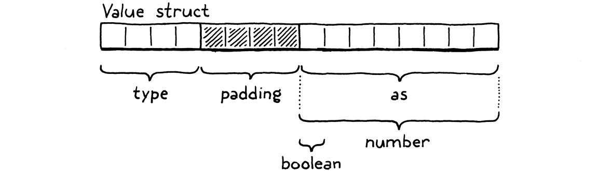

> 你要是一只脑子很小的熊，当你想事情的时候，你会发现，有时在你心里看起来很像回事的事情，当它展示出来，让别人看着它的时候，就完全不同了。（A. A.米尔恩，《小熊维尼》）
>
> ​ —— A. A. Milne, _Winnie-the-Pooh_

前面的几章篇幅很长，充满了复杂的技术和一页又一页的代码。在本章中，只需要学习一个新概念和一些简单的代码。你获得了喘息的机会。

Lox 是动态类型的[^1]。一个变量可以在不同的时间点持有布尔值、数字或字符串。至少，我们的想法是如此。现在，在 clox 中，所有的值都是数字。到本章结束时，它还将支持布尔值和`nil`。虽然这些不是特别有趣，但它们迫使我们弄清楚值表示如何动态地处理不同类型。

## 18.1 带标签联合体

使用 C 语言工作的好处是，我们可以从最基础的比特位开始构建数据结构。坏处是，我们必须这样做。C 语言在编译时并没有提供多少免费的东西，在运行时就更少了。对 C 语言来说，宇宙是一个无差别的字节数组。由我们来决定使用多少个字节以及它们的含义。

为了选择一种值的表示形式，我们需要先回答两个关键问题：

1. **我们如何表示一个值的类型？** 比如说，如果你将一个数字乘以`true`，我们需要在运行时检测到这个错误并报告它。为此，我们需要知道值的类型是什么？

2. **我们如何存储该值本身？** 我们不仅要能分辨出 3 是一个数字，还要能分辨出它与 4 是不同的。我知道，这是显而易见的对吧？但是在我们所讨论的层面，最好把这些事情说清楚。

因为我们不仅仅是设计这门语言，还要自己构建它，所以在回答这两个问题时，我们还必须牢记实现者们永恒的追求：*高效*地完成它。

多年来，语言黑客们想出了各种巧妙的方法，将上述信息打包成尽可能少的比特。现在，我们将从最简单、最经典的解决方案开始：**带标签的联合体**。一个值包含两个部分：一个类型“标签”，和一个实际值的有效载荷。为了存储值的类型，我们要为虚拟机支持的每一种值定义一个枚举[^2]。

_<u>value.h，添加代码：</u>_

```c
#include "common.h"
// 新增部分开始
typedef enum {
  VAL_BOOL,
  VAL_NIL,
  VAL_NUMBER,
} ValueType;
// 新增部分结束
typedef double Value;
```

现在，我们只有这几种情况，但随着我们向 clox 中添加字符串、函数和类，这里也会越来越多。除了类型之外，我们还需要存储值的数据——数字是`double`值，Boolean 是`true`或`false`。我们可以定义一个结构体，其中包含每种可能的类型所对应的字段。


但这是对内存的一种浪费。一个值不可能同时是数字和布尔值。所以在任何时候，这些字段中只有一个会被使用。C 语言中允许定义联合体来优化这一点。联合体看起来很像是结构体，区别在于其中的所有字段在内存中是重叠的。


联合体的大小就是其最大字段的大小。由于这些字段都复用相同的比特位，你在使用它们时必须要非常小心。如果你使用一个字段存储数据，然后用另一个字段访问数据，那你需要重新解释底层比特位的含义[^3]。

顾名思义，“带标签的联合体”说明，我们新的值表示形式中将这两部分合并成一个结构体。

_<u>value.h，在枚举 ValueType 后替换一行：</u>_

```c
} ValueType;
// 替换部分开始
typedef struct {
  ValueType type;
  union {
    bool boolean;
    double number;
  } as;
} Value;
// 替换部分结束
typedef struct {
```

有一个字段用作类型标签，然后是第二个字段，一个包含所有底层值的联合体[^4]。在使用典型的 C 语言编译器的 64 位机器上，布局看起来如下：



首先是 4 字节的类型标签，然后是联合体。大多数体系结构都喜欢将值与它们的字长对齐。由于联合体字段中包含一个 8 字节的 double 值，所以编译器在类型字段后添加了 4 个字节的填充，以使该 double 值保持在最近的 8 字节边界上。这意味着我们实际在类型标签上花费了 8 个字节，而它只需要表示 0 到 3 之间的数字。我们可以把枚举放在一个占位更少的变量中，但这样做只会增加填充量[^5]。

> So our Values are 16 bytes, which seems a little large. We’ll improve it [later](http://www.craftinginterpreters.com/optimization.html). In the meantime, they’re still small enough to store on the C stack and pass around by value. Lox’s semantics allow that because the only types we support so far are **immutable**. If we pass a copy of a Value containing the number three to some function, we don’t need to worry about the caller seeing modifications to the value. You can’t “modify” three. It’s three forever.

所以我们的 Value 是 16 个字节，这似乎有点大。我们[稍后](../optimization/readme/)会改进它。同时，它们也足够小，可以存储在 C 语言的堆栈中，并按值传递。Lox 的语义允许这样做，因为到目前为止我们只支持**不可变**类型。如果我们把一个包含数字 3 的 Value 的副本传递给某个函数，我们不需要担心调用者会看到对该值的修改。你不能“修改”3，它永远都是 3。

## 18.2 Lox 值和 C 值

这就是我们新的值表示形式，但是我们还没有做完。现在，clox 的其余部分都假定了 Value 是`double`的别名。我们有一些代码是直接用 C 语言将一个值转换为另一个值。这些代码现在都被破坏了，好伤心。

在我们新的表示形式中，Value 可以*包含*一个 double 值，但它并不等同于 double 类型。有一个强制性的转换步骤可以实现从一个值到另一个值的转换。我们需要遍历代码并插入这些转换步骤，以使 clox 重新工作。

我们会用少量的宏来实现这些转换，每个宏对应一个类型和操作。首先，将原生的 C 值转换为 clox Value：

_<u>value.h，在结构体 Value 后添加代码：</u>_

```c
} Value;
// 新增部分开始
#define BOOL_VAL(value)   ((Value){VAL_BOOL, {.boolean = value}})
#define NIL_VAL           ((Value){VAL_NIL, {.number = 0}})
#define NUMBER_VAL(value) ((Value){VAL_NUMBER, {.number = value}})
// 新增部分结束
typedef struct {
```

其中每个宏都接收一个适当类型的 C 值，并生成一个 Value，其具有正确类型标签并包含底层的值。这就把静态类型的值提升到了 clox 的动态类型的世界。但是为了能对 Value 做任何操作，我们需要将其拆包并取出对应的 C 值[^6]。

_<u>value.h，在结构体 Value 后添加代码：</u>_

```c
} Value;
// 新增部分开始
#define AS_BOOL(value)    ((value).as.boolean)
#define AS_NUMBER(value)  ((value).as.number)
// 新增部分结束
#define BOOL_VAL(value)   ((Value){VAL_BOOL, {.boolean = value}})
```

这些宏的作用是反方向的。给定一个正确类型的 Value，它们会将其解包并返回对应的原始 C 值。“正确类型”很重要！这些宏会直接访问联合体字段。如果我们要这样做：

```c
Value value = BOOL_VAL(true);
double number = AS_NUMBER(value);
```

那我们可能会打开一个通往暗影王国的阴燃之门。除非我们知道 Value 包含适当的类型，否则使用任何的`AS_`宏都是不安全的。为此，我们定义最后几个宏来检查 Value 的类型。

_<u>value.h，在结构体 Value 后添加代码：</u>_

```c
} Value;
// 新增部分开始
#define IS_BOOL(value)    ((value).type == VAL_BOOL)
#define IS_NIL(value)     ((value).type == VAL_NIL)
#define IS_NUMBER(value)  ((value).type == VAL_NUMBER)
// 新增部分结束
#define AS_BOOL(value)    ((value).as.boolean)
```

如果 Value 具有对应类型，这些宏会返回`true`。每当我们调用一个`AS_`宏时，我们都需要保证首先调用了这些宏。有了这 8 个宏，我们现在可以安全地在 Lox 的动态世界和 C 的静态世界之间传输数据了。

## 18.3 动态类型数字

我们已经有了值的表示形式和转换的工具。要想让 clox 重新运行起来，剩下的工作就是仔细检查代码，修复每个数据跨边界传递的地方。这是本书中不太让人兴奋的章节之一，但我保证会给你展示每一行代码，所以我们开始吧。

我们创建的第一个值是在编译数值字面量时生成的常量。在我们将词素转换为 C 语言的 double 之后，我们简单地将其包装在一个 Value 中，然后再存储到常量表中。

_<u>compiler.c，在 number()函数中替换一行：</u>_

```c
  double value = strtod(parser.previous.start, NULL);
  // 替换部分开始
  emitConstant(NUMBER_VAL(value));
  // 替换部分结束
}
```

在运行时，我们有一个函数来打印值。

_<u>value.c，在 printValue()方法中替换一行：</u>_

```c
void printValue(Value value) {
 // 替换部分开始
 printf("%g", AS_NUMBER(value));
 // 替换部分结束
}
```

在我们将 Value 发送给`printf()`之前，我们将其拆装并提取出 double 值。我们很快会重新回顾这个函数并添加其它类型，但是我们先让现有的代码工作起来。

### 18.3.1 一元取负与运行时错误

接下来最简单的操作是一元取负。它会从栈中弹出一个值，对其取负，并将结果压入栈。现在我们有了其它类型的值，我们不能再假设操作数是一个数字。用户也可以这样做：

```c
print -false; // Uh...
```

我们需要优雅地处理这个问题，这意味着是时候讨论运行时错误了。在执行需要特定类型的操作之前，我们需要确保 Value 是该类型。

对于一元取负来说，检查是这样的：

_<u>vm.c，在 run()方法中替换一行：</u>_

```c
      case OP_DIVIDE:   BINARY_OP(/); break;
      // 替换部分开始
      case OP_NEGATE:
        if (!IS_NUMBER(peek(0))) {
          runtimeError("Operand must be a number.");
          return INTERPRET_RUNTIME_ERROR;
        }
        push(NUMBER_VAL(-AS_NUMBER(pop())));
        break;
      // 替换部分结束
      case OP_RETURN: {
```

首先，我们检查栈顶的 Value 是否是一个数字。如果不是，则报告运行时错误并停止解释器[^7]。否则，我们就继续运行。只有在验证之后，我们才会拆装操作数，取负，将结果封装并压入栈。


为了访问 Value，我们使用一个新的小函数。

_<u>vm.c，在 pop()方法后添加代码：</u>_

```c
static Value peek(int distance) {
  return vm.stackTop[-1 - distance];
}
```

它从堆栈中返回一个 Value，但是并不弹出它[^8]。`distance`参数是指要从堆栈顶部向下看多远：0 是栈顶，1 是下一个槽，以此类推。

我们使用一个新函数来报告运行时错误，在本书的剩余部分，我们会从中得到很多的好处。

_<u>vm.c，在 resetStack()方法后添加代码：</u>_

```c
static void runtimeError(const char* format, ...) {
  va_list args;
  va_start(args, format);
  vfprintf(stderr, format, args);
  va_end(args);
  fputs("\n", stderr);

  size_t instruction = vm.ip - vm.chunk->code - 1;
  int line = vm.chunk->lines[instruction];
  fprintf(stderr, "[line %d] in script\n", line);
  resetStack();
}
```

你以前肯定在 C 语言中调用过变参函数——接受不同数量参数的函数：`printf()`就是其中之一。但你可能还没*定义*过自己的变参函数。这本书不是 C 语言教程[^9]，所以我在这里略过了，但是基本上是`...`和`va_list`让我们可以向`runtimeError()`传递任意数量的参数。它将这些参数转发给`vfprintf()`，这是`printf()`的一个变体，需要一个显式地`va_list`。

调用者可以向`runtimeError()`传入一个格式化字符串，后跟一些参数，就像他们直接调用`printf()`一样。然后`runtimeError()`格式化并打印这些参数。在本章中我们不会利用这一点，但后面的章节中将生成包含其它数据的格式化运行时错误信息。

在显示了希望有帮助的错误信息之后，我们还会告诉用户，当错误发生时正在执行代码中的哪一行[^10]。因为我们在编译器中留下了标识，所以我们可以从编译到字节码块中的调试信息中查找行号。如果我们的编译器正确完成了它的工作，就能对应到字节码被编译出来的那一行源代码。

我们使用当前字节码指令索引减 1 来查看字节码块的调试行数组。这是因为解释器在之前每条指令之前都会向前推进。所以，当我们调用 `runtimeError()`，失败的指令就是前一条。

仅显示发生错误的直接行并不能提供太多上下文。更好的方法是提供完整的堆栈跟踪。但我们甚至还没有要调用的函数，因此没有要跟踪的调用堆栈。

为了使用`va_list`和相关的宏，我们需要引入一个标准头文件。

_<u>vm.c，在文件顶部添加代码：</u>_

```c
// 新增部分开始
#include <stdarg.h>
// 新增部分结束
#include <stdio.h>
```

有了它，我们的虚拟机不仅可以在对数字取负时正确执行（原本就会这样做），而且还可以优雅地处理对其它类型取负的错误尝试（目前还没有，但仍然存在）。

### 18.3.2 二元数字运算符

我们现在已经有了运行时错误机制，所以修复二元运算符更容易，尽管它们更复杂。现在我们支持四种二元运算符：`+`、`-`、`*`和`/`。它们之间唯一的区别就是使用的是哪种底层 C 运算符。为了尽量减少这四个运算符之间的冗余代码，我们将它们的共性封装在一个大的预处理宏中，该宏以运算符标识作为参数。

这个宏在前几章中似乎是多余的，但现在我们却从中受益。它让我们可以在某个地方添加必要的类型检查和转换。
_<u>vm.c，在 run()方法中替换 6 行：</u>_

```c
#define READ_CONSTANT() (vm.chunk>constants.values[READ_BYTE()])
// 替换部分开始
#define BINARY_OP(valueType, op) \
    do { \
      if (!IS_NUMBER(peek(0)) || !IS_NUMBER(peek(1))) { \
        runtimeError("Operands must be numbers."); \
        return INTERPRET_RUNTIME_ERROR; \
      } \
      double b = AS_NUMBER(pop()); \
      double a = AS_NUMBER(pop()); \
      push(valueType(a op b)); \
    } while (false)
 // 替换部分结束
  for (;;) {
```

是的，我知道这是一个巨大的宏。这不是我通常认为的好的 C 语言实践，但我们还是用它吧。这些调整与我们对一元取负所做的相似。首先，我们检查两个操作数是否都是数字。如果其中一个不是，我们就报告一个运行时错误，并拉下弹射座椅手柄。

如果操作数都没有问题，我们就把它们都弹出栈并进行拆装。然后我们应用给定的运算符，包装结果并将其压回栈中。注意，我们没有直接使用`NUMBER_VAL()`来包装结果。相反，我们要使用的包装器是作为宏参数传入的。对于我们现有的数字运算符来说，结果是一个数字，所以我们传入`NUMBER_VAL`宏[^11]。

_<u>vm.c，在 run()方法中替换 4 行：</u>_

```c
      }
      // 替换部分开始
      case OP_ADD:      BINARY_OP(NUMBER_VAL, +); break;
      case OP_SUBTRACT: BINARY_OP(NUMBER_VAL, -); break;
      case OP_MULTIPLY: BINARY_OP(NUMBER_VAL, *); break;
      case OP_DIVIDE:   BINARY_OP(NUMBER_VAL, /); break;
      // 替换部分结束
      case OP_NEGATE:
```

很快，我就会告诉你为什么我们要将包装宏作为参数。

## 18.4 两个新类型

我们现有的所有 clox 代码都恢复正常工作了。最后，是时候添加一些新类型了。我们有一个正在运行的数字计算器，它现在做了一些毫无意义的偏执的运行时类型检查。我们可以在内部表示其它类型，但用户的程序无法创建这些类型的 Value。

现在还不能。首先，我们向编译器添加对三个新字面量的支持：`true`、`false`、`nil`。它们都很简单，所以我们一次性完成这三个。

对于数字字面量，我们要面对这样一个事实：有数十亿个可能的数字值。为此，我们将字面量的值保存在字节码块的常量表中，并生成一个加载该常量的字节码指令。我们可以对这些新类型做同样的事。我们在常量表中存储值，比如`true`，并使用`OP_CONSTANT`来读取它。

但是考虑到这些新类型实际上只有三种可能的值，这样做是没有必要的——而且速度很慢！——浪费了一个两字节的指令和常量表中的一个项。相反，我们会定义三个专用指令[^12]来将这些字面量压入栈中。

_<u>chunk.h，在枚举 OpCode 中添加代码：</u>_

```c
  OP_CONSTANT,
  // 新增部分开始
  OP_NIL,
  OP_TRUE,
  OP_FALSE,
  // 新增部分结束
  OP_ADD,
```

我们的扫描器已经将`true`、`false`和`nil`视为关键字，所以我们可以直接调到解析器。对于我们这个基于表格的 Pratt 解析器，只需要将解析器函数插入到与这些关键字标识类型相对应的行中。我们会在三个槽中使用相同的函数。这里：

_<u>compiler.c，替换一行：</u>_

```c
  [TOKEN_ELSE]          = {NULL,     NULL,   PREC_NONE},
  // 替换部分开始
  [TOKEN_FALSE]         = {literal,  NULL,   PREC_NONE},
  // 替换部分结束
  [TOKEN_FOR]           = {NULL,     NULL,   PREC_NONE},
```

这里:

_<u>compiler.c，替换一行：</u>_

```c
  [TOKEN_THIS]          = {NULL,     NULL,   PREC_NONE},
  // 替换部分开始
  [TOKEN_TRUE]          = {literal,  NULL,   PREC_NONE},
  // 替换部分结束
  [TOKEN_VAR]           = {NULL,     NULL,   PREC_NONE},
```

还有这里:

_<u>compiler.c，替换一行：</u>_

```c
  [TOKEN_IF]            = {NULL,     NULL,   PREC_NONE},
  // 替换部分开始
  [TOKEN_NIL]           = {literal,  NULL,   PREC_NONE},
  // 替换部分结束
  [TOKEN_OR]            = {NULL,     NULL,   PREC_NONE},
```

当解析器在前缀位置遇到`false`、`nil`或 `true`时，它会调用这个新的解析器函数：

_<u>compiler.c，在 binary()方法后添加代码：</u>_

```c
static void literal() {
  switch (parser.previous.type) {
    case TOKEN_FALSE: emitByte(OP_FALSE); break;
    case TOKEN_NIL: emitByte(OP_NIL); break;
    case TOKEN_TRUE: emitByte(OP_TRUE); break;
    default: return; // Unreachable.
  }
}
```

因为`parsePrecedence()`已经消耗了关键字标识，我们需要做的就是输出正确的指令。我们根据解析出的标识的类型来确定指令。我们的前端现在可以将布尔值和`nil`字面量编译为字节码。沿着执行管道向下移动，我们就到了解释器。

_<u>vm.c，在 run()方法中添加代码：</u>_

```c
      case OP_CONSTANT: {
        Value constant = READ_CONSTANT();
        push(constant);
        break;
      }
      // 新增部分开始
      case OP_NIL: push(NIL_VAL); break;
      case OP_TRUE: push(BOOL_VAL(true)); break;
      case OP_FALSE: push(BOOL_VAL(false)); break;
      // 新增部分结束
      case OP_ADD:      BINARY_OP(NUMBER_VAL, +); break;
```

这一点是不言而喻的。每条指令都会召唤出相应的值并将其压入堆栈。我们也不能忘记反汇编程序。

_<u>debug.c，在 disassembleInstruction()方法中添加代码：</u>_

```c
    case OP_CONSTANT:
      return constantInstruction("OP_CONSTANT", chunk, offset);
    // 新增部分开始
    case OP_NIL:
      return simpleInstruction("OP_NIL", offset);
    case OP_TRUE:
      return simpleInstruction("OP_TRUE", offset);
    case OP_FALSE:
      return simpleInstruction("OP_FALSE", offset);
    // 新增部分结束
    case OP_ADD:
```

有了这些，我们就可以运行这个惊天动地的程序：

```c
true
```

只是当解释器试图打印结果时，就崩溃了。我们也需要扩展`printValue()`来处理新类型：

_<u>value.c，在 printValue()方法中替换 1 行：</u>_

```c
void printValue(Value value) {
  // 替换部分开始
  switch (value.type) {
    case VAL_BOOL:
      printf(AS_BOOL(value) ? "true" : "false");
      break;
    case VAL_NIL: printf("nil"); break;
    case VAL_NUMBER: printf("%g", AS_NUMBER(value)); break;
  }
  // 替换部分结束
}
```

我们继续！现在我们有了一些新的类型，只是它们目前还不是很有用。除了字面量之外，你无法真正对其做任何事。还需要一段时间`nil`才会发挥作用，但我们可以先让布尔值在逻辑运算符中发挥作用。

### 18.4.1 逻辑非和 falsiness

最简单的逻辑运算符是我们充满感叹意味的老朋友一元取非。

```c
print !true; // "false"
```

这个新操作会有一条新指令。

_<u>chunk.h，在枚举 OpCode 中添加代码：</u>_

```c
  OP_DIVIDE,
  // 新增部分开始
  OP_NOT,
  // 新增部分结束
  OP_NEGATE,
```

我们可以重用为一元取负所写的解析函数来编译一个逻辑非表达式。我们只需要将其插入到解析表格中。

_<u>compiler.c，替换一行：</u>_

```c
  [TOKEN_STAR]          = {NULL,     binary, PREC_FACTOR},
  // 替换部分开始
  [TOKEN_BANG]          = {unary,    NULL,   PREC_NONE},
  // 替换部分结束
  [TOKEN_BANG_EQUAL]    = {NULL,     NULL,   PREC_NONE},
```

因为我之前已知道我们要这样做，`unary()`函数已经有了关于标识类型的 switch 语句，来判断要输出哪个字节码指令。我们只需要增加一个分支即可。

_<u>compiler.c，在 unary()方法中添加代码：</u>_

```c
  switch (operatorType) {
    // 新增部分开始
    case TOKEN_BANG: emitByte(OP_NOT); break;
    // 新增部分结束
    case TOKEN_MINUS: emitByte(OP_NEGATE); break;
    default: return; // Unreachable.
  }
```

前端就这样了。让我们去虚拟机那里，并将这个指令变成现实。

_<u>vm.c，在 run()方法中添加代码：</u>_

```c
      case OP_DIVIDE:   BINARY_OP(NUMBER_VAL, /); break;
      // 新增部分开始
      case OP_NOT:
        push(BOOL_VAL(isFalsey(pop())));
        break;
      // 新增部分结束
      case OP_NEGATE:
```

跟之前的一元运算符一样，它会弹出一个操作数，执行操作，并将结果压入栈中。正如我们所做的那样，我们必须考虑动态类型。对`true`进行逻辑取非很容易，但没什么能阻止一个不守规矩的程序员写出这样的东西：

```c
print !nil;
```

对于一元取负，我们把对任何非数字的东西进行取负[^13]当作一个错误。但是 Lox，像大多数脚本语言一样，在涉及到`!`和其它期望出现布尔值的情况下，是比较宽容的。处理其它类型的规则被称为“falsiness”，我们在这里实现它：

_<u>vm.c，在 peek()方法后添加代码：</u>_

```c
static bool isFalsey(Value value) {
  return IS_NIL(value) || (IS_BOOL(value) && !AS_BOOL(value));
}
```

Lox 遵循 Ruby 的规定，`nil`和`false`是假的，其它的值都表现为`true`。我们已经有了一条可以生成的新指令，所以我们也需要能够在反汇编程序中反生成它。

_<u>debug.c，在 disassembleInstruction()方法中添加代码：</u>_

```c
    case OP_DIVIDE:
      return simpleInstruction("OP_DIVIDE", offset);
    // 新增部分开始
    case OP_NOT:
      return simpleInstruction("OP_NOT", offset);
    // 新增部分结束
    case OP_NEGATE:
```

### 18.4.2 相等与比较运算符

还不算太糟。让我们继续保持这种势头，搞定相等与比较运算符： `==`，`!=`，`<`，`>`，`<=`和`>=`。这涵盖了所有会返回布尔值的运算符，除了逻辑运算符`and`和`or`。因为这些运算符需要短路计算（基本上是做一个小小的控制流），我们还没准备好。

下面是这些运算符对应的新指令：

_<u>chunk.h，在枚举 OpCode 中添加代码：</u>_

```c
  OP_FALSE,
  // 新增部分开始
  OP_EQUAL,
  OP_GREATER,
  OP_LESS,
  // 新增部分结束
  OP_ADD,
```

等一下，只有三个？那`!=`、`<=`和`>=`呢？我们也可以为它们创建指令。老实说，如果我们这样做，虚拟机的执行速度会更快。所以如果我们的目标是追求性能，那就*应该*这样做。

但我的主要目标是教你有关字节码编译器的知识。我想要你开始内化一个想法：字节码指令不需要紧跟用户的源代码。虚拟机可以完全自由地使用它想要的任何指令集和代码序列，只要它们有正确的用户可见的行为。

表达式`a!=b`与`!(a==b)`具有相同的语义[^14]，所以编译器可以自由地编译前者，就好像它是后者一样。它可以输出一条`OP_EQUAL`指令，之后是一条`OP_NOT`，而不是一条专用的`OP_NOT_EQUAL`指令。同样地，`a<=b`与`!(a>b)`相同，而`a>=b`与`!(a<b)`相同，所以我们只需要三条新指令。

不过，在解析器中，我们确实有 6 个新的操作符要加入到解析表中。我们使用与之前相同的`binary()`解析函数。下面是`!=`对应的行：

_<u>compiler.c，替换 1 行：</u>_

```c
  [TOKEN_BANG]          = {unary,    NULL,   PREC_NONE},
  // 替换部分开始
  [TOKEN_BANG_EQUAL]    = {NULL,     binary, PREC_EQUALITY},
  // 替换部分结束
  [TOKEN_EQUAL]         = {NULL,     NULL,   PREC_NONE},
```

其余五个运算符在表的最下方。

_<u>compiler.c，替换 5 行：</u>_

```c
  [TOKEN_EQUAL]         = {NULL,     NULL,   PREC_NONE},
  // 替换部分开始
  [TOKEN_EQUAL_EQUAL]   = {NULL,     binary, PREC_EQUALITY},
  [TOKEN_GREATER]       = {NULL,     binary, PREC_COMPARISON},
  [TOKEN_GREATER_EQUAL] = {NULL,     binary, PREC_COMPARISON},
  [TOKEN_LESS]          = {NULL,     binary, PREC_COMPARISON},
  [TOKEN_LESS_EQUAL]    = {NULL,     binary, PREC_COMPARISON},
  // 替换部分结束
  [TOKEN_IDENTIFIER]    = {NULL,     NULL,   PREC_NONE},
```

在`binary()`中，我们已经有了一个 switch 语句，为每种标识类型生成正确的字节码。我们为这六个新运算符添加分支。

_<u>compiler.c，在 binary()方法内添加代码：</u>_

```c
  switch (operatorType) {
    // 新增部分开始
    case TOKEN_BANG_EQUAL:    emitBytes(OP_EQUAL, OP_NOT); break;
    case TOKEN_EQUAL_EQUAL:   emitByte(OP_EQUAL); break;
    case TOKEN_GREATER:       emitByte(OP_GREATER); break;
    case TOKEN_GREATER_EQUAL: emitBytes(OP_LESS, OP_NOT); break;
    case TOKEN_LESS:          emitByte(OP_LESS); break;
    case TOKEN_LESS_EQUAL:    emitBytes(OP_GREATER, OP_NOT); break;
    // 新增部分结束
    case TOKEN_PLUS:          emitByte(OP_ADD); break;
```

`==`、`<`和`>` 运算符输出单个指令。其它运算符则输出一对指令，一条用于计算逆运算，然后用`OP_NOT`来反转结果。仅仅使用三种指令就表达出了六种运算符的效果！

这意味着在虚拟机中，我们的工作更简单了。相等是最普遍的操作。

_<u>vm.c，在 run()方法中添加代码：</u>_

```c
      case OP_FALSE: push(BOOL_VAL(false)); break;
      // 新增部分开始
      case OP_EQUAL: {
        Value b = pop();
        Value a = pop();
        push(BOOL_VAL(valuesEqual(a, b)));
        break;
      }
      // 新增部分结束
      case OP_ADD:      BINARY_OP(NUMBER_VAL, +); break;
```

你可以对任意一对对象执行`==`，即使这些对象是不同类型的。这有足够的复杂性，所以有必要把这个逻辑分流到一个单独的函数中。这个函数会一个 C 语言的`bool`值，所以我们可以安全地把结果包装在一个`BOLL_VAL`中。这个函数与 Value 有关，所以它位于“value”模块中。

_<u>value.h，在结构体 ValueArray 后添加代码：</u>_

```c
} ValueArray;
// 新增部分开始
bool valuesEqual(Value a, Value b);
// 新增部分结束
void initValueArray(ValueArray* array);
```

下面是实现：

_<u>value.c，在 printValue()方法后添加代码：</u>_

```c
bool valuesEqual(Value a, Value b) {
  if (a.type != b.type) return false;
  switch (a.type) {
    case VAL_BOOL:   return AS_BOOL(a) == AS_BOOL(b);
    case VAL_NIL:    return true;
    case VAL_NUMBER: return AS_NUMBER(a) == AS_NUMBER(b);
    default:         return false; // Unreachable.
  }
}
```

首先，我们检查类型。如果两个 Value 的类型不同，它们肯定不相等[^15]。否则，我们就把这两个 Value 拆装并直接进行比较。

对于每一种值类型，我们都有一个单独的 case 分支来处理值本身的比较。考虑到这些分支的相似性，你可能会想，为什么我们不能简单地对两个 Value 结构体进行`memcmp()`，然后就可以了。问题在于，因为填充以及联合体字段的大小不同，Value 中会包含无用的比特位。C 语言不能保证这些值是什么，所以两个相同的 Value 在未使用的内存中可能是完全不同的。


(你无法想象在了解这个事实之前我经历了多少痛苦。)

总之，随着我们向 clox 中添加更多的类型，这个函数也会增加更多的 case 分支。就目前而言，这三个已经足够了。其它的比较运算符更简单，因为它们只处理数字。

_<u>vm.c，在 run()方法中添加代码：</u>_

```c
        push(BOOL_VAL(valuesEqual(a, b)));
        break;
      }
      // 新增部分开始
      case OP_GREATER:  BINARY_OP(BOOL_VAL, >); break;
      case OP_LESS:     BINARY_OP(BOOL_VAL, <); break;
      // 新增部分结束
      case OP_ADD:      BINARY_OP(NUMBER_VAL, +); break;
```

我们已经扩展了`BINARY_OP`宏，来处理返回非数字类型的运算符。现在我们要用到它了。因为结果值类型是布尔型，所以我们传入`BOOL_VAL`。除此之外，这与加减运算没有区别。

与往常一样，今天的咏叹调的尾声是对新指令进行反汇编。

_<u>debug.c，在 disassembleInstruction()方法中添加代码：</u>_

```c
    case OP_FALSE:
      return simpleInstruction("OP_FALSE", offset);
    // 新增部分开始
    case OP_EQUAL:
      return simpleInstruction("OP_EQUAL", offset);
    case OP_GREATER:
      return simpleInstruction("OP_GREATER", offset);
    case OP_LESS:
      return simpleInstruction("OP_LESS", offset);
    // 新增部分结束
    case OP_ADD:
```

这样一来，我们的数字计算器就变得更接近于一个通用的表达式求值器。启动 clox 并输入：

```c
!(5 - 4 > 3 * 2 == !nil)
```


好吧，我承认这可能不是最*有用的*表达式，但我们正在取得进展。我们还缺少一种自带字面量形式的内置类型：字符串。它们要复杂得多，因为字符串的大小可以不同。这个微小的差异会产生巨大的影响，以至于我们给字符串单独开了一章。

[^1]: 在静态类型和动态类型之外，还有第三类：单一类型（**unityped**）。在这种范式中，所有的变量都是一个类型，通常是一个机器寄存器整数。单一类型的语言在今天并不常见，但一些 Forth 派生语言和 BCPL（启发了 C 的语言）是这样工作的。从这一刻起，clox 是单一类型的。
[^2]: 这个案例中涵盖了*虚拟机中内置支持*的每一种值。等到我们在语言中添加类时，用户定义的每个类并不需要在这个枚举中添加对应的条目。对于虚拟机而言，一个类的每个实例都是相同的类型：“instance”。换句话说，这是虚拟机中的“类型”概念，而不是用户的。
[^3]: 使用联合体将比特位解释为不同类型是 C 语言的精髓。它提供了许多巧妙的优化，让你能够以内存安全型语言中不允许的方式对内存中的每个字节进行切分。但它也是非常不安全的，如果你不小心，它就可能会锯掉你的手指。
[^4]: 一个聪明的语言黑客给了我一个想法，把“as”作为联合体字段名称，因为当你取出各种值时，读起来感觉很好，就像是强制转换一样。
[^5]: 我们可以把标签字段移动到联合体字段之后，但这也没有多大帮助。每当我们创建一个 Value 数组时（这也是我们对 Value 的主要内存使用），C 编译器都会在每个数值之间插入相同的填充，以保持双精度数对齐。
[^6]: 没有`AS_NIL`宏，因为只有一个`nil`值，所以一个类型为`VAL_NIL`的 Value 不会携带任何额外的数据。
[^7]: Lox 的错误处理方法是相当……简朴的。所有的错误都是致命的，会立即停止解释器。用户代码无法从错误中恢复。如果 Lox 是一种真正的语言，这是我首先要补救的事情之一。
[^8]: 为什么不直接弹出操作数然后验证它呢？我们可以这么做。在后面的章节中，将操作数留在栈上是很重要的，可以确保在运行过程中触发垃圾收集时，垃圾收集器能够找到它们。我在这里做了同样的事情，主要是出于习惯。
[^9]: 如果你在寻找一个 C 教程，我喜欢[C 程序设计语言](https://www.cs.princeton.edu/~bwk/cbook.html)，通常被称为“K&R”，以纪念它的作者。它并不完全是最新的，但是写作质量足以弥补这一点。
[^10]: 仅仅显示发生错误的那一行并不能提供太多的上下文信息。最后是提供完整的堆栈跟踪，但是我们目前甚至还没有函数调用，所以也没有调用堆栈可以跟踪。
[^11]: 你知道可以将宏作为参数传递给宏吗？现在你知道了！
[^12]: 我不是在开玩笑，对于某些常量值的专用操作会更快。字节码虚拟机的大部分执行时间都花在读取和解码指令上。对于一个特定的行为，你需要的指令越少、越简单，它就越快。专用于常见操作的短指令是一种典型的优化。<BR>例如，Java 字节码指令集中有专门的指令用于加载 0.0、1.0、2.0 以及从-1 到 5 之间的整数。（考虑到大多数成熟的 JVM 在执行前都会对字节码进行 JIT 编译，这最终成为了一种残留的优化）
[^13]: 现在我忍不住想弄清楚，对其它类型的值取反意味着什么。`nil`可能有自己的非值，有点像一个奇怪的伪零。对字符串取反可以，呃……，反转？
[^14]: `a<=b`总是与`!(a>b)`相同吗？根据 IEEE 754 标准，当操作数为 NaN 时，所有的比较运算符都返回假。这意味着`NaN <= 1`是假的，`NaN > 1`也是假的。但我们的脱糖操作假定了后者是前者的非值。<BR>在本书中，我们不必纠结于此，但这些细节在你的真正的语言实现中会很重要。
[^15]: 有些语言支持“隐式转换”，如果某个类型的值可以转换为另一个类型，那么这两种类型的值就可以被认为是相等的。举例来说，在 JavaScript 中，数字 0 等同于字符串“0”。这种松散性导致 JS 增加了一个单独的“严格相等”运算符，`===`。<BR>PHP 认为字符串“1”和“01”是等价的，因为两者都可以转换成等价的数字，但是最根本的原因在于 PHP 是由 Lovecraftian(译者注：洛夫克拉夫特，克苏鲁之父，可见作者对 PHP 怨念颇深)的邪神设计的，目的是摧毁人类心智。<BR>大多数具有单独的整数和浮点数类型的动态类型语言认为，如果数值相同，则不同数字类型的值是相等的（所以说，1.0 等于 1），但即便是这种看似无害的便利，如果一不小心也会让人吃不消。

---

## 习题

1. 我们可以进一步简化二元操作符。还有哪些指令可以取消，编译器如何应对这些指令的缺失？

2. 相反，我们可以通过添加更多对应于高级操作的专用指令来提高字节码虚拟机的速度。你会定义什么指令来加速我们在本章中添加的那种用户代码？
